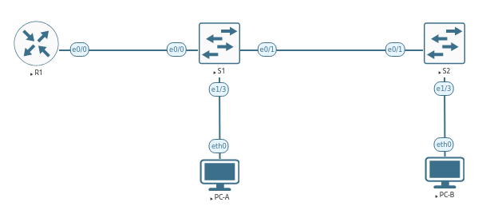

# Лабораторная №1
## VLAN и маршрутизация между VLAN 

### Исходные данные
#### Топология сети

#### Таблица адресов
|Device|Interface|IP Address  |Subnet Mask  |Default Gateway|
|------|---------|------------|-------------|---------------|
|R1    |e0/0.3   |192.168.3.1 |255.255.255.0|n/a            |
|      |e0/0.4   |192.168.4.1 |255.255.255.0|n/a            |
|      |e0/0.8   |n/a         |n/a          |n/a            |
|S1    |VLAN 3   |192.168.3.11|255.255.255.0|192.168.3.1    |
|S2    |VLAN 3   |192.168.3.12|255.255.255.0|192.168.3.1    |
|PC-A  |eth0     |192.168.3.3 |255.255.255.0|192.168.3.1    |
|PC-B  |eth0     |192.168.4.3 |255.255.255.0|192.168.4.1    |

#### Таблица VLAN
|VLAN|Name      |Intreface               |
|----|----------|------------------------|
|3   |Management|S1: VLAN 3              |
|    |          |S2: VLAN 3              |
|    |          |S1: e1/3                |
|4   |Operation |S2: e1/3                |
|7   |ParkingLot|S1: e0/2-3, e1/0-2      |
|    |          |S2: e0/0, e0/2-3, e1/0-2|
|8   |Native    |n/a                     |
