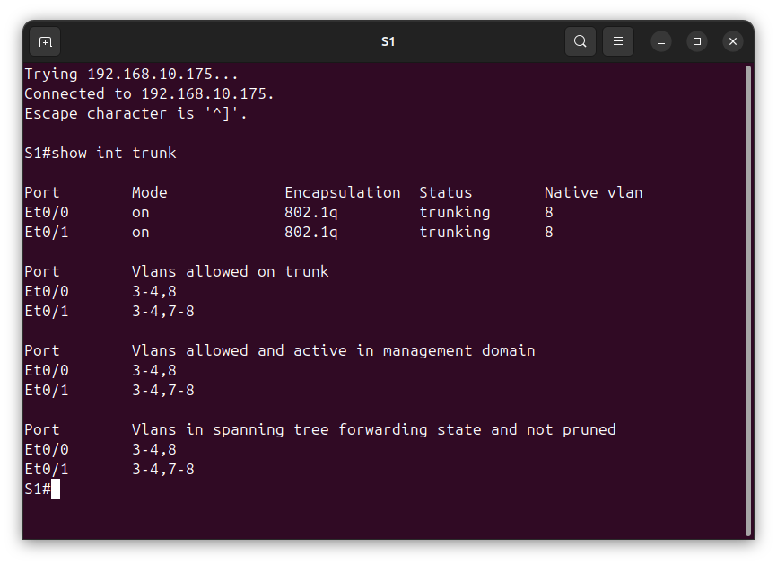
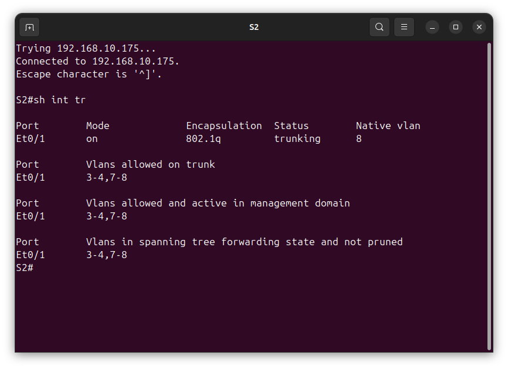
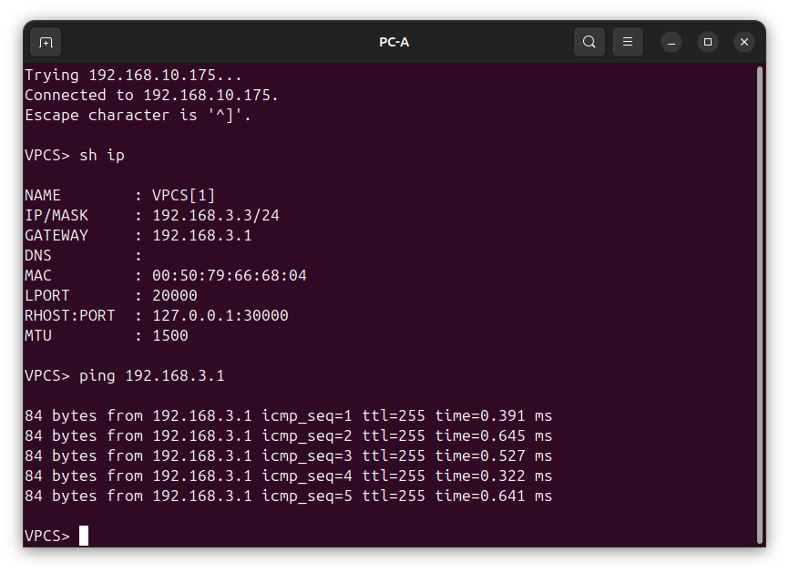
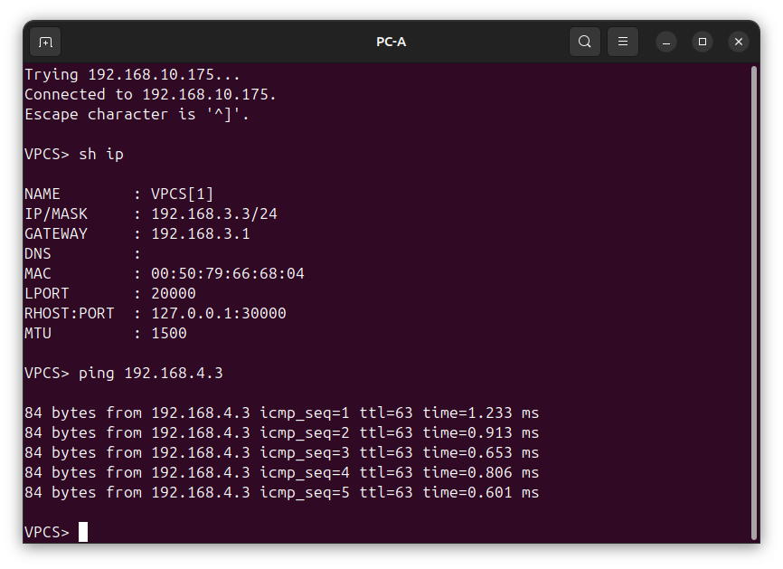
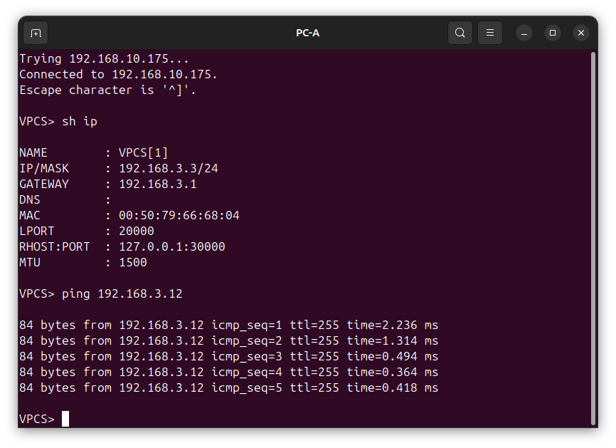
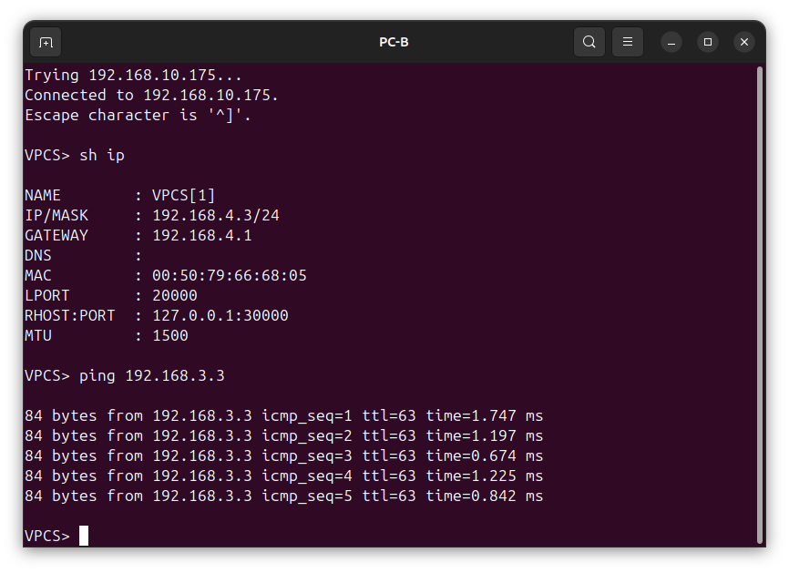

# Лабораторная №1
## VLAN и маршрутизация между VLAN 

### Цель задания
Научится конфигурировать транковые линки и линки доступа для различных VLAN а также настраивать мартшрутизацию между VLAN в топологии "Роутер на палочке" (Router-on-a-Stick).
### Исходные данные
Залание выполняется в среде EVE-NG Pro Version 6.2.0-20

Маршрутизатор R1 - образ **L3-ADVENTERPRISEK9-M-15.4-2T** </br>8 ethenet поротов e0/0-3, e1/0-3

Коммутаторы S1 и S2 - образ **L2-ADVENTERPRISEK9-M-15.2-20150703** </br>8 ethenet поротов e0/0-3, e1/0-3
### Топология сети


### Таблица адресов
|Device|Interface|IP Address  |Subnet Mask  |Default Gateway|
|------|---------|------------|-------------|---------------|
|R1    |e0/0.3   |192.168.3.1 |255.255.255.0|n/a            |
|R1    |e0/0.4   |192.168.4.1 |255.255.255.0|n/a            |
|R1    |e0/0.8   |n/a         |n/a          |n/a            |
|S1    |VLAN 3   |192.168.3.11|255.255.255.0|192.168.3.1    |
|S2    |VLAN 3   |192.168.3.12|255.255.255.0|192.168.3.1    |
|PC-A  |eth0     |192.168.3.3 |255.255.255.0|192.168.3.1    |
|PC-B  |eth0     |192.168.4.3 |255.255.255.0|192.168.4.1    |


### Таблица VLAN
|VLAN|Name      |Intreface               |
|----|----------|------------------------|
|3   |Management|S1: VLAN 3              |
|3   |Management|S2: VLAN 3              |
|3   |Management|S1: e1/3                |
|4   |Operation |S2: e1/3                |
|7   |ParkingLot|S1: e0/2-3, e1/0-2      |
|7   |ParkingLot|S2: e0/0, e0/2-3, e1/0-2|
|8   |Native    |n/a                     |

---
### Этапы выполнения
1. Создем необходимые VLAN на коммутаторах S1 и S2.

```
!
valn 3
name MANAGEMENT
vlan 4 
name OPERATON
vlan 7
name PARKING_LOT
vlan 8 
name NATIVE
```
2. Создаем L3 интерфейсы управления на коммутаторах S1 и S2 и маршрут по умолчанию.

S1
```
!
interface Vlan3
 no shutdown
 description MANAGEMENT
 ip address 192.168.3.11 255.255.255.0
!
ip default-gateway 192.168.3.1
```
S2
```
!
interface Vlan3
 no shutdown
 description MANAGEMENT
 ip address 192.168.3.12 255.255.255.0
!
ip default-gateway 192.168.3.1
```
3. Неиспользуемые интрфейсый коммутаторов S1 и S2 назначаем во VALN 7 (ParkingLot) 

S1
```
!
interface range e0/2-3, e1/0-2
 switchport mode access
 switchport access vlan 7
```
S2
```
!
interface range e0/0, e0/2-3, e1/0-2
 switchport mode access
 switchport access vlan 7
```
4. Назначим VLAN на пользовательские итерфейсы на коммутаторах S1 и S2 

S1
```
!
interface Ethernet1/3
 no shutdown
 description to_PC-A
 switchport access vlan 3
 switchport mode access
```
S2
```
!
interface Ethernet1/3
 no shutdown
 description to_PC-B
 switchport access vlan 4
 switchport mode access
```
5. Настройка транкового соединения между коммутаторами S1 и S2 и маршрутизатором R1

S1
```
!
interface Ethernet0/0
 no shutdown
 description to_R1
 switchport trunk allowed vlan 3,4,8
 switchport trunk encapsulation dot1q
 switchport trunk native vlan 8
 switchport mode trunk
!
interface Ethernet0/1
 no shutdown
 description to_S2
 switchport trunk allowed vlan 3,4,7,8
 switchport trunk encapsulation dot1q
 switchport trunk native vlan 8
 switchport mode trunk
```

S2
```
!
interface Ethernet0/1
 no shutdown
 description to_S1
 switchport trunk allowed vlan 3,4,7,8
 switchport trunk encapsulation dot1q
 switchport trunk native vlan 8
 switchport mode trunk
```


6. Настройка сабинтерфейсов на маршрутизаторе R1
```
!
interface Ethernet0/0
 no shutdown
 description to_S1
 no ip address
!
interface Ethernet0/0.3
 no shutdown
 description MANAGEMENT
 encapsulation dot1Q 3
 ip address 192.168.3.1 255.255.255.0
!
interface Ethernet0/0.4
 no shutdown
 description OPERATIONS
 encapsulation dot1Q 4
 ip address 192.168.4.1 255.255.255.0
!
interface Ethernet0/0.8
 no shutdown
 description NATIVE
 encapsulation dot1Q 8 native
```
---
### Поверка работы 
1. пинг с PC-A на шлюз по умолчанию

2. пинг с PC-A на PC-B

3. пинг с PC-A на S2

4. пинг с PC-B на PC-A


Все файлы конфигураций [здесь](config/).