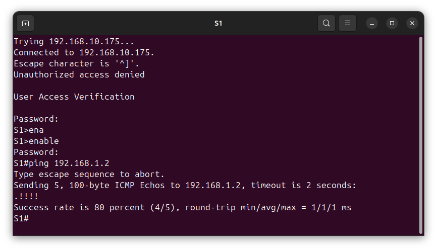
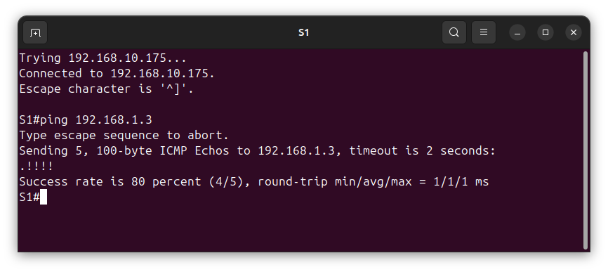
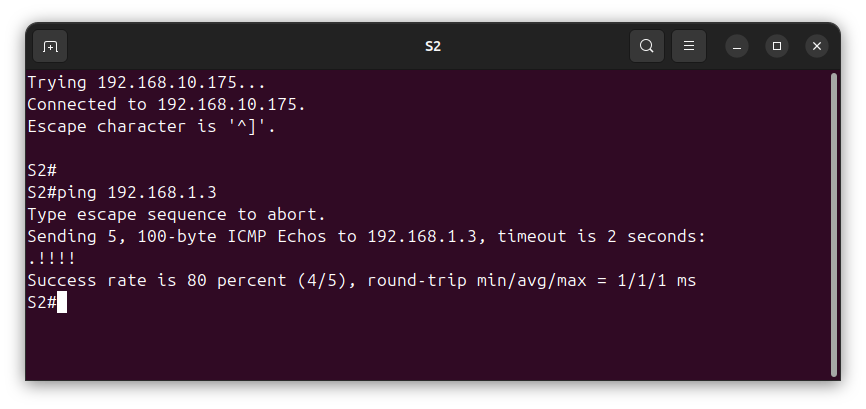
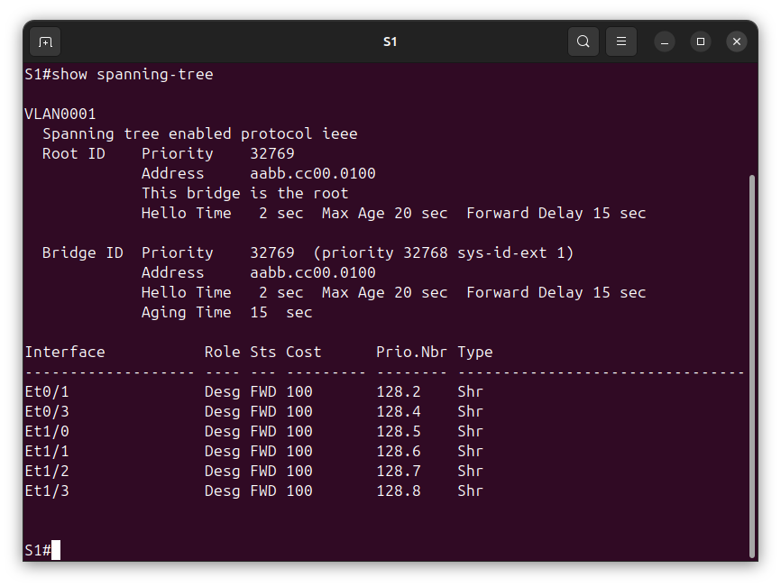
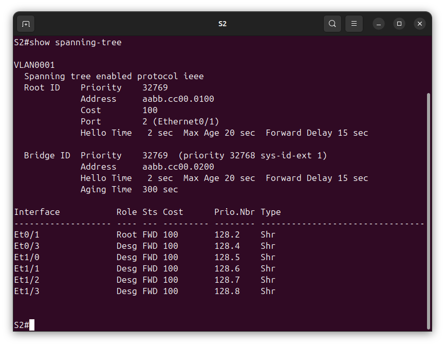
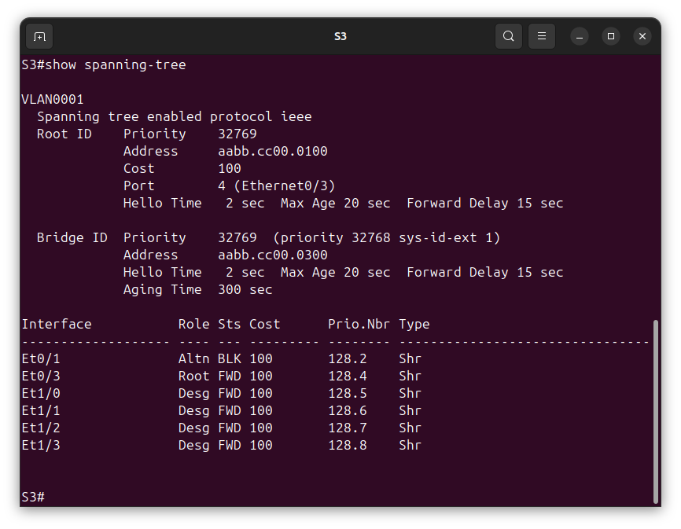

# Лабораторная №2
## Избыточность локальных сетей. STP 


### Цель задания
проанализировать протокол связующего дерева, назначение, функционирование и настройка STP.

### Исходные данные
Задание выполняется в среде EVE-NG Pro Version 6.2.0-20

Коммутаторы S1, S2 и S3 - образ **L2-ADVENTERPRISEK9-M-15.2-20150703** </br>8 ethenet портов e0/0-3, e1/0-3
### Топология сети


### Таблица адресов
|Device|Interface|IP Address  |Subnet Mask  |
|------|---------|------------|-------------|
|S1    |VLAN 1   |192.168.1.1 |255.255.255.0|
|S2    |VLAN 1   |192.168.1.2 |255.255.255.0|
|S3    |VLAN 1   |192.168.1.3 |255.255.255.0|

### Этапы выполнения

#### Создание сети и настройка основных параметров устройства
1. Настройка базовых параметров
    + Отключение поиска DNS
        ```
        (config)# no ip domain-lookup
        ```
    + Присвойте имена устройствам в соответствии с топологией.
        ```
        (config)# hostname S<n>
        ```
        где \<n> - номер коммутатора 
    + Назначьте **class** в качестве зашифрованного пароля доступа к привилегированному режиму.
        ```
        (config)# enable secret class
        ```
    + Назначьте **cisco** в качестве паролей консоли и VTY и активируйте вход для консоли и VTY каналов.
        ```
        (config)# line console 0
        (config-line)# password cisco
        (config-line)# login
        ```
        ```
        (config)# line vty 0 4
        (config-line)# password cisco
        (config-line)# login
        ```
    + Настройте logging synchronous для консольного канала.
        ```
        (config)# line console 0
        (config-line)# logging synchronous
        ```     
    + Настройте баннерное сообщение дня (MOTD) для предупреждения пользователей о запрете несанкционированного доступа.
        ```
        (config)# banner motd "Unauthorized access denied"
        ```
    + Задайте IP-адрес, указанный в таблице адресации для VLAN 1 на всех коммутаторах.
        ```
        (config)#interface vlan 1
        (config-if)# ip address 192.168.1.<n> 255.255.255.0
        (config-if)#no shutdown
        ```
        где \<n> - номер коммутатора
    + Скопируйте текущую конфигурацию в файл загрузочной конфигурации.
        ```
        # copy running-config startup-config
        ```
2. Проверка IP связности устройств 
    + Эхо запросы от коммутатора S1 на коммутатор S2
        ```
        # ping 192.168.1.2
        ```
        
    + Эхо запросы от коммутатора S1 на коммутатор S3
        ```
        # ping 192.168.1.3
        ```
        
    + Эхо запросы от коммутатора S2 на коммутатор S3
        ```
        # ping 192.168.1.3
        ```
        

#### Определение корневого моста

```
S1#show spanning-tree
```



```
S2#show spanning-tree
```


```
S3#show spanning-tree
```



