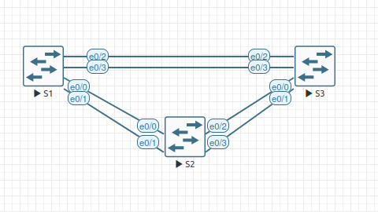

# Лабораторная №2
## Избыточность локальных сетей. STP 

### Цель задания
Научится конфигурировать транковые линки и линки доступа для различных VLAN а также настраивать маршрутизацию между VLAN в топологии "Роутер на палочке" (Router-on-a-Stick).

### Исходные данные
Задание выполняется в среде EVE-NG Pro Version 6.2.0-20

Коммутаторы S1, S2 и S3 - образ **L2-ADVENTERPRISEK9-M-15.2-20150703**  8 ethenet портов e0/0-3, e1/0-3
### Топология сети

### Таблица адресов
|Device|Interface|IP Address  |Subnet Mask  |
|------|---------|------------|-------------|
|S1    |VLAN 1   |192.168.1.1 |255.255.255.0|
|S2    |VLAN 1   |192.168.1.2 |255.255.255.0|
|S3    |VLAN 1   |192.168.1.3 |255.255.255.0|
