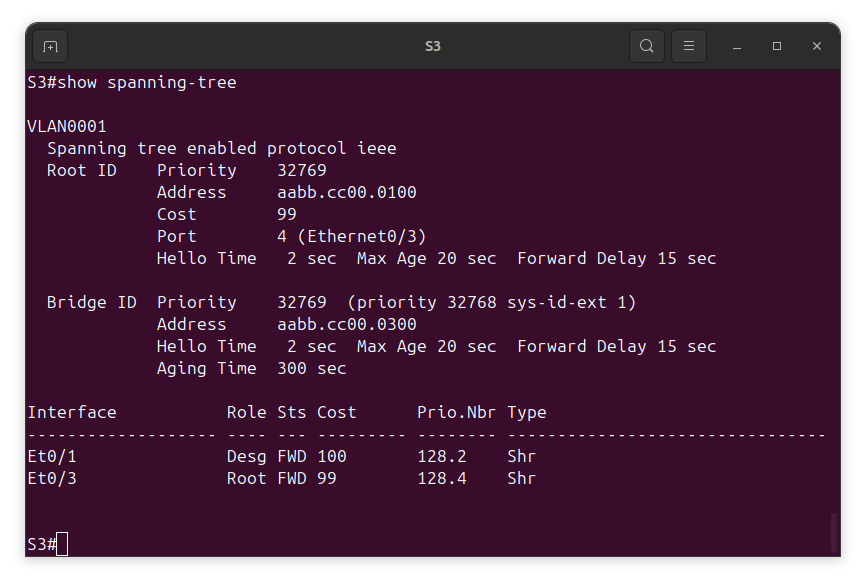
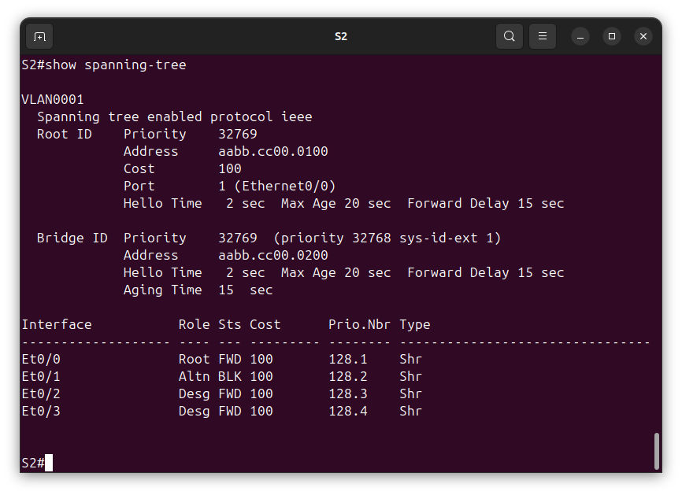
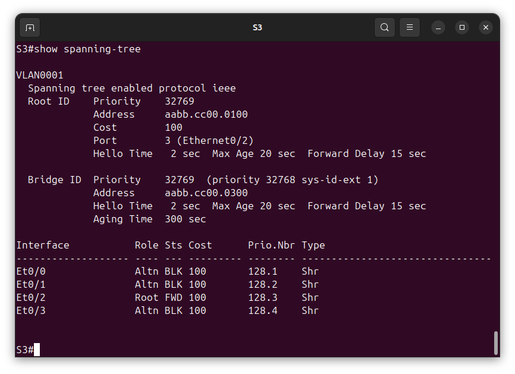

# Лабораторная №2
## Избыточность локальных сетей. STP 


### Цель задания
проанализировать протокол связующего дерева, назначение, функционирование и настройка STP.

### Исходные данные
Задание выполняется в среде EVE-NG Pro Version 6.2.0-20

Коммутаторы S1, S2 и S3 - образ **L2-ADVENTERPRISEK9-M-15.2-20150703** </br>8 ethenet портов e0/0-3, e1/0-3
### Топология сети


### Таблица адресов
|Device|Interface|IP Address  |Subnet Mask  |
|------|---------|------------|-------------|
|S1    |VLAN 1   |192.168.1.1 |255.255.255.0|
|S2    |VLAN 1   |192.168.1.2 |255.255.255.0|
|S3    |VLAN 1   |192.168.1.3 |255.255.255.0|

### Этапы выполнения

#### Создание сети и настройка основных параметров устройства
1. Настройка базовых параметров
    + Отключение поиска DNS
        ```
        (config)# no ip domain-lookup
        ```
    + Присвойте имена устройствам в соответствии с топологией.
        ```
        (config)# hostname S<n>
        ```
        где \<n> - номер коммутатора 
    + Назначьте **class** в качестве зашифрованного пароля доступа к привилегированному режиму.
        ```
        (config)# enable secret class
        ```
    + Назначьте **cisco** в качестве паролей консоли и VTY и активируйте вход для консоли и VTY каналов.
        ```
        (config)# line console 0
        (config-line)# password cisco
        (config-line)# login
        ```
        ```
        (config)# line vty 0 4
        (config-line)# password cisco
        (config-line)# login
        ```
    + Настройте logging synchronous для консольного канала.
        ```
        (config)# line console 0
        (config-line)# logging synchronous
        ```     
    + Настройте баннерное сообщение дня (MOTD) для предупреждения пользователей о запрете несанкционированного доступа.
        ```
        (config)# banner motd "Unauthorized access denied"
        ```
    + Задайте IP-адрес, указанный в таблице адресации для VLAN 1 на всех коммутаторах.
        ```
        (config)#interface vlan 1
        (config-if)# ip address 192.168.1.<n> 255.255.255.0
        (config-if)#no shutdown
        ```
        где \<n> - номер коммутатора
    + Скопируйте текущую конфигурацию в файл загрузочной конфигурации.
        ```
        # copy running-config startup-config
        ```
2. Проверка IP связности устройств 
    + Эхо запросы от коммутатора S1 на коммутатор S2
        ```
        # ping 192.168.1.2
        ```
        
    + Эхо запросы от коммутатора S1 на коммутатор S3
        ```
        # ping 192.168.1.3
        ```
        
    + Эхо запросы от коммутатора S2 на коммутатор S3
        ```
        # ping 192.168.1.3
        ```
        

#### Определение корневого моста
1. Отключить все порты на коммутаторах  
    ```
    (config)#interface range e0/0-3,e1/0-3
    (config-if-range)#shutdown
    ```
2. Настроить все подключенные порты в качестве транковых
    ```
    (config)#interface range e0/0-3
    (config-if-range)#switchport trunk encapsulation dot1q
    (config-if-range)#switchport mode trunk
    (config-if-range)#switchport trunk allowed vlan all  
    ```
3. Включить порты e0/1 и e0/3 на всех коммутаторах
    ```
    (config)#interface range e0/1,e0/3
    (config-if-range)#no shutdown
    ```
4. Отобразить данные протокола spanning-tree

    + **S1**
    ```
    S1#show spanning-tree
    ```
    
    + **S2**
    ```
    S2#show spanning-tree
    ```
    
    + **S3**
    ```
    S3#show spanning-tree
    ```
    

    

    Согласно выводу команды **show spanning-tree** Root Bridge стал  коммутатор **S1** с наименьшим значением mac адреса *aabb.cc80.0100*, т.к. Priority на всех коммутаторах установлен в дефолтное значение 32768.

    На коммутаторе **S2** root портом назначен *e0/1* порт а на коммутаторе **S3** root портом назначен *e0/3* порт т.к эти порты на прямую подключены к Root Bridge с учетом одинаковой стоимости линков.

    Назначенными портами на коммутаторе **S1** являются порты *e0/1* и *e0/3* т.к оба порта могут передавать информация от Root Bridge.
    Назначенными портами на коммутаторе **S2** является порт *e0/3* т.к порт может передавать информация от Root Bridge.
    
    Альтернативным портом выбран порт *e0/1* на коммутаторе **S3** т.к. у данного коммутатора наибольший Bridge ID (BID).

#### Наблюдение за процессом выбора протоколом STP порта, исходя из стоимости портов
1. Определите коммутатор с заблокированным портом на некорневых коммутаторах.

    ```
    S2#show spanning-tree
    ```
    
    
    ```
    S3#show spanning-tree
    ```
    

    заблокирован порт *e0/1* на коммутаторе **S3**

2. Изменим стоимость корневого порта на коммутаторе **S3**.
    
    ```
    (config)#interface e0/3 
    (config-if)#spanning-tree cost 99
    ```

3. Просмотр изменения протокола spanning-tree на некорневых коммутаторах.
    
    ```
    S2#show spanning-tree
    ```
    

    ```
    S3#show spanning-tree
    ```
    

4. Удаление изменения стоимости порта на коммутаторе **S3**.
    ```
    (config)#interface e0/3
    (config-if)#no spanning-tree cost 
    ```
Протокол spanning-tree меняет заблокированный порт и назначенный порт т.к. меняется стоимость пути до корневого коммутатора. Порт с более низкой стоимостью является приоритетным. 

#### Наблюдение за процессом выбора протоколом STP порта, исходя из приоритета портов

1. Включим порты *e0/0* и *e0/2* на всех коммутаторах
    ```
    (config)#interface range e0/0,e0/2
    (config-if-range)#no shutdown
    ```

2. Просмотр изменения протокола spanning-tree на некорневых коммутаторах.
    ```
    S2#show spanning-tree
    ```
    

    ```
    S3#show spanning-tree
    ```
    

