# Лабораторная №3
##  DHCPv4/v6 и SLAAC

### Цели задания


### Исходные данные

# Настройка DHCPv4
#### Создание сети и настройка основных параметров устройства
## 1. Установите схему адресации
Разбейте сеть на подсети 192.168.1.0/24, чтобы удовлетворить следующим требованиям:
    
   + «Подсеть A», поддерживающая 58 хостов (клиентская сеть на R1).
    
    Ближайшая подсеть удовлетворяющая условиям /26 содержащая до 62 хостов 

   + «Подсеть B», поддерживающая 28 хостов (управляющая сеть на R1).

    Ближайшая подсеть удовлетворяющая условиям /27 содержащая до 30 хостов

   + «Подсеть C», поддерживающая 12 хостов (клиентская сеть на R2).
  
    Ближайшая подсеть удовлетворяющая условиям /28 содержащая до 14 хостов

    |Подсеть  |Количество хостов        |Адрес сети     |Маска сети     |Обратная маска |Широковещательный адрес|
    |---------|-------------------------|---------------|---------------|---------------|-----------------------|              
    |Подсеть A|необходимо 58 доступно 62|192.168.1.0/26 |255.255.255.192|0.0.0.63       |192.168.1.63           |
    |Подсеть B|необходимо 28 доступно 30|192.168.1.64/27|255.255.255.224|0.0.0.31       |192.168.1.95           |
    |Подсеть C|необходимо 12 доступно 14|192.168.1.96/28|255.255.255.240|0.0.0.15       |192.168.1.111          |

## 2. Настройка базовых параметров
   + Присвойте имена устройствам в соответствии с топологией.
   ```
    (config)# hostname <X><n>
   ```
    где \<X> R - маршрутизатор S - коммутатор </br>
        \<n> номер устройства
   + Отключение поиска DNS
   ```
    (config)# no ip domain-lookup
   ```
   + Назначьте **class** в качестве зашифрованного пароля доступа к привилегированному режиму.
   ```
    (config)# enable secret class
   ```
   + Назначьте **cisco** в качестве паролей консоли и VTY
   ```
    (config)# line console 0
    (config-line)# password cisco
    (config-line)# login
   ```
   ```
    (config)# line vty 0 4
    (config-line)# password cisco
    (config-line)# login
   ```   
   + Включить шифрование паролей
   ```
    (config)# service password-encryption
   ```
   + Настройка баннерного сообщения дня (MOTD) для предупреждения пользователей о запрете несанкционированного доступа.
   ```
    (config)# banner motd "Unauthorized access denied"
   ```
   + Сохранение конфигурации
   ```
    #copy running-config startup-config
   ```
## 3. Настройка межвлановой маршрутизации на R1
   + Настраиваем саб-интерфейсы на R1
   ```
    R1(config)# interface g0/1.100
    R1(config-subif)# encapsulation dot1Q 100
    R1(config-subif)# description Clients   
    R1(config-subif)# ip address 192.168.1.1 255.255.255.192
    R1(config-subif)# exit
    R1(config)# interface g0/1.200
    R1(config-subif)# encapsulation dot1Q 200
    R1(config-subif)# description Management
    R1(config-subif)# ip address 192.168.1.62 255.255.255.224
    R1(config-subif)# exit
    R1(config)# interface g0/1.1000
    R1(config-subif)# encapsulation dot1Q 1000 native
    R1(config-subif)# description Native VLAN
    R1(config-subif)# exit
    R1(config)# interface g0/1
    R1(config-if)# no shutdown
   ```
## 4. Настройка интерфейса G0/1 на R2 и статической маршрутизации между R1 и R2 на интерфейсах G0/0
   + Настроим интерфейс G0/1 на R2
   ```
   R2(config)#interface g0/1
   R2(config-if)#description Clients R2
   R2(config-if)#ip address 192.168.1.97 255.255.255.240
   ```
   + Настройка интерфейсов G0/0 на маршрутизаторах R1 и R2
   ```
   R1(config)#interface g0/0
   R1(config-if)#description to_R2
   R1(config-if)#ip address 10.0.0.1 255.255.255.252
   R1(config-if)#no shutdown
   ```
   ```
   R2(config)#interface g0/0
   R2(config-if)#description to_R1
   R2(config-if)#ip address 10.0.0.2 255.255.255.252
   R2(config-if)#no shutdown
   ```
   + Настройка маршрутов по умолчанию на маршрутизаторах R1 и R2
   ```
   R1(config)#ip route 0.0.0.0 0.0.0.0 10.0.0.2
   ```
   ```
   R2(config)#ip route 0.0.0.0 0.0.0.0 10.0.0.1
   ```
   + Проверка статической маршрутизации между маршрутизаторами
   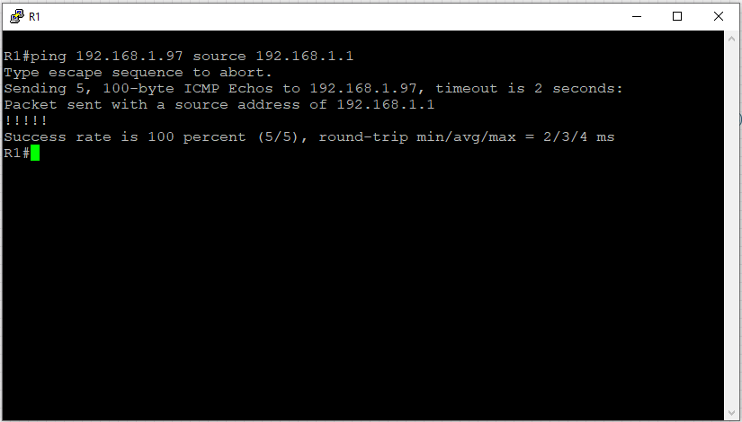

## 5. Настройка VLAN на коммутаторе S1
   + 
   ```
   S1(config)#vlan 100
   S1(config-vlan)#name Clients
   S1(config-vlan)#exit
   S1(config)#vlan 200
   S1(config-vlan)#name Management
   S1(config-vlan)#exit
   S1(config)#vlan 999
   S1(config-vlan)#name Parking_Lot
   S1(config-vlan)#exit
   S1(config)#vlan 1000
   S1(config-vlan)#name Native
   ```
   + Настройка интерфейса управления на S1
   ```
   S1(config)#interface vlan 200
   S1(config-if)#description Management
   S1(config-if)#ip address 192.168.1.66 255.255.255.224
   S1(config-if)#no shutdown
   S1(config-if)#exit
   S1(config)#ip route 0.0.0.0 0.0.0.0 192.168.1.65
   ```
   + Настройка интерфейса управления на S2
   ```
   S2(config)#interface vlan 1
   S2(config-if)#ip address 192.168.1.98 255.255.255.240
   S2(config-if)#no shutdown
   S2(config-if)#exit
   S2(config)#ip route 0.0.0.0 0.0.0.0 192.168.1.97
   ```
   + На коммутаторе S1 все неиспользуемые порты назначаем во VLAN 999 Parking_Lot и деактивируем их
   ```
   S1(config)#interface range g0/0-3, g1/2-3
   S1(config-if-range)#switchport mode access
   S1(config-if-range)#switchport access vlan 999
   S1(config-if-range)#shutdown
   ```
   + На коммутаторе S1 все неиспользуемые порты деактивируем
   ```
   S2(config)#interface range g0/0-3, g1/1-2
   S2(config-if-range)#shutdown
   ```
   + Настройка портов на коммутаторе S1
   ```
   S1(config)#interface g1/1
   S1(config-if)#switchport mode access
   S1(config-if)#switchport access vlan 100
   S1(config-if)#description to_Clients
   S1(config-if)#exit
   S1(config)#interface g1/0
   S1(config-if)#switchport trunk encapsulation dot1q
   S1(config-if)#switchport mode trunk
   S1(config-if)#switchport trunk allowed vlan 100,200,1000
   S1(config-if)#switchport trunk native vlan 1000
   S1(config-if)#description Trunk to_R1
   ```
## 6. Настройка DHCP сервера на маршрутизаторе R1
   + Исключаем первые 5 адресов из каждой клиентской подсети 
   ```
   R1(config)#ip dhcp excluded-address 192.168.1.1 192.168.1.5
   R1(config)#ip dhcp excluded-address 192.168.1.97 192.168.1.101
   ```
   + Настраиваем пулы адресов для каждой клиентской подсети 
   ```
   R1(config) ip dhcp pool Clients_R1
   R1(dhcp-config)# network 192.168.1.0 255.255.255.192
   R1(dhcp-config)# default-router 192.168.1.1
   R1(dhcp-config)# domain-name ccna-lab.com
   R1(dhcp-config)# lease 2 12 30
   R1(dhcp-config)# exit
   R1(config)#ip dhcp pool R2_Clients_LAN
   R1(dhcp-config)#network 192.168.1.96 255.255.255.240
   R1(dhcp-config)#default-router 192.168.1.97
   R1(dhcp-config)#domain-name ccna-lab.com
   R1(dhcp-config)#lease 2 12 30
   ```
## 7. Настройка DHCP Relay на маршрутизаторе R2
   + На клиентском интерфейсе G0/1 настроим IP helper
   ```
   R2(config)#interface g0/1
   R2(config-if)#ip helper-address 10.0.0.1
   ```

## 8. Проверка работоспособности
   + Проверка получения адреса клиентами PC-A и PC-B
   
   PC-A получен адрес 192.168.1.6 из подсети A
   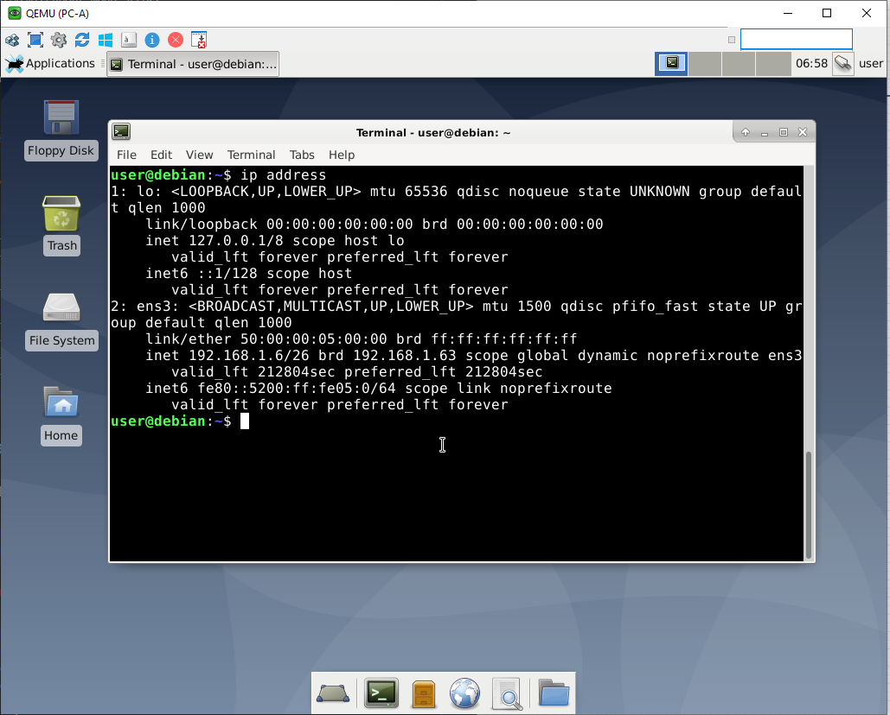

   PC-B получен адрес 192.168.1.102 из подсети C
   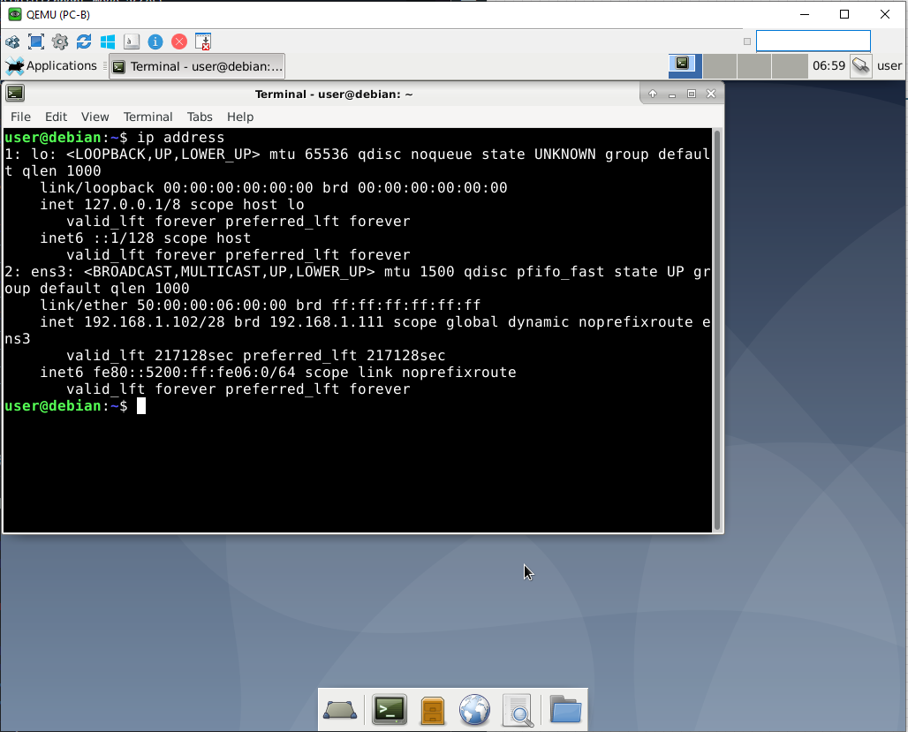

   + Проверка конфигурации сервера DHCP на R1

   ```
   show ip dhcp pool
   ```
   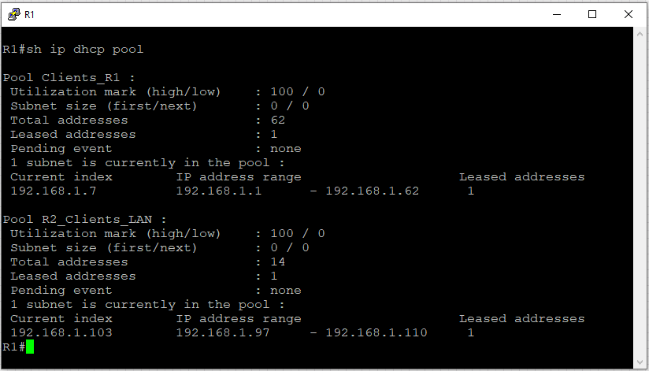

   ```
   show ip dhcp bindings
   ```
   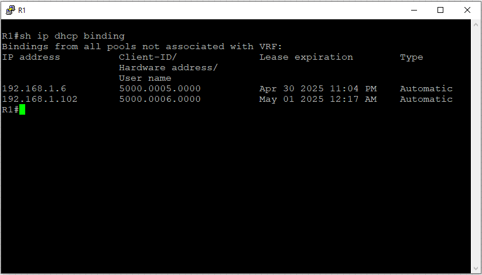

   ```
   show ip dhcp server statistics
   ```
   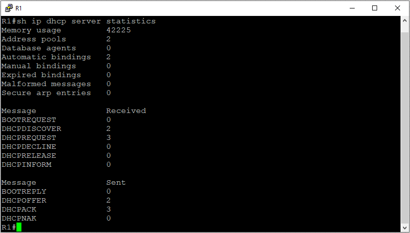

# Настройка DHCPv6

## 1. Настройка Stateless IPv6 адресов на PC-A и PC-B
   + R1
   ```
   R1(config)#ipv6 unicast-routing
   R1(config)#interface g0/0
   R1(config-if)# ipv6 address fe80::1 link-local
   R1(config-if)# ipv6 address 2001:db8:acad:2::1/64
   R1(config-if)#exit
   R1(config)#interface GigabitEthernet0/1.100
   R1(config-subif)# ipv6 address fe80::1 link-local
   R1(config-subif)# ipv6 address 2001:db8:acad:1::1/64
   R1(config-if)#exit
   R2(config)#ipv6 route ::/0 2001:db8:acad:2::2
   ```
   + R2
   ```
   R2(config)#ipv6 unicast-routing
   R2(config)#interface g0/0
   R2(config-if)# ipv6 address fe80::2 link-local
   R2(config-if)# ipv6 address 2001:db8:acad:2::2/64
   R2(config-if)#exit
   R2(config)#interface g0/1
   R2(config-if)# ipv6 address fe80::1 link-local
   R2(config-if)# ipv6 address 2001:db8:acad:3::1/64
   R2(config-if)#exit
   R2(config)#ipv6 route ::/0 2001:db8:acad:2::1
   ```
## 2. Проверка получения адреса IPv6 от маршрутизаторов и IPv6 связи между PC-A и PC-B

   + R1
   
   + PC-A
   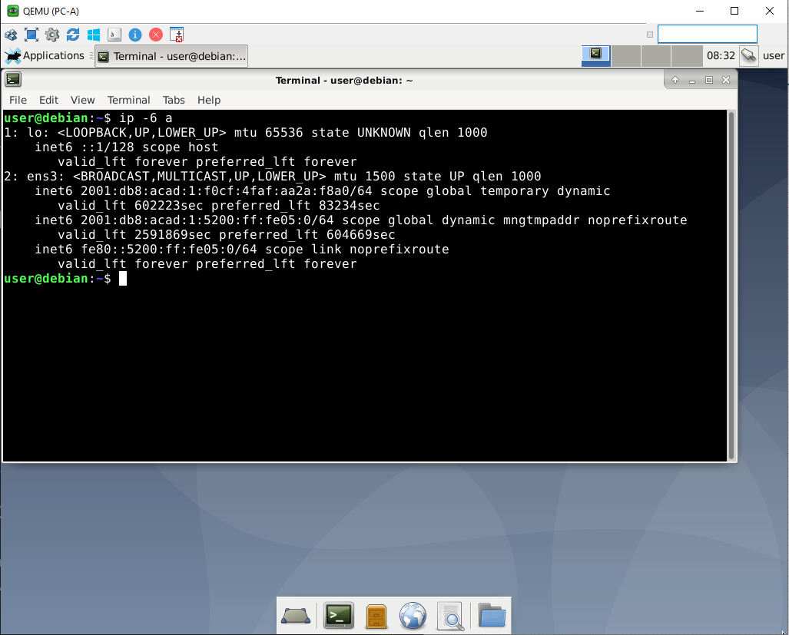
   + R2
   
   + PC-B
   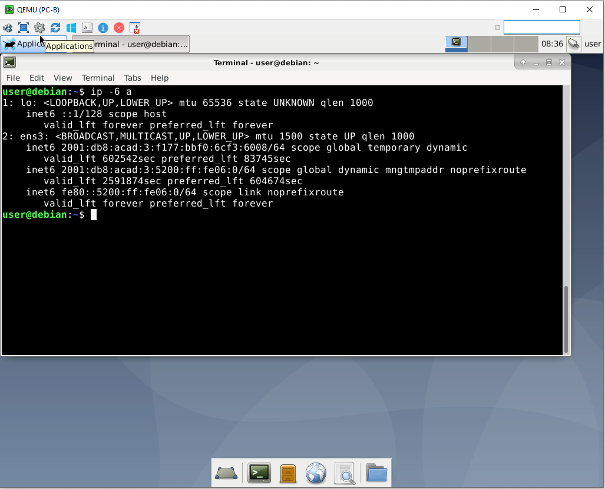
   + пинги от PC-A к PC-B
   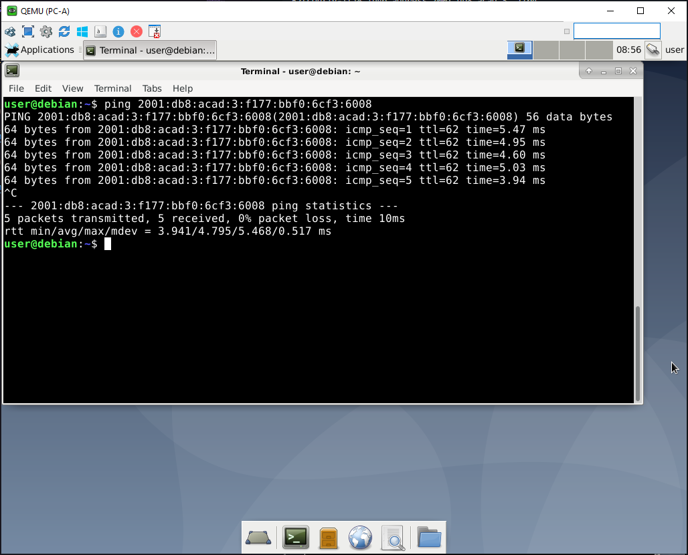
   + пингт от PC-B к PC-A
   

## 3. Настройка Stateless IPv6 адресов с получением дополнительных параметров от DHCPv6
   + R1
   ```
   R1(config)#ipv6 dhcp pool R1-STATELESS
   R1(config-dhcpv6)#dns-server 2001:db8:acad::254
   R1(config-dhcpv6)#domain-name SATTELESS.com
   R1(config-dhcpv6)#exit
   R1(config)#interface g0/1.100
   R1(config-subif)#ipv6 nd other-config-flag
   R1(config-subif)#ipv6 dhcp server R1-STATELESS

   ```
   + Проверка правильности настройки R1
   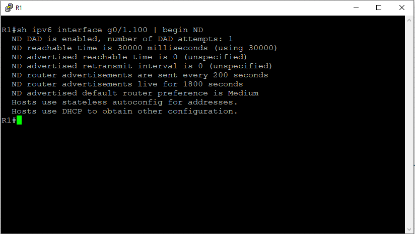
   
   + Проверка получения IPv6 адреса DNS сервера на PC-A
   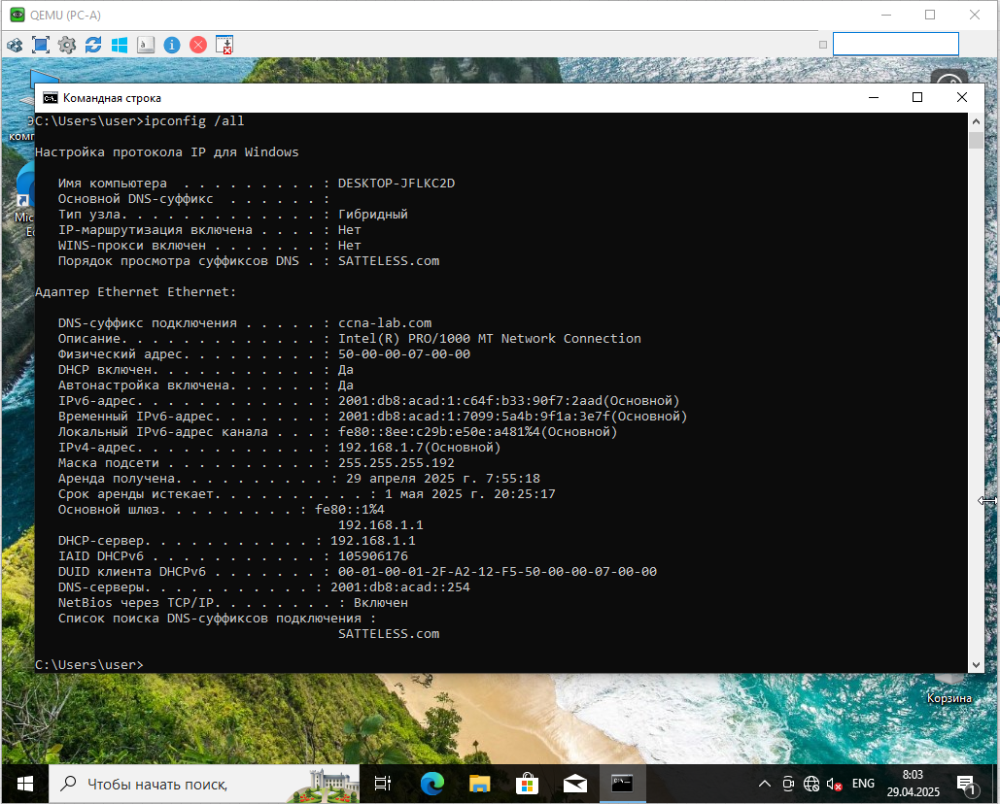
   
## 4. Настройка Stateful DHCPv6 сервера на R1
   + R1
   ```
   R1(config)#ipv6 dhcp pool R2-STATEFUL
   R1(config-dhcpv6)#address prefix 2001:db8:acad:3:aaa::/80
   R1(config-dhcpv6)#dns-server 2001:db8:acad::254
   R1(config-dhcpv6)#domain-name SATTEFUL.com
   R1(config-dhcpv6)#exit
   R1(config)#interface g0/0
   R1(config-if)#ipv6 dhcp server R2-STATEFUL

   ```
   + Настройка DHCPv6 relay на R2
   ```
   R2(config)#interface g0/1
   R2(config)#ipv6 nd managed-config-flag
   R2(config)#ipv6 dhcp relay destination 2001:db8:acad:2::1 g0/0
   ```
   + 