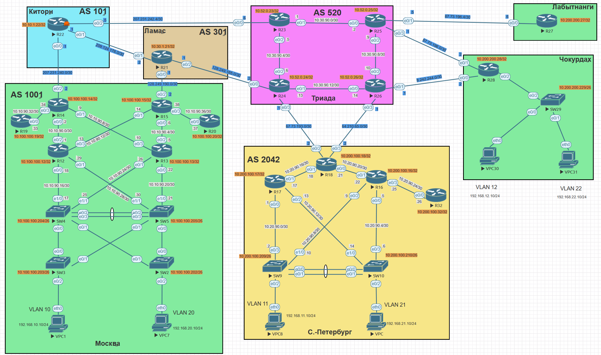

# Лабораторная №4
##  DHCPv4/v6 и SLAAC

### Цели задания
Распланировать адресное пространство, настроить IP на всех активных портах. Адресное пространство должно быть задокументировано.

### Топология сети

### Задачи:

+ Разработаете и задокументируете адресное пространство для лабораторного стенда.
+ Настроите ip адреса на каждом активном порту
+ Настроите каждый VPC в каждом офисе в своем VLAN.
+ Настроите VLAN/Loopbackup interface управления для сетевых устройств
+ Настроите сети офисов так, чтобы не возникало broadcast штормов, а использование линков было максимально оптимизировано
+ Используете IPv4. IPv6 по желанию

## Таблица адресов для AS 101 (Киторн)
| Device | Interface | IP Address     | Subnet Mask     | Default Gateway | Description  |
| ------ | --------- | -------------- | --------------- | --------------- | -------------|
| R22    | lo0       | 10.10.1.22     | 255.255.255.255 |                 | Loopback_R22 |
|        | e0/0      | 207.231.240.1  | 255.255.255.252 |                 | to_R14_AS1001|
|        | e0/1      | 209.124.176.1  | 255.255.255.252 |                 | to_R21_AS301 |
|        | e0/2      | 207.231.242.5  | 255.255.255.252 |                 | to_R23_AS520 |

## Таблица адресов для AS 301 (Ламас)
| Device | Interface | IP Address     | Subnet Mask     | Default Gateway | Description  |
| ------ | --------- | -------------- | --------------- | --------------- | -------------|
| R21    | lo0       | 10.30.1.21     | 255.255.255.255 |                 | Loopback_R21 |
|        | e0/0      | 128.249.190.1  | 255.255.255.252 |                 | to_R15_AS1001|
|        | e0/1      | 209.124.176.2  | 255.255.255.252 |                 | to_R22_AS101 |
|        | e0/2      | 128.249.165.1  | 255.255.255.252 |                 | to_R24_AS520 |

## Таблица адресов для AS 520 (Триада)
| Device | Interface | IP Address      | Subnet Mask     | Default Gateway | Description  |
| ------ | --------- | --------------- | --------------- | --------------- | -------------|
| R23    | lo0       | 10.52.0.23      | 255.255.255.255 |                 | Loopback_R23 |
|        | e0/0      | 207.231.242.6   | 255.255.255.252 |                 | to_R22_AS101 | 
|        | e0/1      | 10.30.90.1      | 255.255.255.252 |                 | to_R25       |
|        | e0/2      | 10.30.90.5      | 255.255.255.252 |                 | to_R24       |
| R24    | lo0       | 10.52.0.24      | 255.255.255.255 |                 | Loopback_R24 |
|        | e0/0      | 128.249.165.2   | 255.255.255.252 |                 | to_R21_AS301 |
|        | e0/1      | 10.30.90.13     | 255.255.255.252 |                 | to_R26       |
|        | e0/2      | 10.30.90.6      | 255.255.255.252 |                 | to_R23       |
|        | e0/3      | 67.73.193.1     | 255.255.255.252 |                 | to_R18_AS2042|
| R25    | lo0       | 10.52.0.25      | 255.255.255.255 |                 | Loopback_R25 |
|        | e0/0      | 10.30.90.2      | 255.255.255.252 |                 | to_R23       |
|        | e0/1      | 67.73.196.5     | 255.255.255.252 |                 | to_R27_ext   |
|        | e0/2      | 10.30.90.9      | 255.255.255.252 |                 | to_R26       |
|        | e0/3      | 67.73.196.1     | 255.255.255.252 |                 | to_R28_ext   |
| R26    | lo0       | 10.52.0.26      | 255.255.255.255 |                 | Loopback_R26 |
|        | e0/0      | 10.30.90.14     | 255.255.255.252 |                 | to_R24       |
|        | e0/1      | 8.242.244.1     | 255.255.255.252 |                 | to_R28_ext   |
|        | e0/2      | 10.30.90.10     | 255.255.255.252 |                 | to_R25       |
|        | e0/3      | 64.210.65.1     | 255.255.255.252 |                 | to_R18_AS2042|

## Таблица адресов для Лабытнанги
| Device | Interface | IP Address      | Subnet Mask     | Default Gateway | Description  |
| ------ | --------- | --------------- | --------------- | --------------- | -------------|
| R27    | lo0       | 10.200.200.27   | 255.255.255.255 |                 | Loopback_R27 |
|        | e0/0      | 67.73.196.6     | 255.255.255.252 |                 | to_R25_ext   |

## Таблица адресов AS 1001 (Москва)
| Device | Interface | IP Address     | Subnet Mask     | Default Gateway | Description  |
| ------ | --------- | -------------- | --------------- | --------------- | -------------|
| R14    | lo0       | 10.100.100.14  | 255.255.255.255 |                 | Loopback_R14 |
|        | e0/0      | 10.10.90.2     | 255.255.255.252 |                 | to_R12       |
|        | e0/1      | 10.10.90.9     | 255.255.255.252 |                 | to_R13       |
|        | e0/2      | 207.231.240.2  | 255.255.255.252 |                 | to_R22_AS101 |
|        | e0/3      | 10.10.90.34    | 255.255.255.252 |                 | to_R19       |
| R15    | lo0       | 10.100.100.15  | 255.255.255.255 |                 | Loopback_R15 | 
|        | e0/0      | 10.10.90.6     | 255.255.255.252 |                 | to_R13       |
|        | e0/1      | 10.10.90.14    | 255.255.255.252 |                 | to_R12       |
|        | e0/2      | 128.249.190.2  | 255.255.255.252 |                 | to_R21_AS301 |
|        | e0/3      | 10.10.90.38    | 255.255.255.252 |                 | to_R20
| R12    | lo0       | 10.100.100.12  | 255.255.255.255 |                 | Loopback_R12 |
|        | e0/0      | 10.10.90.18    | 255.255.255.252 |                 | to_SW4       |
|        | e0/1      | 10.10.90.29    | 255.255.255.252 |                 | to_SW5       |
|        | e0/2      | 10.10.90.1     | 255.255.255.252 |                 | to_R14       |
|        | e0/3      | 10.10.90.13    | 255.255.255.252 |                 | to_R15       |
| R13    | lo0       | 10.100.100.13  | 255.255.255.255 |                 | Loopback_R13 |
|        | e0/0      | 10.10.90.22    | 255.255.255.252 |                 | to_SW5       |
|        | e0/1      | 10.10.90.26    | 255.255.255.252 |                 | to_SW4       |
|        | e0/2      | 10.10.90.5     | 255.255.255.252 |                 | to_R15       |
|        | e0/3      | 10.10.90.10    | 255.255.255.252 |                 | to_R14       |
| R19    | lo0       | 10.100.100.19  | 255.255.255.255 |                 | Loopback_R19 |
|        | e0/0      | 10.10.90.33    | 255.255.255.252 |                 | to_R14       |
| R20    | lo0       | 10.100.100.20  | 255.255.255.255 |                 | Loopback_R20 |
|        | e0/0      | 10.10.90.37    | 255.255.255.252 |                 | to_R15       |
| SW2    | lo0       | 10.100.100.102 | 255.255.255.255 |                 | Loopback_SW2 |
| SW3    | lo0       | 10.100.100.103 | 255.255.255.255 |                 | Loopback_SW3 |
| SW4    | lo0       | 10.100.100.104 | 255.255.255.255 |                 | Loopback_SW4 |
| SW5    | lo0       | 10.100.100.105 | 255.255.255.255 |                 | Loopback_SW5 |
| VPC1   | eth0      | 192.168.10.10  | 255.255.255.0   | 192.168.10.1    |              |
| VPC7   | eth0      | 192.168.20.10  | 255.255.255.0   | 192.168.20.1    |              |

## Таблица VLAN для AS 1001 (Москва)
| VLAN | Name       | Назначенный интерфейс    |
| ---- | ---------- | ----------------------   |
| 10   | Client 10  | SW3: e0/2                |
| 20   | Client 20  | SW2: e0/2                |
| 90   | MGMT       | SW2,SW3,SW4,SW5: VLAN 90 |
| 999  | ParkingLot | SW3,SW4: Et0/3,Et1/0-3   |