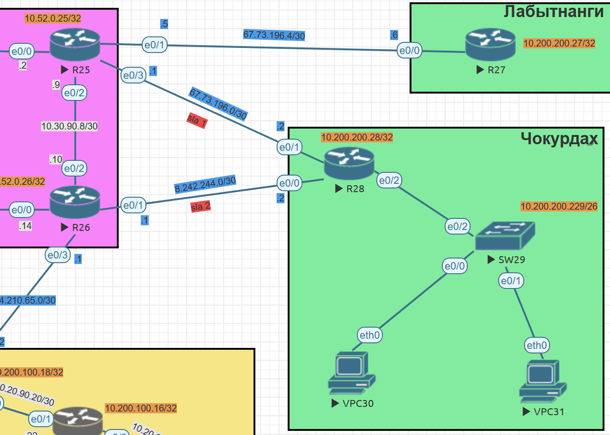
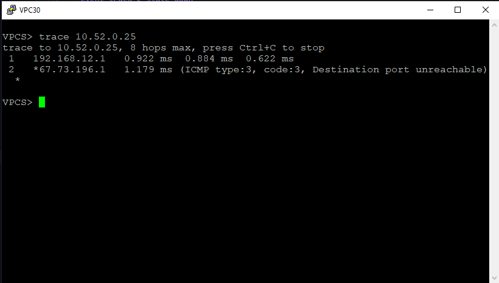
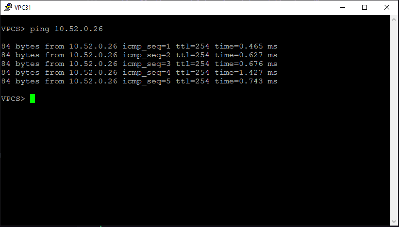
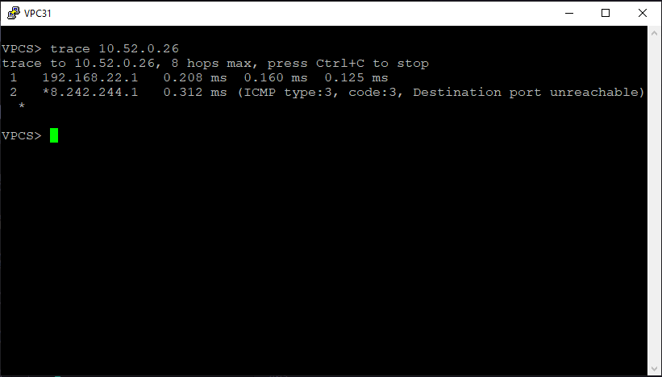
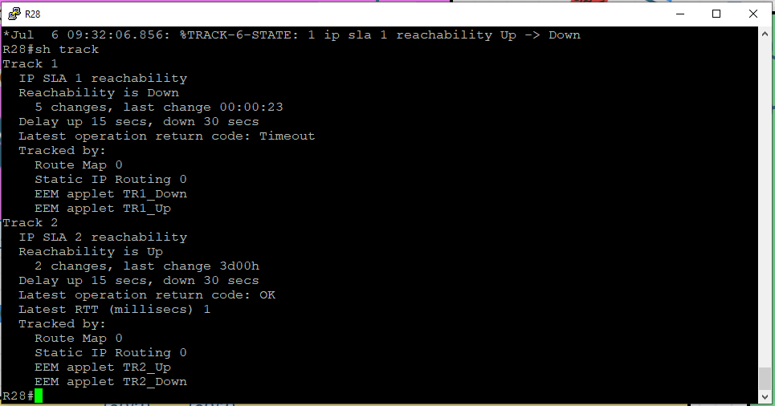
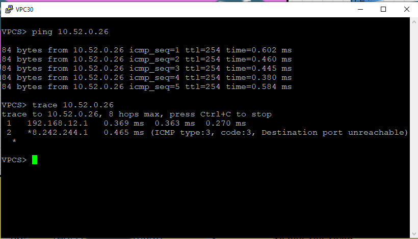

# Лабораторная №5

## Маршрутизация на основе политик (PBR)

### Цели задания

- разобрать правила образования политик маршрутизации;
- выбор маршрута на основе политики;
- отслеживание падений каналов;

### Топология сети



### Задачи

- Настроите политику маршрутизации для сетей офиса.
- Распределите трафик между двумя линками с провайдером.
- Настроите отслеживание линка через технологию IP SLA.(только для IPv4)
- Настройте для офиса Лабытнанги маршрут по-умолчанию.
- План работы и изменения зафиксированы в документации.

## Таблица адресов для Лабытнанги

Адресация для оборудования берется из предыдущей [лабораторной работы #4](../lab_04/README.md)

| Device | Interface | IP Address    | Subnet Mask     | Default Gateway | Description  |
| ------ | --------- | ------------- | --------------- | --------------- | ------------ |
| R27    | lo0       | 10.200.200.27 | 255.255.255.255 |                 | Loopback_R27 |
|        | e0/0      | 67.73.196.6   | 255.255.255.252 |                 | to_R25_ext   |

## Таблица адресов Чокурдан

| Device | Interface | IP Address     | Subnet Mask     | Default Gateway | Description  |
| ------ | --------- | -------------- | --------------- | --------------- | ------------ |
| R28    | lo0       | 10.200.200.28  | 255.255.255.255 |                 | Loopback_R28 |
|        | e0/0      | 67.73.196.2    | 255.255.255.252 |                 | to_R26_AS520 |
|        | e0/1      | 8.242.244.2    | 255.255.255.252 |                 | to_R25_AS520 |
|        | e0/2.12   | 192.168.12.1   | 255.255.255.0   |                 |              |
|        | e0/2.22   | 192.168.22.1   | 255.255.255.0   |                 |              |
|        | e0/2.102  | 10.200.200.193 | 255.255.255.192 |                 | MGMT         |
| SW29   | vlan102   | 10.200.200.229 | 255.255.255.192 | 10.200.200.193  | MGMT         |
| VPC30  | eth0      | 192.168.12.10  | 255.255.255.0   | 192.168.12.1    |              |
| VPC31  | eht0      | 192.168.22.10  | 255.255.255.0   | 192.168.22.1    |              |

## Таблица VLAN для Чокурдан

| VLAN | Name      | Назначенный интерфейс |
| ---- | --------- | --------------------- |
| 12   | Client 12 | SW29: e0/0            |
| 22   | Client 22 | SW29: e0/1            |
| 102  | MGMT      | SW29: VLAN 102        |

# Настройка устройств:

<details>
<summary> Настройка базовых параметров</summary>

Настройка произведена в [лабораторной работе № 4](../lab_04/README.md)

- Присвойте имена устройствам в соответствии с топологией.

```
 (config)# hostname <X><n>
```

    где \<X> R - маршрутизатор S - коммутатор </br>
        \<n> номер устройства

- Отключение поиска DNS

```
 (config)# no ip domain-lookup
```

- Назначьте **class** в качестве зашифрованного пароля доступа к привилегированному режиму.

```
 (config)# enable secret class
```

- Назначьте **cisco** в качестве паролей консоли и VTY

```
 (config)# line console 0
 (config-line)# password cisco
 (config-line)# login
```

```
 (config)# line vty 0 4
 (config-line)# password cisco
 (config-line)# login
```

- Включить шифрование паролей

```
 (config)# service password-encryption
```

- Настройка баннерного сообщения дня (MOTD) для предупреждения пользователей о запрете несанкционированного доступа.

```
 (config)# banner motd "Unauthorized access denied"
```

- Сохранение конфигурации

```
 #copy running-config startup-config
```

</details>

# Настраиваем интерфейсы и ip адреса

## Лабытнанги

<details>

<summary> Настраиваем интерфейсы для маршрутизатора R27: </summary>

Настройка произведена в [лабораторной работе № 4](../lab_04/README.md)

```
interface Loopback0
 description Loopback_R27
 ip address 10.200.200.27 255.255.255.255
!
interface Ethernet0/0
 description to_R25_ext
 ip address 67.73.196.6 255.255.255.252
!
```

Настраиваем маршрут по умолчанию для маршрутизатора R27:

```
ip route 0.0.0.0 0.0.0.0 67.73.196.5
```

</details>

## Чокурдах

<details>

<summary> Настраиваем интерфейсы для маршрутизатора R28: </summary>

Настройка произведена в [лабораторной работе № 4](../lab_04/README.md)

```
interface Loopback0
 no shutdown
 description Loopback_R28
 ip address 10.200.200.28 255.255.255.255
!
interface Ethernet0/0
 no shutdown
 description to_R26_AS520
 ip address 8.242.244.2 255.255.255.252
!
interface Ethernet0/1
 no shutdown
 description to_R25_AS520
 ip address 67.73.196.2 255.255.255.252
!
interface Ethernet0/2.12
 no shutdown
 description Client VLAN 12
 encapsulation dot1Q 12
 ip address 192.168.12.1 255.255.255.0
!
interface Ethernet0/2.22
 no shutdown
 description Client VLAN 22
 encapsulation dot1Q 22
 ip address 192.168.22.1 255.255.255.0
!
interface Ethernet0/2.102
 no shutdown
 description MGMT
 encapsulation dot1Q 102
 ip address 10.200.200.193 255.255.255.192
!

```

</details>

<details>

<summary> Настраиваем интерфейсы для коммутатора SW29: </summary>

Настройка произведена в [лабораторной работе № 4](../lab_04/README.md)

```
interface Ethernet0/0
 no shutdown
 switchport access vlan 12
 switchport mode access
!
interface Ethernet0/1
 no shutdown
 switchport access vlan 22
 switchport mode access
!
interface Ethernet0/2
 no shutdown
 switchport trunk encapsulation dot1q
 switchport mode trunk
!
interface Ethernet0/3
 no shutdown
!
interface Vlan102
 no shutdown
 description MGMT
 ip address 10.200.200.229 255.255.255.192
```

</details>

<details>

<summary> Настраиваем VPC30: </summary>

Настройка произведена в [лабораторной работе № 4](../lab_04/README.md)

```
set pcname VPCS
ip 192.168.10.10 192.168.10.1 24
```

</details>

<details>

<summary> Настраиваем VPC31: </summary>

```
set pcname VPCS
ip 192.168.20.10 192.168.20.1 24
```

</details>

<details>

<summary> Настраиваем маршрутизатор R28: </summary>

- создаем аксес листы для локальных сетей

```
!
access-list 112 permit ip 192.168.12.0 0.0.0.255 any
access-list 122 permit ip 192.168.22.0 0.0.0.255 any

```

- настраиваем Service Level Agreements и track для внешних шлюзов

```
!
ip sla 1
 icmp-echo 67.73.196.1 source-ip 67.73.196.2
 frequency 10
ip sla schedule 1 life forever start-time now
ip sla 2
 icmp-echo 8.242.244.1 source-ip 8.242.244.2
 frequency 10
ip sla schedule 2 life forever start-time now
!

!
track 1 ip sla 1 reachability
 delay down 30 up 15
!
track 2 ip sla 2 reachability
 delay down 30 up 15

```

- настраиваем маршруты по умолчанию и включаем на них tracking

```
ip route 0.0.0.0 0.0.0.0 67.73.196.1 10 track 1
ip route 0.0.0.0 0.0.0.0 8.242.244.1 20 track 2
!

```

- настраиваем Route Map для tracking

```
route-map rm_TRACKING permit 10
 match ip address 112
 set ip next-hop verify-availability 67.73.196.1 10 track 1
 set ip next-hop verify-availability 8.242.244.1 20 track 2
!
route-map rm_TRACKING permit 20
 match ip address 122
 set ip next-hop verify-availability 8.242.244.1 10 track 2
 set ip next-hop verify-availability 67.73.196.1 20 track 1

```

- настраиваем Route Map для NAT

```
!
route-map rm_NAT_via_e0/1 permit 10
 match ip address 112 122
 match interface Ethernet0/1
 set ip next-hop 67.73.196.1
!
route-map rm_NAT_via_e0/0 permit 10
 match ip address 122 112
 match interface Ethernet0/0
 set ip next-hop 8.242.244.1

```

- на внешних интерфейсах включаем NAT

```
!
interface Ethernet0/0
 description to_R26_AS520
 ip address 8.242.244.2 255.255.255.252
 ip nat outside
 ip virtual-reassembly in
!
interface Ethernet0/1
 description to_R25_AS520
 ip address 67.73.196.2 255.255.255.252
 ip nat outside
 ip virtual-reassembly in

```

- на внутренних интерфейсах применяем политику rm_TRACKING

```
!
interface Ethernet0/2.12
 description Client VLAN 12
 encapsulation dot1Q 12
 ip address 192.168.12.1 255.255.255.0
 ip nat inside
 ip nat enable
 ip virtual-reassembly in
 ip policy route-map rm_TRACKING
!
interface Ethernet0/2.22
 description Client VLAN 22
 encapsulation dot1Q 22
 ip address 192.168.22.1 255.255.255.0
 ip nat inside
 ip nat enable
 ip virtual-reassembly in
 ip policy route-map rm_TRACKING
!

```

- включаем NAT

```
!
ip nat inside source route-map rm_NAT_via_e0/0 interface Ethernet0/0 overload
ip nat inside source route-map rm_NAT_via_e0/1 interface Ethernet0/1 overload

```

- настроим event manager для очищения таблицы NAT при срабатывания TRACKING

```
!
event manager applet TR1_Down
 event track 1 state down
 action 10 wait 20
 action 20 cli command "enable"
 action 30 cli command "clear ip nat translation forced"
event manager applet TR1_Up
 event track 1 state up
 action 10 wait 20
 action 20 cli command "enable"
 action 30 cli command "clear ip nat translation forced"
event manager applet TR2_Down
 event track 2 state down
 action 10 wait 20
 action 20 cli command "enable"
 action 30 cli command "clear ip nat translation forced"
event manager applet TR2_Up
 event track 2 state up
 action 10 wait 20
 action 20 cli command "enable"
 action 30 cli command "clear ip nat translation forced"

```

</details>

# Проверка работоспособности

<details>
<summary> ping и trace от VPC30 до R25 </summary>




</details>

<details>
<summary> ping и trace от VPC31 до R26 </summary>





</details>

<details>
<summary> проверка TRACKING </summary>

отключим линию от R28 к R25


ping от VPC30 до R 26


</details>

### [Файлы конфигураций устройств ](./config/)
