# Лабораторная №6

## OSPF. Фильтрация

### Цели задания

- настроить OSPF офисе Москва
- разделить сеть на зоны
- настроить фильтрацию между зонами

### Топология сети

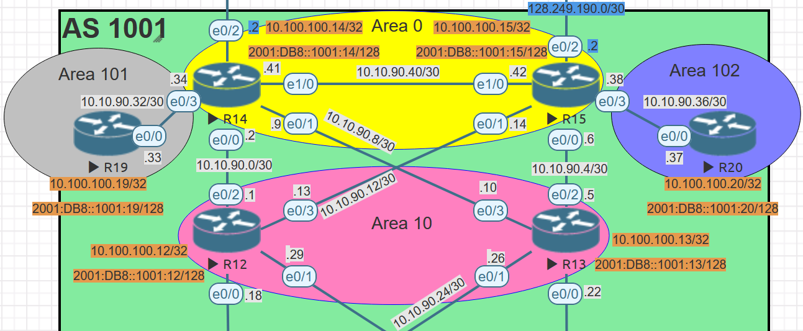

### Задачи

- Маршрутизаторы R14-R15 находятся в зоне 0 - backbone.
- Маршрутизаторы R12-R13 находятся в зоне 10. Дополнительно к маршрутам должны получать маршрут по умолчанию.
- Маршрутизатор R19 находится в зоне 101 и получает только маршрут по умолчанию.
- Маршрутизатор R20 находится в зоне 102 и получает все маршруты, кроме маршрутов до сетей зоны 101.
- Настройка для IPv6 повторяет логику IPv4.
- План работы и изменения зафиксированы в документации .

## Таблица адресов

IPv4 адреса для оборудования берется из предыдущей [лабораторной работы #4](../lab_04/README.md)

| Device | Interface | IP Address    | Subnet Mask     | Default Gateway | Description  |
| ------ | --------- | ------------- | --------------- | --------------- | ------------ |
| R14    | lo0       | 10.100.100.14 | 255.255.255.255 |                 | Loopback_R14 |
|        | e0/0      | 10.10.90.2    | 255.255.255.252 |                 | to_R12       |
|        | e0/1      | 10.10.90.9    | 255.255.255.252 |                 | to_R13       |
|        | e0/2      | 207.231.240.2 | 255.255.255.252 |                 | to_R22_AS101 |
|        | e0/3      | 10.10.90.34   | 255.255.255.252 |                 | to_R19       |
|        | e1/0      | 10.10.90.41   | 255.255.255.252 |                 | to_R15       |
| R15    | lo0       | 10.100.100.15 | 255.255.255.255 |                 | Loopback_R15 |
|        | e0/0      | 10.10.90.6    | 255.255.255.252 |                 | to_R13       |
|        | e0/1      | 10.10.90.14   | 255.255.255.252 |                 | to_R12       |
|        | e0/2      | 128.249.190.2 | 255.255.255.252 |                 | to_R21_AS301 |
|        | e0/3      | 10.10.90.38   | 255.255.255.252 |                 | to_R20       |
|        | e1/0      | 10.10.90.42   | 255.255.255.252 |                 | to_R14       |
| R12    | lo0       | 10.100.100.12 | 255.255.255.255 |                 | Loopback_R12 |
|        | e0/0      | 10.10.90.18   | 255.255.255.252 |                 | to_SW4       |
|        | e0/1      | 10.10.90.29   | 255.255.255.252 |                 | to_SW5       |
|        | e0/2      | 10.10.90.1    | 255.255.255.252 |                 | to_R14       |
|        | e0/3      | 10.10.90.13   | 255.255.255.252 |                 | to_R15       |
| R13    | lo0       | 10.100.100.13 | 255.255.255.255 |                 | Loopback_R13 |
|        | e0/0      | 10.10.90.22   | 255.255.255.252 |                 | to_SW5       |
|        | e0/1      | 10.10.90.26   | 255.255.255.252 |                 | to_SW4       |
|        | e0/2      | 10.10.90.5    | 255.255.255.252 |                 | to_R15       |
|        | e0/3      | 10.10.90.10   | 255.255.255.252 |                 | to_R14       |
| R19    | lo0       | 10.100.100.19 | 255.255.255.255 |                 | Loopback_R19 |
|        | e0/0      | 10.10.90.33   | 255.255.255.252 |                 | to_R14       |
| R20    | lo0       | 10.100.100.20 | 255.255.255.255 |                 | Loopback_R20 |
|        | e0/0      | 10.10.90.37   | 255.255.255.252 |                 | to_R15       |

IPV6 адреса для оборудования

| Device | Interface | IPv6 Address          | IPv6 link-local     | Default Gateway | Description  |
| ------ | --------- | --------------------- | ------------------- | --------------- | ------------ |
| R14    | lo0       | 2001:DB8::1001:14/128 |                     |                 | Loopback_R14 |
|        | e0/0      | 2001:DB8:1214::14/64  | FE80::14 link-local |                 | to_R12       |
|        | e0/1      | 2001:DB8:1314::14/64  | FE80::14 link-local |                 | to_R13       |
|        | e0/3      | 2001:DB8:1419::14/64  | FE80::14 link-local |                 | to_R19       |
|        | e1/0      | 2001:DB8:1415::14/64  | FE80::14 link-local |                 | to_R15       |
| R15    | lo0       | 2001:DB8::1001:15/128 |                     |                 | Loopback_R15 |
|        | e0/0      | 2001:DB8:1315::15/64  | FE80::15 link-local |                 | to_R13       |
|        | e0/1      | 2001:DB8:1215::15/64  | FE80::15 link-local |                 | to_R12       |
|        | e0/3      | 2001:DB8:1520::15/64  | FE80::15 link-local |                 | to_R12       |
|        | e1/0      | 2001:DB8:1415::15/64  | FE80::15 link-local |                 | to_R14       |
| R12    | lo0       | 2001:DB8::1001:12/128 |                     |                 | Loopback_R12 |
|        | e0/2      | 2001:DB8:1214::12/64  | FE80::12 link-local |                 | to_R14       |
|        | e0/3      | 2001:DB8:1215::12/64  | FE80::12 link-local |                 | to_R15       |
| R13    | lo0       | 2001:DB8::1001:13/128 |                     |                 | Loopback_R13 |
|        | e0/2      | 2001:DB8:1315::13/64  | FE80::13 link-local |                 | to_R15       |
|        | e0/3      | 2001:DB8:1314::13/64  | FE80::13 link-local |                 | to_R14       |
| R19    | lo0       | 2001:DB8::1001:19/128 |                     |                 | Loopback_R19 |
|        | e0/0      | 2001:DB8:1419::19/64  | FE80::19 link-local |                 | to_R14       |
| R20    | lo0       | 2001:DB8::1001:20/128 |                     |                 | Loopback_R20 |
|        | e0/0      | 2001:DB8:1520::20/64  | FE80::20 link-local |                 | to_R15       |

# Настройка устройств:

<details>
<summary> Настройка базовых параметров</summary>

Настройка произведена в [лабораторной работе № 4](../lab_04/README.md)

- Присвойте имена устройствам в соответствии с топологией.

```
 (config)# hostname <X><n>
```

    где \<X> R - маршрутизатор S - коммутатор </br>
        \<n> номер устройства

- Отключение поиска DNS

```
 (config)# no ip domain-lookup
```

- Назначьте **class** в качестве зашифрованного пароля доступа к привилегированному режиму.

```
 (config)# enable secret class
```

- Назначьте **cisco** в качестве паролей консоли и VTY

```
 (config)# line console 0
 (config-line)# password cisco
 (config-line)# login
```

```
 (config)# line vty 0 4
 (config-line)# password cisco
 (config-line)# login
```

- Включить шифрование паролей

```
 (config)# service password-encryption
```

- Настройка баннерного сообщения дня (MOTD) для предупреждения пользователей о запрете несанкционированного доступа.

```
 (config)# banner motd "Unauthorized access denied"
```

- Сохранение конфигурации

```
 #copy running-config startup-config
```

</details>

# Настраиваем IPv6 адреса и OSPF процесс на маршрутизаторах

<details>

<summary> Настраиваем R14: </summary>

```
!
interface Loopback0
 no shutdown
 description Loopback_R14
 ip address 10.100.100.14 255.255.255.255
 ipv6 address 2001:DB8::1001:14/128
 ipv6 enable
 ospfv3 1 ipv6 area 0
 ospfv3 1 ipv4 area 0
!
interface Ethernet0/0
 no shutdown
 description to_R12
 ip address 10.10.90.2 255.255.255.252
 ipv6 address FE80::14 link-local
 ipv6 address 2001:DB8:1214::14/64
 ipv6 enable
 ospfv3 1 cost 20
 ospfv3 1 ipv4 area 10
 ospfv3 1 ipv6 area 10
!
interface Ethernet0/1
 no shutdown
 description to_R13
 ip address 10.10.90.9 255.255.255.252
 ipv6 address FE80::14 link-local
 ipv6 address 2001:DB8:1314::14/64
 ipv6 enable
 ospfv3 1 cost 50
 ospfv3 1 ipv4 area 10
 ospfv3 1 ipv6 area 10
!
interface Ethernet0/3
 no shutdown
 description to_R19
 ip address 10.10.90.34 255.255.255.252
 ipv6 address FE80::14 link-local
 ipv6 address 2001:DB8:1419::14/64
 ipv6 enable
 ospfv3 1 ipv6 area 101
 ospfv3 1 ipv4 area 101
!
interface Ethernet1/0
 no shutdown
 description to_R15
 ip address 10.10.90.41 255.255.255.252
 ipv6 address FE80::14 link-local
 ipv6 address 2001:DB8:1415::14/64
 ipv6 enable
 ospfv3 1 cost 60
 ospfv3 1 ipv4 area 0
 ospfv3 1 ipv6 area 0
!
```

Настраиваем типы зон по заданию

```
router ospfv3 1
 router-id 10.100.100.14
 area 10 stub
 area 101 stub no-summary
 !
 address-family ipv4 unicast
  passive-interface Loopback0
 exit-address-family
 !
 address-family ipv6 unicast
  passive-interface Loopback0
 exit-address-family
!
```

</details>

<details>

<summary> Настраиваем R15: </summary>

```
!
interface Loopback0
 no shutdown
 description Loopback_R15
 ip address 10.100.100.15 255.255.255.255
 ipv6 address 2001:DB8::1001:15/128
 ipv6 enable
 ospfv3 1 ipv6 area 0
 ospfv3 1 ipv4 area 0
!
interface Ethernet0/0
 no shutdown
 description to_R13
 ip address 10.10.90.6 255.255.255.252
 ipv6 address FE80::15 link-local
 ipv6 address 2001:DB8:1315::15/64
 ipv6 enable
 ospfv3 1 cost 20
 ospfv3 1 ipv4 area 10
 ospfv3 1 ipv6 area 10
!
interface Ethernet0/1
 no shutdown
 description to_R12
 ip address 10.10.90.14 255.255.255.252
 ipv6 address FE80::15 link-local
 ipv6 address 2001:DB8:1215::15/64
 ipv6 enable
 ospfv3 1 cost 50
 ospfv3 1 ipv4 area 10
 ospfv3 1 ipv6 area 10
!
interface Ethernet0/3
 no shutdown
 description to_R20
 ip address 10.10.90.38 255.255.255.252
 ipv6 address FE80::15 link-local
 ipv6 address 2001:DB8:1520::15/64
 ipv6 enable
 ospfv3 1 ipv6 area 102
 ospfv3 1 ipv4 area 102
!
interface Ethernet1/0
 no shutdown
 description to_R14
 ip address 10.10.90.42 255.255.255.252
 ipv6 address FE80::15 link-local
 ipv6 address 2001:DB8:1415::15/64
 ipv6 enable
 ospfv3 1 cost 60
 ospfv3 1 ipv4 area 0
 ospfv3 1 ipv6 area 0
!
```

Настраивает типы зон и применяем фильтрацию по заданию

```
!
router ospfv3 1
 router-id 10.100.100.15
 area 10 stub
 !
 address-family ipv4 unicast
  passive-interface Loopback0
  area 102 filter-list prefix AREA_101 in
 exit-address-family
 !
 address-family ipv6 unicast
  passive-interface Loopback0
  area 102 filter-list prefix AREA_101_v6 in
 exit-address-family
!
```

Настраиваем префикс листы для OSPF фильтра

```
!
ip prefix-list AREA_101 seq 10 deny 10.100.100.19/32
ip prefix-list AREA_101 seq 20 deny 10.10.90.32/30
ip prefix-list AREA_101 seq 30 permit 0.0.0.0/0 le 32
!
!
ipv6 prefix-list AREA_101_v6 seq 10 deny 2001:DB8::1001:20/128
ipv6 prefix-list AREA_101_v6 seq 20 deny 2001:DB8:1419::/64
ipv6 prefix-list AREA_101_v6 seq 30 permit ::/0 le 128
!

```

</details>

<details>

<summary> Настраиваем R12: </summary>

```
!
interface Loopback0
 description Loopback_R12
 ip address 10.100.100.12 255.255.255.255
 ipv6 address 2001:DB8::1001:12/128
 ipv6 enable
 ospfv3 1 ipv6 area 10
 ospfv3 1 ipv4 area 10
!
interface Ethernet0/2
 description to_R14
 ip address 10.10.90.1 255.255.255.252
 ipv6 address FE80::12 link-local
 ipv6 address 2001:DB8:1214::12/64
 ipv6 enable
 ospfv3 1 cost 20
 ospfv3 1 ipv4 area 10
 ospfv3 1 ipv6 area 10
!
interface Ethernet0/3
 description to_R15
 ip address 10.10.90.13 255.255.255.252
 ipv6 address FE80::12 link-local
 ipv6 address 2001:DB8:1215::12/64
 ipv6 enable
 ospfv3 1 cost 50
 ospfv3 1 ipv4 area 10
 ospfv3 1 ipv6 area 10
!

```

Настраивает типы зон и применяем фильтрацию по заданию

```
!
router ospfv3 1
 router-id 10.100.100.12
 area 10 stub
 !
 address-family ipv4 unicast
  passive-interface Loopback0
 exit-address-family
 !
 address-family ipv6 unicast
  passive-interface Loopback0
 exit-address-family
!

```

</details>

<details>

<summary> Настраиваем R13: </summary>

```
!
interface Loopback0
 description Loopback_R13
 ip address 10.100.100.13 255.255.255.255
 ipv6 address 2001:DB8::1001:13/128
 ipv6 enable
 ospfv3 1 ipv6 area 10
 ospfv3 1 ipv4 area 10
!
interface Ethernet0/2
 description to_R15
 ip address 10.10.90.5 255.255.255.252
 ipv6 address FE80::13 link-local
 ipv6 address 2001:DB8:1315::13/64
 ipv6 enable
 ospfv3 1 cost 20
 ospfv3 1 ipv4 area 10
 ospfv3 1 ipv6 area 10
!
interface Ethernet0/3
 description to_R14
 ip address 10.10.90.10 255.255.255.252
 ipv6 address FE80::13 link-local
 ipv6 address 2001:DB8:1314::13/64
 ipv6 enable
 ospfv3 1 cost 50
 ospfv3 1 ipv4 area 10
 ospfv3 1 ipv6 area 10
!
```

Настраивает типы зон по заданию

```
!
router ospfv3 1
 router-id 10.100.100.13
 area 10 stub
 !
 address-family ipv4 unicast
  passive-interface Loopback0
 exit-address-family
 !
 address-family ipv6 unicast
  passive-interface Loopback0
 exit-address-family
!

```

</details>

<details>

<summary> Настраиваем R19: </summary>

```
!
interface Loopback0
 no shutdown
 description Loopback_R19
 ip address 10.100.100.19 255.255.255.255
 ipv6 address 2001:DB8::1001:19/128
 ipv6 enable
 ospfv3 1 ipv6 area 101
 ospfv3 1 ipv4 area 101
!
interface Ethernet0/0
 no shutdown
 description to_R14
 ip address 10.10.90.33 255.255.255.252
 ipv6 address FE80::19 link-local
 ipv6 address 2001:DB8:1419::19/64
 ipv6 enable
 ospfv3 1 ipv6 area 101
 ospfv3 1 ipv4 area 101
!

```

Настраивает типы зон по заданию

```
!
router ospfv3 1
 router-id 10.100.100.19
 area 101 stub no-summary
 !
 address-family ipv4 unicast
  passive-interface Loopback0
 exit-address-family
 !
 address-family ipv6 unicast
  passive-interface Loopback0
 exit-address-family
!
```

</details>

<details>

<summary> Настраиваем R20: </summary>

```
!
interface Loopback0
 no shutdown
 description Loopback_R20
 ip address 10.100.100.20 255.255.255.255
 ipv6 address 2001:DB8::1001:20/128
 ipv6 enable
 ospfv3 1 ipv6 area 102
 ospfv3 1 ipv4 area 102
!
interface Ethernet0/0
 no shutdown
 description to_R15
 ip address 10.10.90.37 255.255.255.252
 ipv6 address FE80::20 link-local
 ipv6 address 2001:DB8:1520::20/64
 ipv6 enable
 ospfv3 1 ipv6 area 102
 ospfv3 1 ipv4 area 102
!

```

Настраивает типы зон по заданию

```
!
router ospfv3 1
 router-id 10.100.100.20
 !
 address-family ipv4 unicast
  passive-interface Loopback0
 exit-address-family
 !
 address-family ipv6 unicast
  passive-interface Loopback0
 exit-address-family
!

```

</details>

# Проверка работоспособности

<details>
<summary>Таблицы маршрутизации</summary>

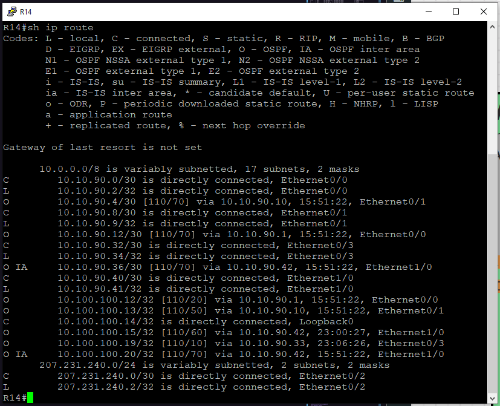

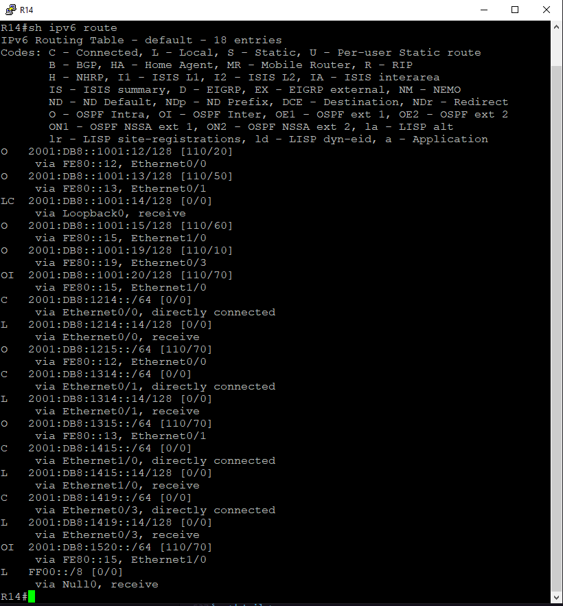

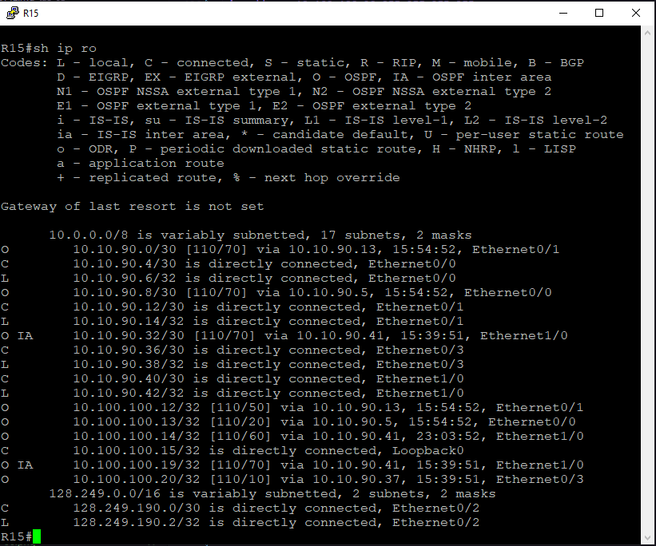

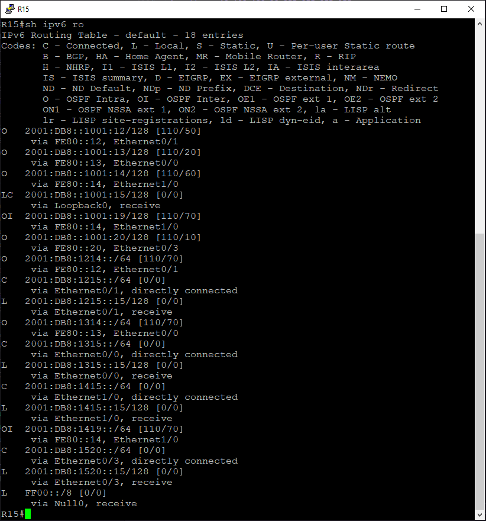

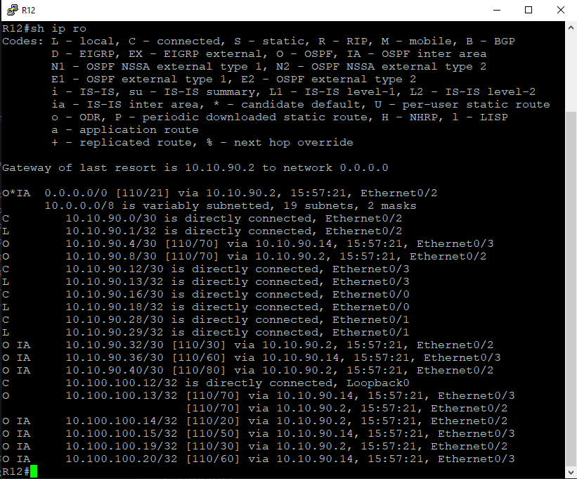

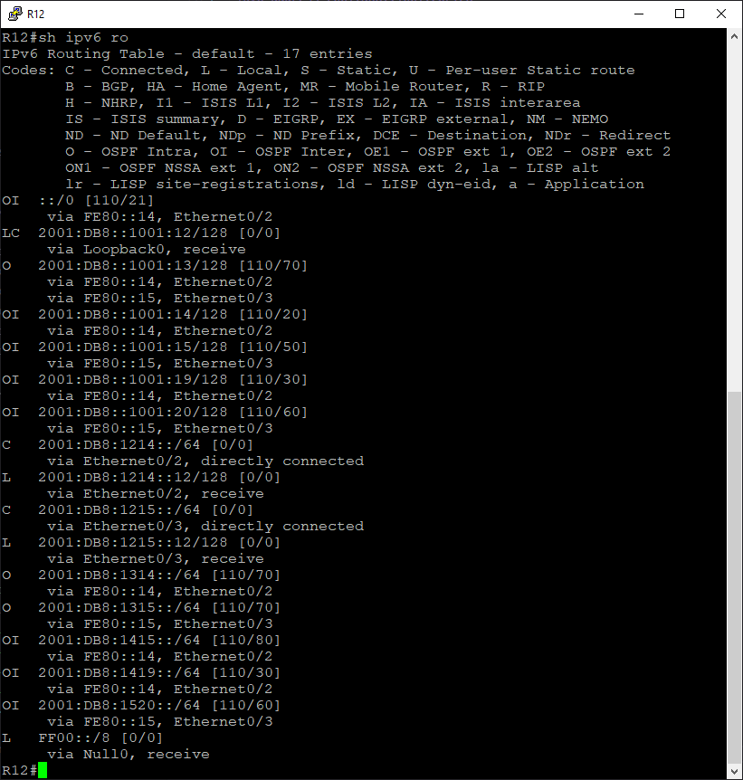

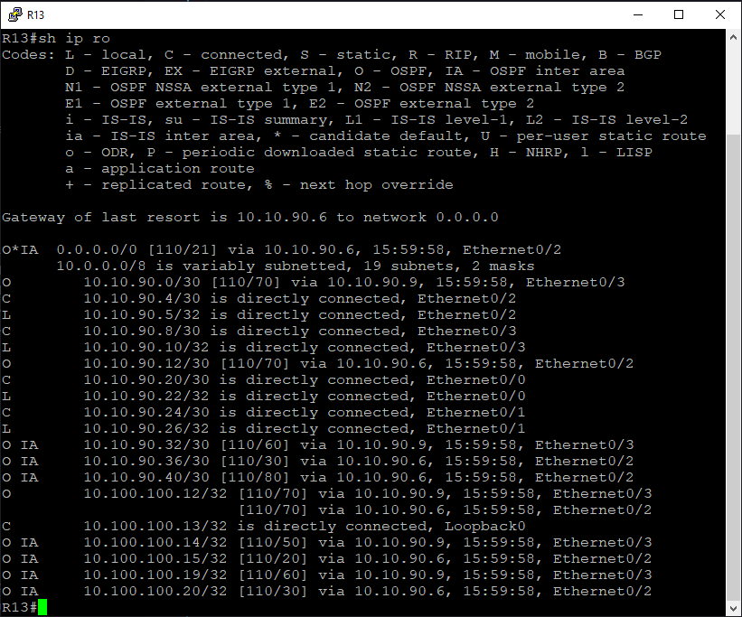

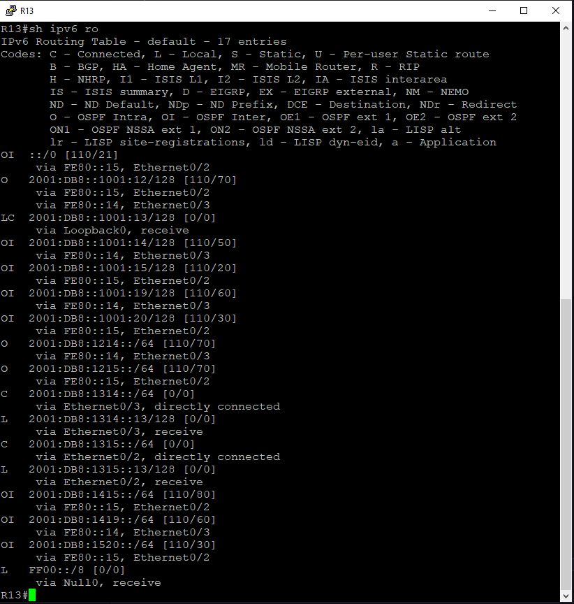

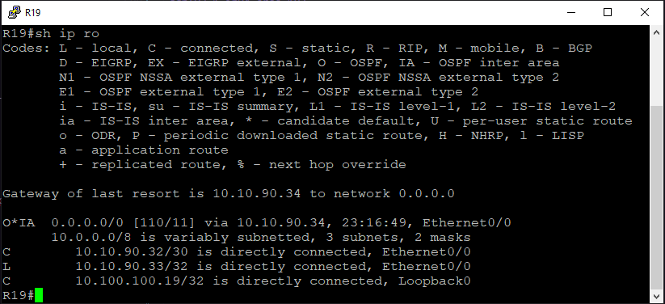

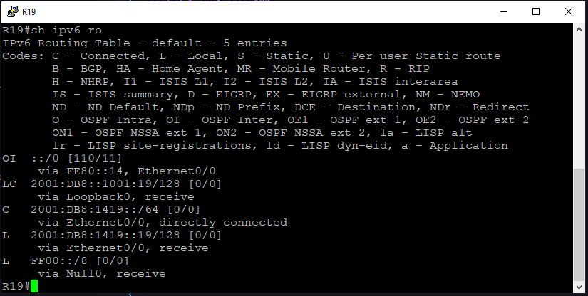

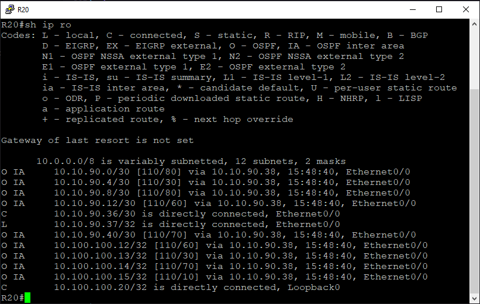

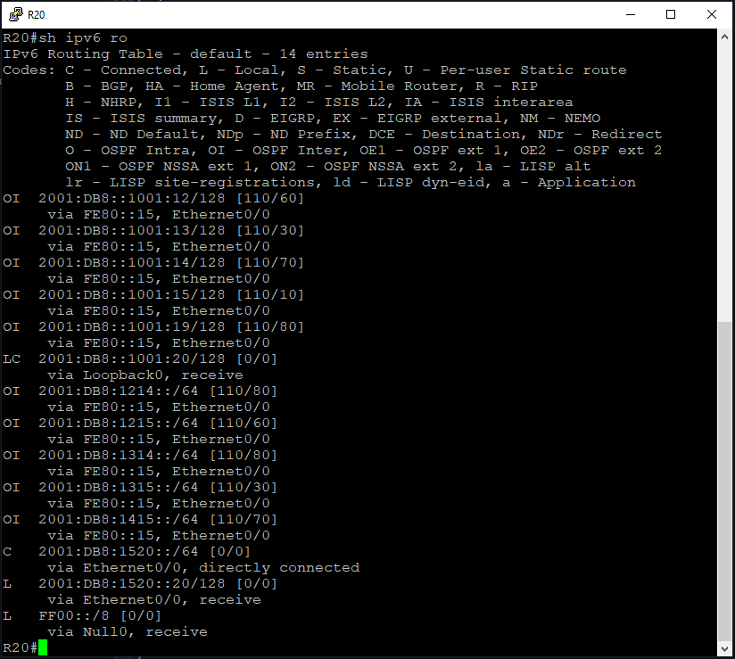

</details>

<details>
<summary>Проверка IP связности</summary>

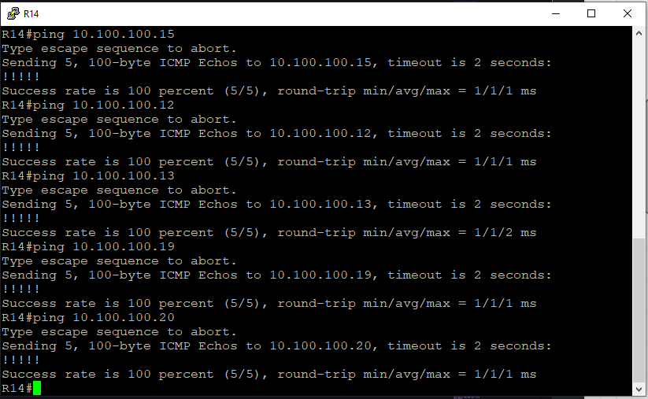

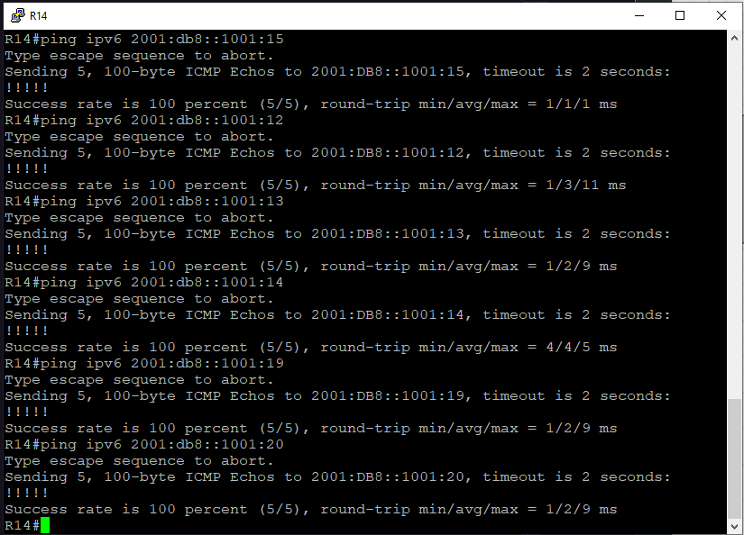

</details>

<details>
<summary>Соседство OSPF</summary>

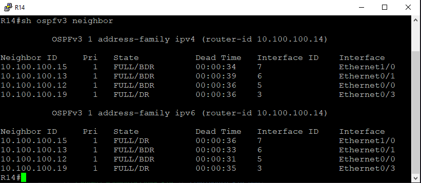

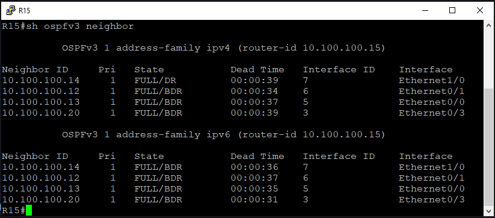

</details>
