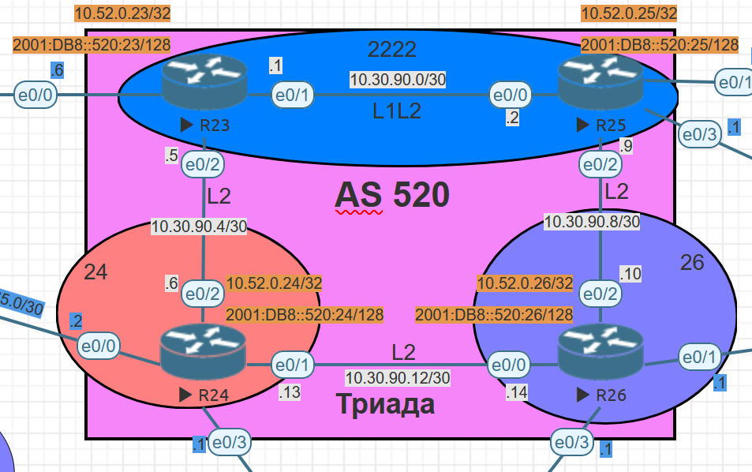

# Лабораторная №7

## IS-IS.

### Цели задания

- Настроить IS-IS офисе Триада

### Топология сети

### Задачи

- Настроите IS-IS в ISP Триада.
- R23 и R25 находятся в зоне 2222.
- R24 находится в зоне 24.
- R26 находится в зоне 26.

Настройка осуществляется одновременно для IPv4 и IPv6.

## Таблица адресов IPv4

IPv4 адреса для оборудования берутся из предыдущей [лабораторной работы #4](../lab_04/README.md)

| Device | Interface | IP Address  | Subnet Mask     | Default Gateway | Description  |
| ------ | --------- | ----------- | --------------- | --------------- | ------------ |
| R23    | lo0       | 10.52.0.23  | 255.255.255.255 |                 | Loopback_R23 |
|        | e0/1      | 10.30.90.1  | 255.255.255.252 |                 | to_R25       |
|        | e0/2      | 10.30.90.5  | 255.255.255.252 |                 | to_R24       |
| R24    | lo0       | 10.52.0.24  | 255.255.255.255 |                 | Loopback_R24 |
|        | e0/1      | 10.30.90.13 | 255.255.255.252 |                 | to_R26       |
|        | e0/2      | 10.30.90.6  | 255.255.255.252 |                 | to_R23       |
| R25    | lo0       | 10.52.0.25  | 255.255.255.255 |                 | Loopback_R25 |
|        | e0/0      | 10.30.90.2  | 255.255.255.252 |                 | to_R23       |
|        | e0/2      | 10.30.90.9  | 255.255.255.252 |                 | to_R26       |
| R26    | lo0       | 10.52.0.26  | 255.255.255.255 |                 | Loopback_R26 |
|        | e0/0      | 10.30.90.14 | 255.255.255.252 |                 | to_R24       |
|        | e0/2      | 10.30.90.10 | 255.255.255.252 |                 | to_R25       |

## Таблица адресов IPv4

| Device | Interface | IPv6 Address         | IPv6 link-local         | Default Gateway | Description  |
| ------ | --------- | -------------------- | ----------------------- | --------------- | ------------ |
| R23    | lo0       | 2001:DB8::520:23/128 |                         |                 | Loopback_R23 |
|        | e0/1      | 2001:DB8:2325::23/64 | FE80:520::23 link-local |                 | to_R25       |
|        | e0/2      | 2001:DB8:2324::23/64 | FE80:520::23 link-local |                 | to_R24       |
| R24    | lo0       | 2001:DB8::520:24/128 |                         |                 | Loopback_R24 |
|        | e0/1      | 2001:DB8:2426::24/64 | FE80:520::24 link-local |                 | to_R26       |
|        | e0/2      | 2001:DB8:2324::24/64 | FE80:520::24 link-local |                 | to_R23       |
| R25    | lo0       | 2001:DB8::520:25/128 |                         |                 | Loopback_R25 |
|        | e0/0      | 2001:DB8:2325::25/64 | FE80:520::25 link-local |                 | to_R23       |
|        | e0/2      | 2001:DB8:2526::25/64 | FE80:520::25 link-local |                 | to_R26       |
| R26    | lo0       | 2001:DB8::520:26/128 |                         |                 | Loopback_R26 |
|        | e0/0      | 2001:DB8:2426::26/64 | FE80:520::26 link-local |                 | to_R24       |
|        | e0/2      | 2001:DB8:2526::26/64 | FE80:520::26 link-local |                 | to_R25       |
