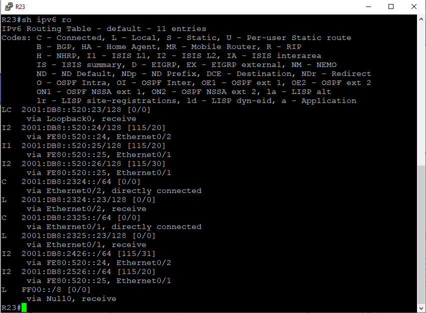

# Лабораторная №7

## IS-IS.

### Цели задания

- Настроить IS-IS офисе Триада

### Топология сети


### Задачи

- Настроите IS-IS в ISP Триада.
- R23 и R25 находятся в зоне 2222.
- R24 находится в зоне 24.
- R26 находится в зоне 26.

Настройка осуществляется одновременно для IPv4 и IPv6.

## Таблица адресов IPv4

IPv4 адреса для оборудования берутся из предыдущей [лабораторной работы #4](../lab_04/README.md)

| Device | Interface | IP Address  | Subnet Mask     | Default Gateway | Description  |
| ------ | --------- | ----------- | --------------- | --------------- | ------------ |
| R23    | lo0       | 10.52.0.23  | 255.255.255.255 |                 | Loopback_R23 |
|        | e0/1      | 10.30.90.1  | 255.255.255.252 |                 | to_R25       |
|        | e0/2      | 10.30.90.5  | 255.255.255.252 |                 | to_R24       |
| R24    | lo0       | 10.52.0.24  | 255.255.255.255 |                 | Loopback_R24 |
|        | e0/1      | 10.30.90.13 | 255.255.255.252 |                 | to_R26       |
|        | e0/2      | 10.30.90.6  | 255.255.255.252 |                 | to_R23       |
| R25    | lo0       | 10.52.0.25  | 255.255.255.255 |                 | Loopback_R25 |
|        | e0/0      | 10.30.90.2  | 255.255.255.252 |                 | to_R23       |
|        | e0/2      | 10.30.90.9  | 255.255.255.252 |                 | to_R26       |
| R26    | lo0       | 10.52.0.26  | 255.255.255.255 |                 | Loopback_R26 |
|        | e0/0      | 10.30.90.14 | 255.255.255.252 |                 | to_R24       |
|        | e0/2      | 10.30.90.10 | 255.255.255.252 |                 | to_R25       |

## Таблица адресов IPv6

| Device | Interface | IPv6 Address         | IPv6 link-local         | Default Gateway | Description  |
| ------ | --------- | -------------------- | ----------------------- | --------------- | ------------ |
| R23    | lo0       | 2001:DB8::520:23/128 |                         |                 | Loopback_R23 |
|        | e0/1      | 2001:DB8:2325::23/64 | FE80:520::23 link-local |                 | to_R25       |
|        | e0/2      | 2001:DB8:2324::23/64 | FE80:520::23 link-local |                 | to_R24       |
| R24    | lo0       | 2001:DB8::520:24/128 |                         |                 | Loopback_R24 |
|        | e0/1      | 2001:DB8:2426::24/64 | FE80:520::24 link-local |                 | to_R26       |
|        | e0/2      | 2001:DB8:2324::24/64 | FE80:520::24 link-local |                 | to_R23       |
| R25    | lo0       | 2001:DB8::520:25/128 |                         |                 | Loopback_R25 |
|        | e0/0      | 2001:DB8:2325::25/64 | FE80:520::25 link-local |                 | to_R23       |
|        | e0/2      | 2001:DB8:2526::25/64 | FE80:520::25 link-local |                 | to_R26       |
| R26    | lo0       | 2001:DB8::520:26/128 |                         |                 | Loopback_R26 |
|        | e0/0      | 2001:DB8:2426::26/64 | FE80:520::26 link-local |                 | to_R24       |
|        | e0/2      | 2001:DB8:2526::26/64 | FE80:520::26 link-local |                 | to_R25       |

# Настройка устройств:

<details>
<summary> Настройка базовых параметров</summary>

Настройка произведена в [лабораторной работе № 4](../lab_04/README.md)

- Присвойте имена устройствам в соответствии с топологией.

```
 (config)# hostname <X><n>
```

    где \<X> R - маршрутизатор S - коммутатор </br>
        \<n> номер устройства

- Отключение поиска DNS

```
 (config)# no ip domain-lookup
```

- Назначьте **class** в качестве зашифрованного пароля доступа к привилегированному режиму.

```
 (config)# enable secret class
```

- Назначьте **cisco** в качестве паролей консоли и VTY

```
 (config)# line console 0
 (config-line)# password cisco
 (config-line)# login
```

```
 (config)# line vty 0 4
 (config-line)# password cisco
 (config-line)# login
```

- Включить шифрование паролей

```
 (config)# service password-encryption
```

- Настройка баннерного сообщения дня (MOTD) для предупреждения пользователей о запрете несанкционированного доступа.

```
 (config)# banner motd "Unauthorized access denied"
```

- Сохранение конфигурации

```
 #copy running-config startup-config
```

</details>

# Настраиваем IPv6 адреса и ISIS процесс на маршрутизаторах

<details>

<summary> Настраиваем R23: </summary>

```
interface Loopback0
 description Loopback_R23
 ip address 10.52.0.23 255.255.255.255
 ip router isis
 ipv6 address 2001:DB8::520:23/128
 ipv6 enable
 ipv6 router isis
!
interface Ethernet0/1
 description to_R25
 ip address 10.30.90.1 255.255.255.252
 ip router isis
 ipv6 address FE80:520::23 link-local
 ipv6 address 2001:DB8:2325::23/64
 ipv6 enable
 ipv6 router isis
!
interface Ethernet0/2
 description to_R24
 ip address 10.30.90.5 255.255.255.252
 ip router isis
 ipv6 address FE80:520::23 link-local
 ipv6 address 2001:DB8:2324::23/64
 ipv6 enable
 ipv6 router isis
 isis circuit-type level-2-only
!
```

Настраиваем зону ISIS по заданию

```
router isis
 net 49.2222.0100.5200.0023.00
 metric-style wide
!
```

</details>

<details>

<summary> Настраиваем R24: </summary>

```
!
interface Loopback0
 description Loopback_R24
 ip address 10.52.0.24 255.255.255.255
 ip router isis
 ipv6 address 2001:DB8::520:24/128
 ipv6 enable
 ipv6 router isis
!
interface Ethernet0/1
 description to_R26
 ip address 10.30.90.13 255.255.255.252
 ip router isis
 ipv6 address FE80:520::24 link-local
 ipv6 address 2001:DB8:2426::24/64
 ipv6 enable
 ipv6 router isis
 isis circuit-type level-2-only
 isis metric 21
!
interface Ethernet0/2
 description to_R23
 ip address 10.30.90.6 255.255.255.252
 ip router isis
 ipv6 address FE80:520::24 link-local
 ipv6 address 2001:DB8:2324::24/64
 ipv6 enable
 ipv6 router isis
 isis circuit-type level-2-only
!
```

Настраиваем зону ISIS по заданию

```
!
router isis
 net 49.0024.0100.5200.0024.00
 is-type level-2-only
 metric-style wide

```

</details>

<details>

<summary> Настраиваем R25: </summary>

```
!
interface Loopback0
 description Loopback_R25
 ip address 10.52.0.25 255.255.255.255
 ip router isis
 ipv6 address 2001:DB8::520:25/128
 ipv6 enable
 ipv6 router isis
!
interface Ethernet0/0
 description to_R23
 ip address 10.30.90.2 255.255.255.252
 ip router isis
 ipv6 address FE80:520::25 link-local
 ipv6 address 2001:DB8:2325::25/64
 ipv6 enable
 ipv6 router isis
!
interface Ethernet0/2
 description to_R26
 ip address 10.30.90.9 255.255.255.252
 ip router isis
 ipv6 address FE80:520::25 link-local
 ipv6 address 2001:DB8:2526::25/64
 ipv6 enable
 ipv6 router isis
 isis circuit-type level-2-only
!

```

Настраиваем зону ISIS по заданию

```
!
router isis
 net 49.2222.0100.5200.0025.00
 metric-style wide
!
```

</details>

<details>

<summary> Настраиваем R26: </summary>

```
!
interface Loopback0
 description Loopback_R26
 ip address 10.52.0.26 255.255.255.255
 ip router isis
 ipv6 address 2001:DB8::520:26/128
 ipv6 enable
 ipv6 router isis
!
interface Ethernet0/0
 description to_R24
 ip address 10.30.90.14 255.255.255.252
 ip router isis
 ipv6 address FE80:520::26 link-local
 ipv6 address 2001:DB8:2426::26/64
 ipv6 enable
 ipv6 router isis
 isis circuit-type level-2-only
 isis metric 21
!
interface Ethernet0/2
 description to_R25
 ip address 10.30.90.10 255.255.255.252
 ip router isis
 ipv6 address FE80:520::26 link-local
 ipv6 address 2001:DB8:2526::26/64
 ipv6 enable
 ipv6 router isis
 isis circuit-type level-2-only
!

```

Настраиваем зону ISIS по заданию

```
!
router isis
 net 49.0026.0100.5200.0026.00
 is-type level-2-only
 metric-style wide
!
```

</details>

# Проверка работоспособности

<details>
<summary>Таблицы маршрутизации</summary>





</details>

<details>
<summary>Проверка IP связности</summary>

Пинги IPv4 на loopback маршрутизаторов R24, R25, R26


Пинги IPv6 на loopback маршрутизаторов R24, R25, R26


</details>

<details>
<summary>Соседство ISIS</summary>


</details>

### [Файлы конфигураций устройств ](./config/)
