# Лабораторная №8

## IS-IS.

### Цели задания

- Настроить EIGRP в С.-Петербург. Использовать named EIGRP

### Топология сети

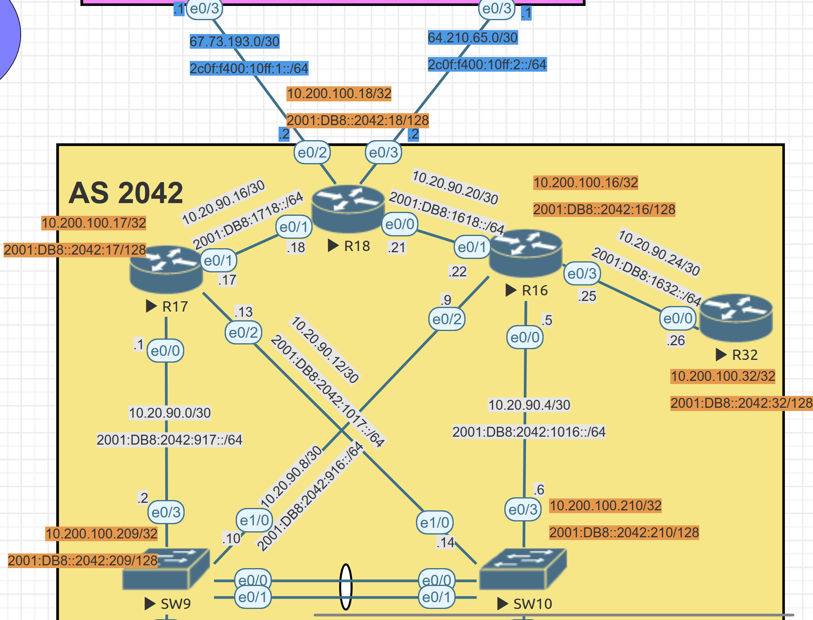

### Задачи

- В офисе С.-Петербург настроить EIGRP.
- R32 получает только маршрут по умолчанию.
- R16-17 анонсируют только суммарные префиксы.
- Использовать EIGRP named-mode для настройки сети.

Настройка осуществляется одновременно для IPv4 и IPv6.

## Таблица адресов IPv4

Pv4 адреса для оборудования берутся из предыдущей [лабораторной работы #4](../lab_04/README.md)

| Device | Interface | IP Address     | Subnet Mask     | Default Gateway | Description  |
| ------ | --------- | -------------- | --------------- | --------------- | ------------ |
| R16    | lo0       | 10.200.100.16  | 255.255.255.255 |                 | Loopback_R16 |
|        | e0/0      | 10.20.90.5     | 255.255.255.252 |                 | to_SW10      |
|        | e0/1      | 10.20.90.22    | 255.255.255.252 |                 | to_R18       |
|        | e0/2      | 10.20.90.9     | 255.255.255.252 |                 | to_SW9       |
|        | e0/3      | 10.20.90.25    | 255.255.255.252 |                 | to_R32       |
| R17    | lo0       | 10.200.100.17  | 255.255.255.255 |                 | Loopback_R17 |
|        | e0/0      | 10.20.90.1     | 255.255.255.252 |                 | to_SW9       |
|        | e0/1      | 10.20.90.17    | 255.255.255.252 |                 | to_R18       |
|        | e0/2      | 10.20.90.13    | 255.255.255.252 |                 | to_SW10      |
| R18    | lo0       | 10.200.100.18  | 255.255.255.255 |                 | Loopback_R18 |
|        | e0/0      | 10.20.90.21    | 255.255.255.252 |                 | to_R16       |
|        | e0/1      | 10.20.90.18    | 255.255.255.252 |                 | to_R17       |
|        | e0/2      | 67.73.193.2    | 255.255.255.252 |                 | to_R24_AS520 |
|        | e0/3      | 64.210.65.2    | 255.255.255.252 |                 | to_R26_As520 |
| R32    | lo0       | 10.200.100.32  | 255.255.255.255 |                 | Loopback_R32 |
|        | e0/0      | 10.20.90.26    | 255.255.255.252 |                 | to_R16       |
| SW9    | lo0       | 10.200.100.209 | 255.255.255.192 |                 | MGMT         |
|        | e0/3      | 10.20.90.2     | 255.255.255.252 |                 | to_R17       |
|        | e1/0      | 10.20.90.10    | 255.255.255.252 |                 | to_R16       |
| SW10   | lo0       | 10.200.100.210 | 255.255.255.192 |                 | MGMT         |
|        | e0/3      | 10.20.90.6     | 255.255.255.252 |                 | to_R16       |
|        | e1/0      | 10.20.90.14    | 255.255.255.252 |                 | to_R17       |

## Таблица адресов IPv6

| Device | Interface | IPv6 Address              | IPv6 link-local          | Default Gateway | Description  |
| ------ | --------- | ------------------------- | ------------------------ | --------------- | ------------ |
| R16    | lo0       | 2001:DB8::2042:16/128     |                          |                 | Loopback_R16 |
|        | e0/0      | 2001:DB8:2042:1016::5/64  | FE80:2042::16 link-local |                 | to_SW10      |
|        | e0/1      | 2001:DB8:1618::22/64      | FE80:2042::16 link-local |                 | to_R18       |
|        | e0/2      | 2001:DB8:2042:916::9/64   | FE80:2042::16 link-local |                 | to_SW9       |
|        | e0/3      | 2001:DB8:1632::25/64      | FE80:2042::16 link-local |                 | to_R32       |
| R17    | lo0       | 2001:DB8::2042:17/128     |                          |                 | Loopback_R17 |
|        | e0/0      | 2001:DB8:2042:917::1/64   | FE80:2042::17 link-local |                 | to_SW9       |
|        | e0/1      | 2001:DB8:1718::17/64      | FE80:2042::17 link-local |                 | to_R18       |
|        | e0/2      | 2001:DB8:2042:1017::13/64 | FE80:2042::17 link-local |                 | to_SW10      |
| R18    | lo0       | 2001:DB8::2042:18/128     |                          |                 | Loopback_R18 |
|        | e0/0      | 2001:DB8:1618::21/64      | FE80:2042::18 link-local |                 | to_R16       |
|        | e0/1      | 2001:DB8:1718::18/64      | FE80:2042::18 link-local |                 | to_R17       |
|        | e0/2      | 2C0F:F400:10FF:1::2/64    |                          |                 | to_R24_AS520 |
|        | e0/3      | 2C0F:F400:10FF:2::2/64    |                          |                 | to_R26_As520 |
| R32    | lo0       | 2001:DB8::2042:32/128     |                          |                 | Loopback_R32 |
|        | e0/0      | 2001:DB8:1632::32/64      | FE80:2042::32 link-local |                 | to_R16       |
| SW9    | lo0       | 2001:DB8::2042:209/128    |                          |                 | MGMT         |
|        | e0/3      | 2001:DB8:2042:917::2/64   | FE80:2042::9 link-local  |                 | to_R17       |
|        | e1/0      | 2001:DB8:2042:916::10/64  | FE80:2042::9 link-local  |                 | to_R16       |
| SW10   | lo0       | 2001:DB8::2042:210/128    |                          |                 | MGMT         |
|        | e0/3      | 2001:DB8:2042:1016::6/64  | FE80:2042::10 link-local |                 | to_R16       |
|        | e1/0      | 2001:DB8:2042:1017::14/64 | FE80:2042::10 link-local |                 | to_R17       |

# Настройка устройств:

<details>
<summary> Настройка базовых параметров</summary>

Настройка произведена в [лабораторной работе № 4](../lab_04/README.md)

- Присвойте имена устройствам в соответствии с топологией.

```
 (config)# hostname <X><n>
```

    где \<X> R - маршрутизатор S - коммутатор </br>
        \<n> номер устройства

- Отключение поиска DNS

```
 (config)# no ip domain-lookup
```

- Назначьте **class** в качестве зашифрованного пароля доступа к привилегированному режиму.

```
 (config)# enable secret class
```

- Назначьте **cisco** в качестве паролей консоли и VTY

```
 (config)# line console 0
 (config-line)# password cisco
 (config-line)# login
```

```
 (config)# line vty 0 4
 (config-line)# password cisco
 (config-line)# login
```

- Включить шифрование паролей

```
 (config)# service password-encryption
```

- Настройка баннерного сообщения дня (MOTD) для предупреждения пользователей о запрете несанкционированного доступа.

```
 (config)# banner motd "Unauthorized access denied"
```

- Сохранение конфигурации

```
 #copy running-config startup-config
```

</details>

# Настраиваем IPv6 адреса на маршрутизаторах и процесс EIGRP

<details>

<summary> Настраиваем R18: </summary>

```
!
interface Loopback0
 description Loopback_R18
 ip address 10.200.100.18 255.255.255.255
 ipv6 address 2001:DB8::2042:18/128
 ipv6 enable
!
interface Ethernet0/0
 description to_R16
 ip address 10.20.90.21 255.255.255.252
 ipv6 address FE80:2042::18 link-local
 ipv6 address 2001:DB8:1618::21/64
 ipv6 enable
!
interface Ethernet0/1
 description to_R17
 ip address 10.20.90.18 255.255.255.252
 ipv6 address FE80:2042::18 link-local
 ipv6 address 2001:DB8:1718::18/64
 ipv6 enable
!
interface Ethernet0/2
 description to_R24_AS520
 ip address 67.73.193.2 255.255.255.252
 ipv6 address 2C0F:F400:10FF:1::2/64
 ipv6 enable
!
interface Ethernet0/3
 description to_R26_AS520
 ip address 64.210.65.2 255.255.255.252
 ipv6 address 2C0F:F400:10FF:2::2/64
 ipv6 enable
```

Маршруты по умолчанию

```
ip route 0.0.0.0 0.0.0.0 67.73.193.1 10
ip route 0.0.0.0 0.0.0.0 64.210.65.1 20
!
ipv6 route ::/0 2C0F:F400:10FF:2::1 20
ipv6 route ::/0 2C0F:F400:10FF:1::1 10

```

процесс EIGRP

```
router eigrp AS2042
 !
 address-family ipv4 unicast autonomous-system 2042
  !
  topology base
   redistribute static
  exit-af-topology
  network 10.20.90.16 0.0.0.3
  network 10.20.90.20 0.0.0.3
  network 10.200.100.18 0.0.0.0
  eigrp router-id 10.200.100.18
 exit-address-family
 !
 address-family ipv6 unicast autonomous-system 2042
  !
  topology base
   redistribute static metric 100000 10 255 1 1500
  exit-af-topology
  eigrp router-id 10.200.100.18
 exit-address-family
!
```

</details>

<details>

<summary> Настраиваем R17: </summary>

```
interface Loopback0
 description Loopback_R17
 ip address 10.200.100.17 255.255.255.255
 ipv6 address 2001:DB8::2042:17/128
 ipv6 enable
!
interface Ethernet0/0
 description to_SW9
 ip address 10.20.90.1 255.255.255.252
 ipv6 address FE80:2042::17 link-local
 ipv6 address 2001:DB8:2042:917::1/64
 ipv6 enable
!
interface Ethernet0/1
 description to_R18
 ip address 10.20.90.17 255.255.255.252
 ipv6 address FE80:2042::17 link-local
 ipv6 address 2001:DB8:1718::17/64
 ipv6 enable
!
interface Ethernet0/2
 description to_SW10
 ip address 10.20.90.13 255.255.255.252
 ipv6 address FE80:2042::17 link-local
 ipv6 address 2001:DB8:2042:1017::13/64
 ipv6 enable
!
```

процесс EIGRP

```
router eigrp AS2042
 !
 address-family ipv4 unicast autonomous-system 2042
  !
  af-interface Ethernet0/1
   summary-address 10.20.90.0 255.255.255.240
  exit-af-interface
  !
  topology base
  exit-af-topology
  network 10.20.90.0 0.0.0.3
  network 10.20.90.12 0.0.0.3
  network 10.20.90.16 0.0.0.3
  network 10.200.100.17 0.0.0.0
  eigrp router-id 10.200.100.17
 exit-address-family
 !
 address-family ipv6 unicast autonomous-system 2042
  !
  af-interface Ethernet0/1
   summary-address 2001:DB8:2042::/48
  exit-af-interface
  !
  topology base
  exit-af-topology
  eigrp router-id 10.200.100.17
 exit-address-family
!

```

</details>

<details>

<summary> Настраиваем R16: </summary>

```
!
interface Loopback0
 description Loopback_R16
 ip address 10.200.100.16 255.255.255.255
 ipv6 address 2001:DB8::2042:16/128
 ipv6 enable
!
interface Ethernet0/0
 description to_SW10
 ip address 10.20.90.5 255.255.255.252
 ipv6 address FE80:2042::16 link-local
 ipv6 address 2001:DB8:2042:1016::5/64
 ipv6 enable
!
interface Ethernet0/1
 description to_R18
 ip address 10.20.90.22 255.255.255.252
 ipv6 address FE80:2042::16 link-local
 ipv6 address 2001:DB8:1618::22/64
 ipv6 enable
!
interface Ethernet0/2
 description to_SW9
 ip address 10.20.90.9 255.255.255.252
 ipv6 address FE80:2042::16 link-local
 ipv6 address 2001:DB8:2042:916::9/64
 ipv6 enable
!
interface Ethernet0/3
 description to_R32
 ip address 10.20.90.25 255.255.255.252
 ipv6 address FE80:2042::16 link-local
 ipv6 address 2001:DB8:1632::25/64
 ipv6 enable
!
```

Префикс листы для фильтрации маршрутов передаваемых на R32

```
!
ip prefix-list pl_R32 seq 20 deny 10.0.0.0/8 le 32
ip prefix-list pl_R32 seq 30 permit 0.0.0.0/0
!
!
ipv6 prefix-list pl_R32_v6 seq 10 deny 2001:DB8::/32 le 128
ipv6 prefix-list pl_R32_v6 seq 20 permit ::/0
!
```

процесс EIGRP

```
!
router eigrp AS2042
 !
 address-family ipv4 unicast autonomous-system 2042
  !
  af-interface Ethernet0/1
   summary-address 10.20.90.0 255.255.255.240
  exit-af-interface
  !
  topology base
   distribute-list prefix pl_R32 out Ethernet0/3
  exit-af-topology
  network 10.20.90.4 0.0.0.3
  network 10.20.90.8 0.0.0.3
  network 10.20.90.20 0.0.0.3
  network 10.20.90.24 0.0.0.3
  network 10.200.100.16 0.0.0.0
  eigrp router-id 10.200.100.16
 exit-address-family
 !
 address-family ipv6 unicast autonomous-system 2042
  !
  af-interface Ethernet0/1
   summary-address 2001:DB8:2042::/48
  exit-af-interface
  !
  topology base
   distribute-list prefix-list pl_R32_v6 out Ethernet0/3
  exit-af-topology
  eigrp router-id 10.200.100.16
 exit-address-family
!
```

</details>

<details>

<summary> Настраиваем SW9: </summary>

```
!
interface Loopback0
 description Loopback_SW9
 ip address 10.200.100.209 255.255.255.255
 ipv6 address 2001:DB8::2042:209/128
 ipv6 enable
!
interface Ethernet0/3
 description to_R17
 no switchport
 ip address 10.20.90.2 255.255.255.252
 duplex auto
 ipv6 address FE80:2042::9 link-local
 ipv6 address 2001:DB8:2042:917::2/64
 ipv6 enable
!
interface Ethernet1/0
 description to_R16
 no switchport
 ip address 10.20.90.10 255.255.255.252
 duplex auto
 ipv6 address FE80:2042::9 link-local
 ipv6 address 2001:DB8:2042:916::10/64
 ipv6 enable
!

```

процесс EIGRP

```
!
router eigrp AS2042
 !
 address-family ipv4 unicast autonomous-system 2042
  !
  topology base
  exit-af-topology
  network 10.20.90.0 0.0.0.3
  network 10.20.90.8 0.0.0.3
  network 10.200.100.209 0.0.0.0
  eigrp router-id 10.200.100.209
 exit-address-family
 !
 address-family ipv6 unicast autonomous-system 2042
  !
  topology base
  exit-af-topology
  eigrp router-id 10.200.100.209
 exit-address-family
!
```

</details>

<details>

<summary> Настраиваем SW10: </summary>

```
!
interface Loopback0
 description Loopback_SW10
 ip address 10.200.100.210 255.255.255.255
 ipv6 address 2001:DB8::2042:210/128
 ipv6 enable
!
interface Ethernet0/3
 description to_R16
 no switchport
 ip address 10.20.90.6 255.255.255.252
 duplex auto
 ipv6 address FE80:2042::10 link-local
 ipv6 address 2001:DB8:2042:1016::6/64
 ipv6 enable
!
interface Ethernet1/0
 description to_R17
 no switchport
 ip address 10.20.90.14 255.255.255.252
 duplex auto
 ipv6 address FE80:2042::10 link-local
 ipv6 address 2001:DB8:2042:1017::14/64
 ipv6 enable
!
```

процесс EIGRP

```
router eigrp AS2042
 !
 address-family ipv4 unicast autonomous-system 2042
  !
  topology base
  exit-af-topology
  network 10.20.90.4 0.0.0.3
  network 10.20.90.12 0.0.0.3
  network 10.200.100.210 0.0.0.0
  eigrp router-id 10.200.100.210
 exit-address-family
 !
 address-family ipv6 unicast autonomous-system 2042
  !
  topology base
  exit-af-topology
  eigrp router-id 10.200.100.210
 exit-address-family
!

```

</details>

# Проверка работоспособности

<details>

<summary>Таблицы маршрутизации</summary>

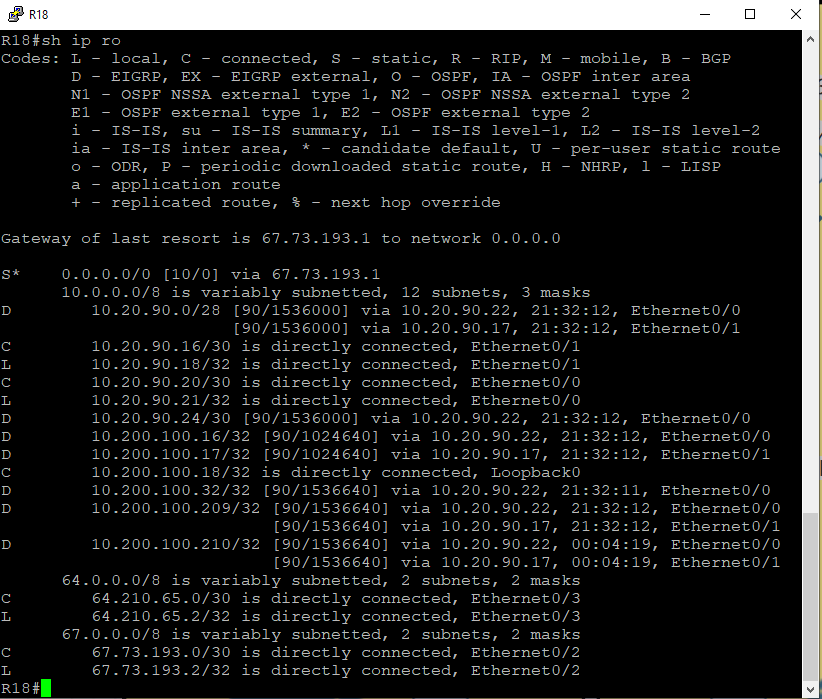

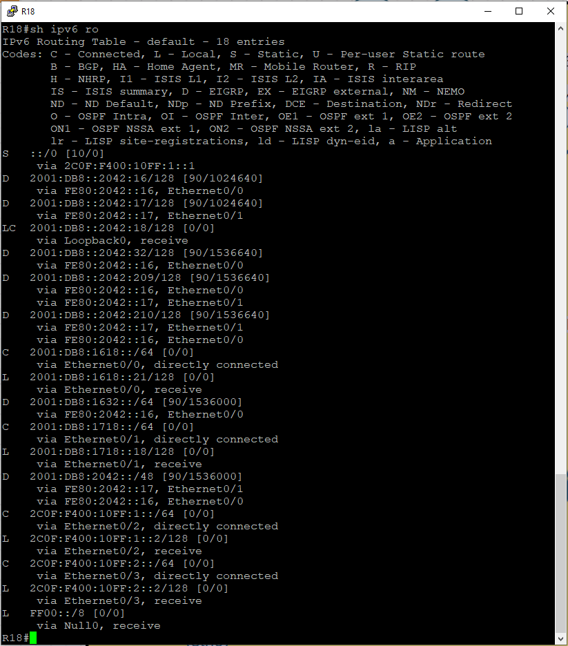

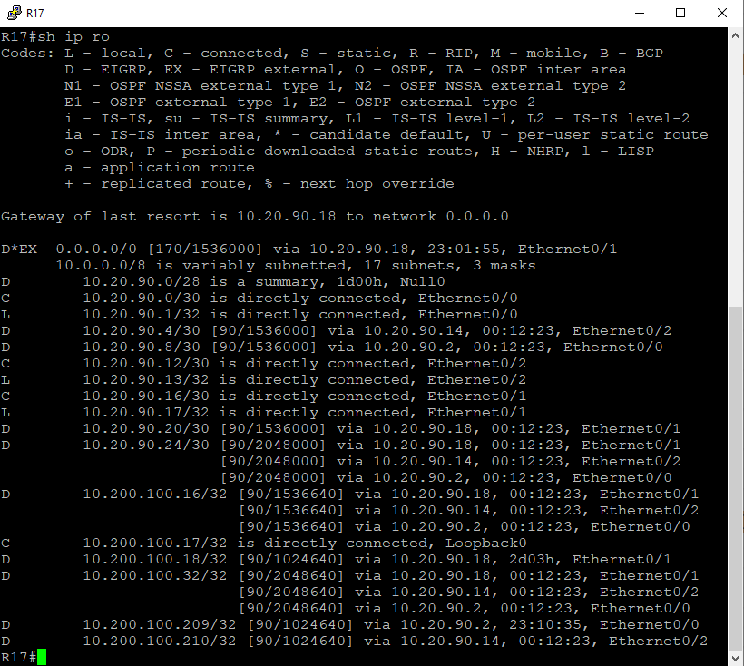

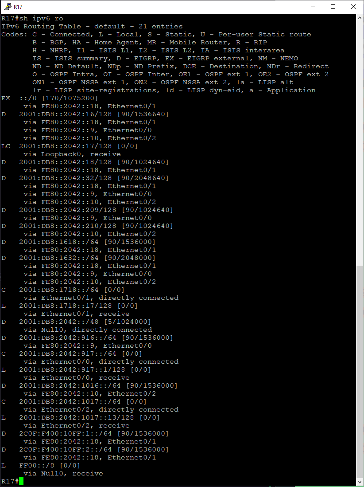

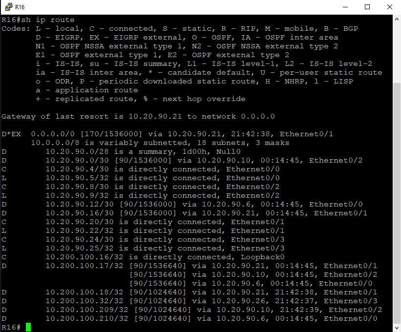

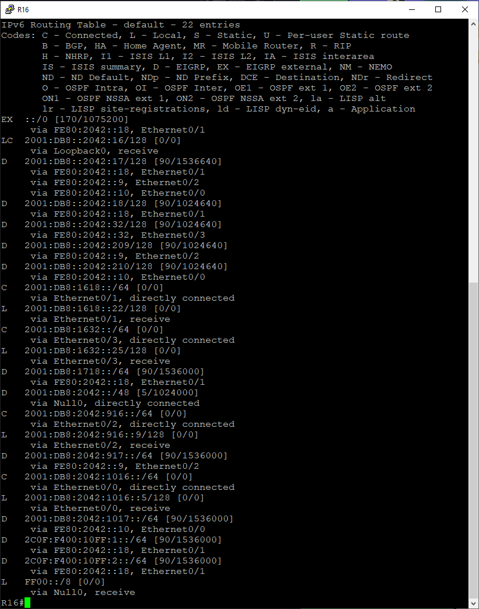

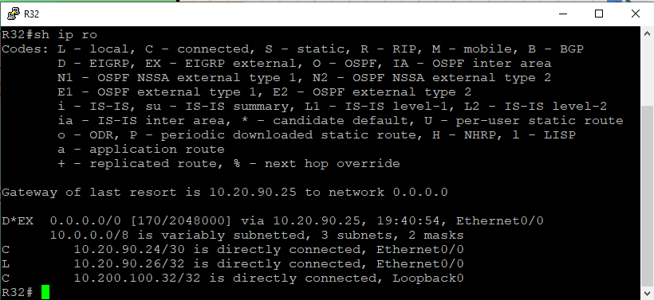

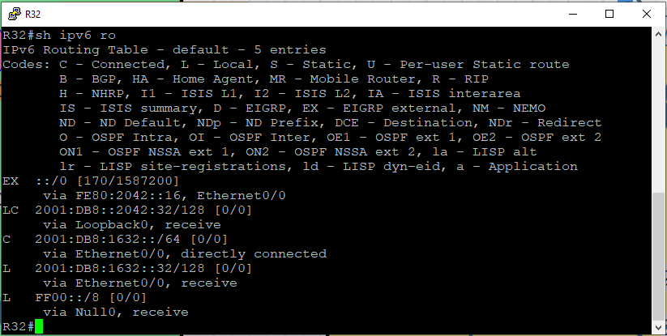

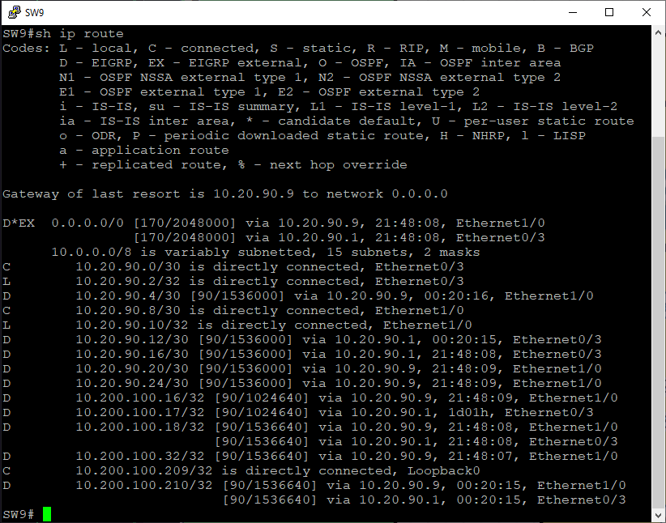

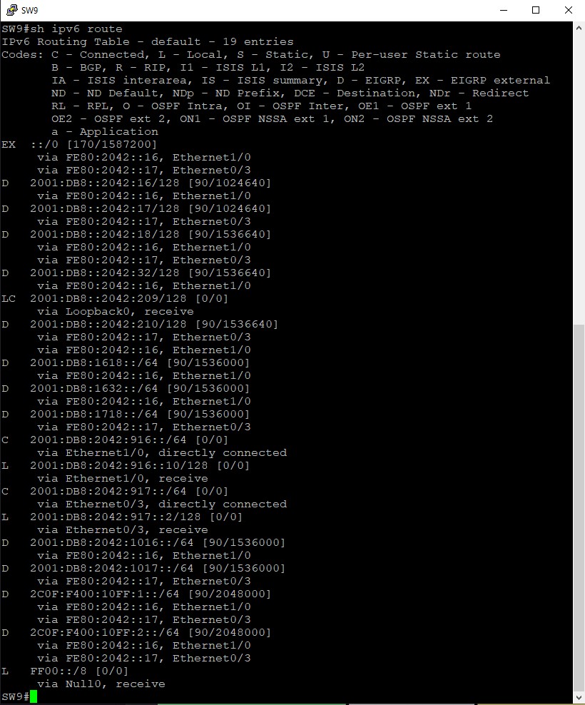

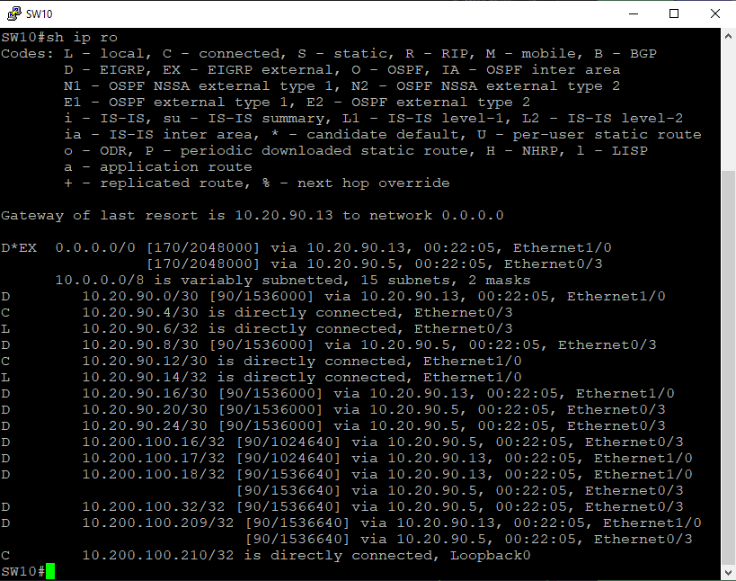

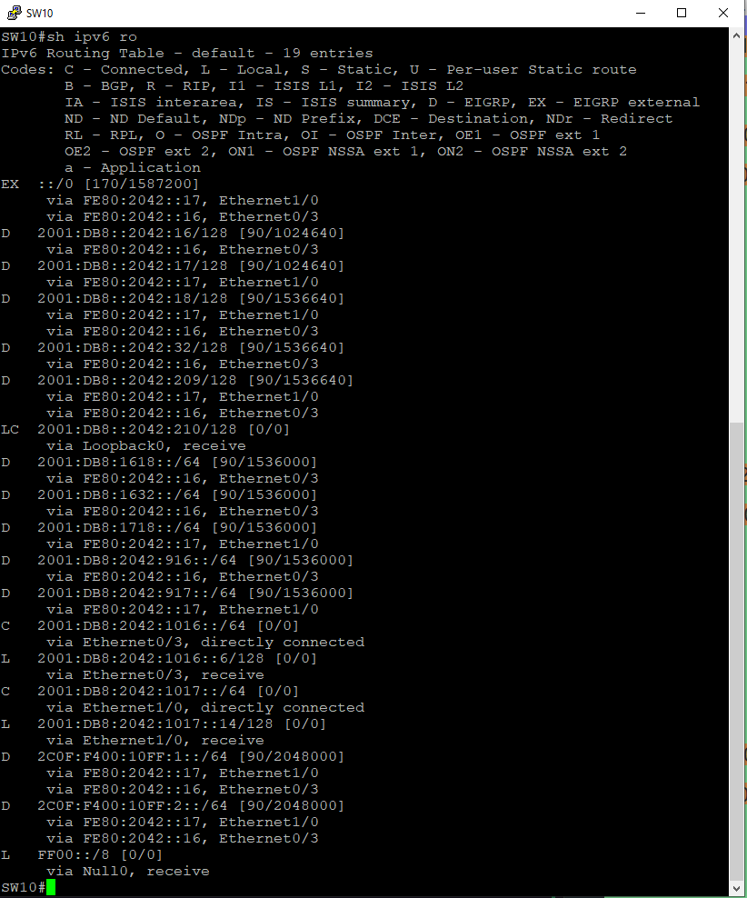

</details>

<details>
<summary>Проверка IP связности</summary>

Пинги IPv4 на loopback маршрутизаторов R17, R16, SW9, SW10, R32

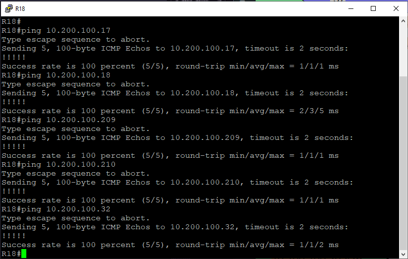

Пинги IPv6 на loopback маршрутизаторов R17, R16, SW9, SW10, R32

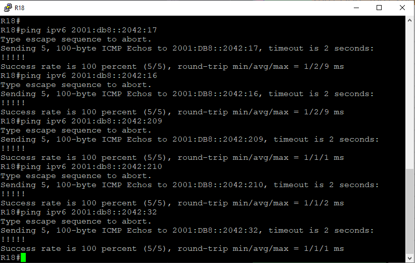

</details>

<details>
<summary>Соседство EIGRP</summary>

R18

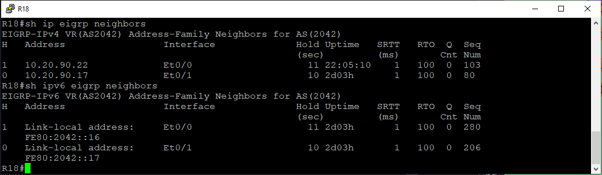

R17

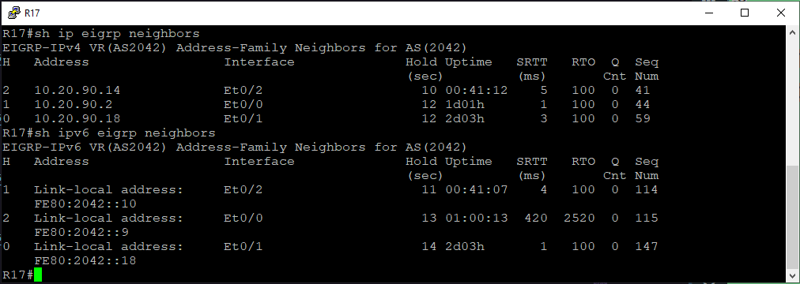

R16

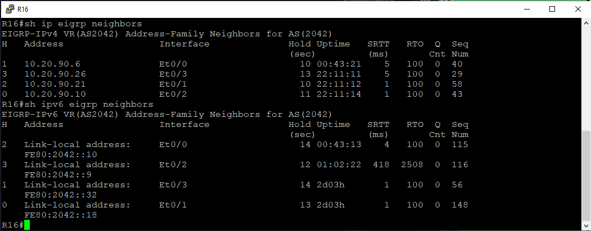

R32

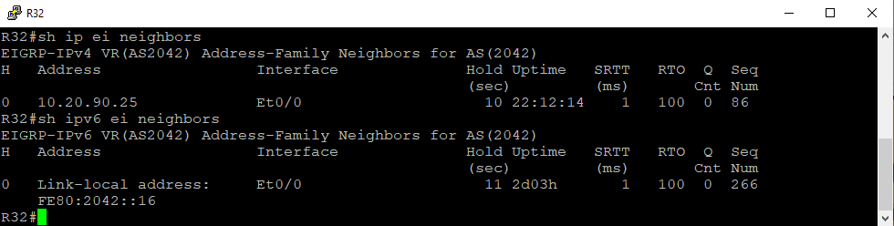

SW9

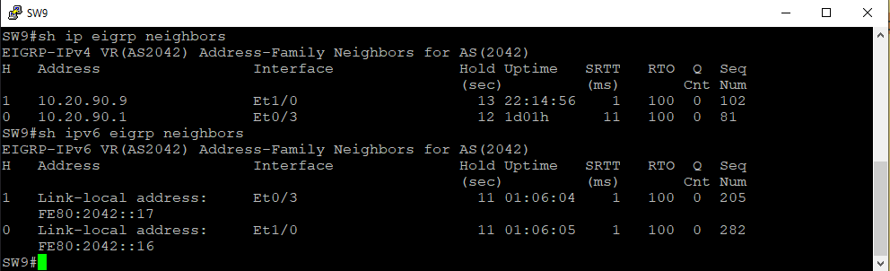

SW10

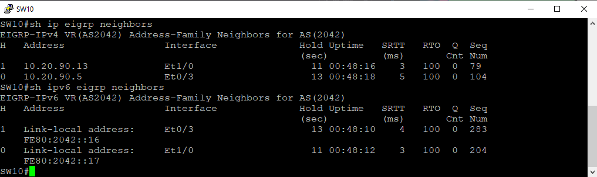

</details>

### [Файлы конфигураций устройств ](./config/)
