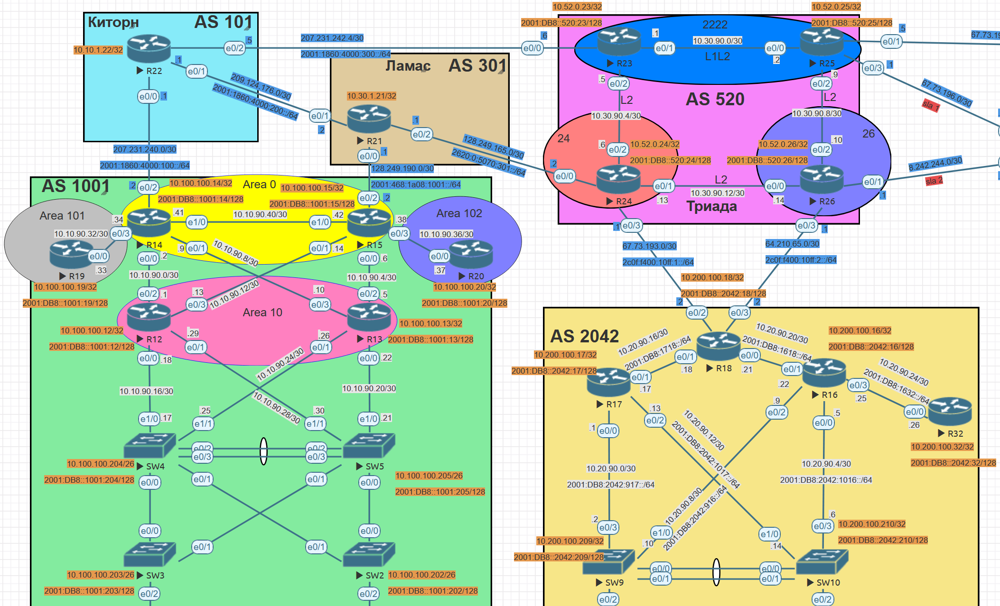

# Лабораторная №9

## BGP

### Цели задания

- Настроить BGP между автономными системами
- Организовать доступность между офисами Москва и С.-Петербург

### Топология сети



### Задачи

- Настроите eBGP между офисом Москва и двумя провайдерами - Киторн и Ламас.
- Настроите eBGP между провайдерами Киторн и Ламас.
- Настроите eBGP между Ламас и Триада.
- Настроите eBGP между офисом С.-Петербург и провайдером Триада.
- Организуете IP доступность между пограничным роутерами офисами Москва и С.-Петербург.
- План работы и изменения зафиксированы в документации.

## Таблица адресов

Pv4 адреса для оборудования берутся из предыдущей [лабораторной работы #4](../lab_04/README.md)

## AS 101 (Киторн)

### IPv4 адреса

| Device | Interface | IP Address    | Subnet Mask     | Default Gateway | Description   |
| ------ | --------- | ------------- | --------------- | --------------- | ------------- |
| R22    | lo0       | 10.10.1.22    | 255.255.255.255 |                 | Loopback_R22  |
|        | e0/0      | 207.231.240.1 | 255.255.255.252 |                 | to_R14_AS1001 |
|        | e0/1      | 209.124.176.1 | 255.255.255.252 |                 | to_R21_AS301  |
|        | e0/2      | 207.231.242.5 | 255.255.255.252 |                 | to_R23_AS520  |

### IPv6 адреса

| Device | Interface | IPv6 Address             | Default Gateway | Description   |
| ------ | --------- | ------------------------ | --------------- | ------------- |
| R22    | lo0       |                          |                 | Loopback_R22  |
|        | e0/0      | 2001:1860:4000:100::1/64 |                 | to_R14_AS1001 |
|        | e0/1      | 2001:1860:4000:200::1/64 |                 | to_R21_AS301  |
|        | e0/2      | 2001:1860:4000:300::5/64 |                 | to_R23_AS520  |

## AS 301 (Ламас)

### IPv4 адреса

| Device | Interface | IP Address    | Subnet Mask     | Default Gateway | Description   |
| ------ | --------- | ------------- | --------------- | --------------- | ------------- |
| R21    | lo0       | 10.30.1.21    | 255.255.255.255 |                 | Loopback_R21  |
|        | e0/0      | 128.249.190.1 | 255.255.255.252 |                 | to_R15_AS1001 |
|        | e0/1      | 209.124.176.2 | 255.255.255.252 |                 | to_R22_AS101  |
|        | e0/2      | 128.249.165.1 | 255.255.255.252 |                 | to_R24_AS520  |

### IPv6 адреса

| Device | Interface | IPv6 Address             | Default Gateway | Description   |
| ------ | --------- | ------------------------ | --------------- | ------------- |
| R21    | lo0       |                          |                 | Loopback_R21  |
|        | e0/0      | 2001:468:1A08:1001::1/64 |                 | to_R15_AS1001 |
|        | e0/1      | 2001:1860:4000:200::2/64 |                 | to_R22_AS101  |
|        | e0/2      | 2620:0:5070:301::1/64    |                 | to_R24_AS520  |

## AS 520 (Триада)

### IPv4 адреса

| Device | Interface | IP Address    | Subnet Mask     | Default Gateway | Description   |
| ------ | --------- | ------------- | --------------- | --------------- | ------------- |
| R23    | lo0       | 10.52.0.23    | 255.255.255.255 |                 | Loopback_R23  |
|        | e0/0      | 207.231.242.6 | 255.255.255.252 |                 | to_R22_AS101  |
| R24    | lo0       | 10.52.0.24    | 255.255.255.255 |                 | Loopback_R24  |
|        | e0/0      | 128.249.165.2 | 255.255.255.252 |                 | to_R21_AS301  |
|        | e0/3      | 67.73.193.1   | 255.255.255.252 |                 | to_R18_AS2042 |
| R26    | lo0       | 10.52.0.26    | 255.255.255.255 |                 | Loopback_R26  |
|        | e0/3      | 64.210.65.1   | 255.255.255.252 |                 | to_R18_AS2042 |

### IPv6 адреса

| Device | Interface | IPv6 Address             | Default Gateway | Description   |
| ------ | --------- | ------------------------ | --------------- | ------------- |
| R23    | lo0       | 2001:DB8::520:23/128     |                 | Loopback_R23  |
|        | e0/0      | 2001:1860:4000:300::6/64 |                 | to_R22_AS101  |
| R24    | lo0       | 2001:DB8::520:24/128     |                 | Loopback_R24  |
|        | e0/0      | 2620:0:5070:301::2/64    |                 | to_R21_AS301  |
|        | e0/3      | 2C0F:F400:10FF:1::1/64   |                 | to_R18_AS2042 |
| R26    | lo0       | 2001:DB8::520:26/128     |                 | Loopback_R26  |
|        | e0/3      | 2C0F:F400:10FF:2::1/6    |                 | to_R18_AS2042 |

## AS 1001 (Москва)

### IPv4 адреса

| Device | Interface | IP Address    | Subnet Mask     | Default Gateway | Description  |
| ------ | --------- | ------------- | --------------- | --------------- | ------------ |
| R14    | lo0       | 10.100.100.14 | 255.255.255.255 |                 | Loopback_R14 |
|        | e0/2      | 207.231.240.2 | 255.255.255.252 |                 | to_R22_AS101 |
| R15    | lo0       | 10.100.100.15 | 255.255.255.255 |                 | Loopback_R15 |
|        | e0/2      | 128.249.190.2 | 255.255.255.252 |                 | to_R21_AS301 |

### IPv6 адреса

| Device | Interface | IPv6 Address             | Default Gateway | Description  |
| ------ | --------- | ------------------------ | --------------- | ------------ |
| R14    | lo0       | 2001:DB8::1001:14/128    |                 | Loopback_R14 |
|        | e0/2      | 2001:1860:4000:100::2/64 |                 | to_R22_AS101 |
| R15    | lo0       | 2001:DB8::1001:15/128    |                 | Loopback_R15 |
|        | e0/2      | 2001:468:1A08:1001::2/64 |                 | to_R21_AS301 |

## AS 2042 (С.-Петербург)

### IPv4 адреса

| Device | Interface | IP Address    | Subnet Mask     | Default Gateway | Description  |
| ------ | --------- | ------------- | --------------- | --------------- | ------------ |
| R18    | lo0       | 10.200.100.18 | 255.255.255.255 |                 | Loopback_R18 |
|        | e0/2      | 67.73.193.2   | 255.255.255.252 |                 | to_R24_AS520 |
|        | e0/3      | 64.210.65.2   | 255.255.255.252 |                 | to_R26_As520 |

### IPv6 адреса

| Device | Interface | IPv6 Address           | Default Gateway | Description  |
| ------ | --------- | ---------------------- | --------------- | ------------ |
| R18    | lo0       | 2001:DB8::2042:18/128  |                 | Loopback_R23 |
|        | e0/2      | 2C0F:F400:10FF:1::2/64 |                 | to_R24_AS520 |
|        | e0/3      | 2C0F:F400:10FF:2::2/64 |                 | to_R26_AS520 |

# Настройка устройств:

<details>
<summary> Настройка базовых параметров</summary>

Настройка произведена в [лабораторной работе № 4](../lab_04/README.md)

- Присвойте имена устройствам в соответствии с топологией.

```
 (config)# hostname <X><n>
```

    где \<X> R - маршрутизатор S - коммутатор </br>
        \<n> номер устройства

- Отключение поиска DNS

```
 (config)# no ip domain-lookup
```

- Назначьте **class** в качестве зашифрованного пароля доступа к привилегированному режиму.

```
 (config)# enable secret class
```

- Назначьте **cisco** в качестве паролей консоли и VTY

```
 (config)# line console 0
 (config-line)# password cisco
 (config-line)# login
```

```
 (config)# line vty 0 4
 (config-line)# password cisco
 (config-line)# login
```

- Включить шифрование паролей

```
 (config)# service password-encryption
```

- Настройка баннерного сообщения дня (MOTD) для предупреждения пользователей о запрете несанкционированного доступа.

```
 (config)# banner motd "Unauthorized access denied"
```

- Сохранение конфигурации

```
 #copy running-config startup-config
```

</details>
