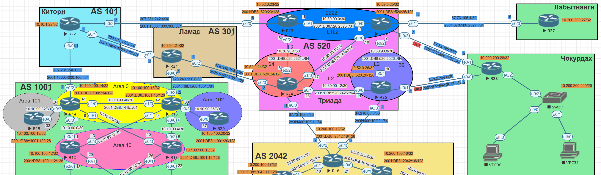

# Лабораторная №10

## Масштабируемость и дизайн iBGP

### Цели задания

- Настроить iBGP в офисе Москва
- Настроить iBGP в сети провайдера Триада
- Организовать полную IP связанность всех сетей

### Топология сети



### Задачи

- Настроите iBGP в офисом Москва между маршрутизаторами R14 и R15.
- Настроите iBGP в провайдере Триада, с использованием RR.
- Настройте офиса Москва так, чтобы приоритетным провайдером стал Ламас.
- Настройте офиса С.-Петербург так, чтобы трафик до любого офиса распределялся по двум линкам одновременно.
- Все сети в лабораторной работе должны иметь IP связность.
- План работы и изменения зафиксированы в документации.

Для построения iBGP в провайдере Триада с использованием Route Reflector (RR) создадим дополнительный линк R24-R25

## Таблица адресов

IPv4 адреса для оборудования берутся из предыдущей [лабораторной работы #4](../lab_04/README.md) и [лабораторной работы #9](../lab_09/README.md)

## AS 520 (Триада)

### IPv4 адреса

| Device | Interface | IP Address    | Subnet Mask     | Default Gateway | Description   |
| ------ | --------- | ------------- | --------------- | --------------- | ------------- |
| R23    | lo0       | 10.52.0.23    | 255.255.255.255 |                 | Loopback_R23  |
|        | e0/0      | 207.231.242.6 | 255.255.255.252 |                 | to_R22_AS101  |
|        | e0/1      | 10.30.90.1    | 255.255.255.252 |                 | to_R25        |
|        | e0/2      | 10.30.90.5    | 255.255.255.252 |                 | to_R24        |
| R24    | lo0       | 10.52.0.24    | 255.255.255.255 |                 | Loopback_R24  |
|        | e0/0      | 128.249.165.2 | 255.255.255.252 |                 | to_R21_AS301  |
|        | e0/1      | 10.30.90.13   | 255.255.255.252 |                 | to_R26        |
|        | e0/2      | 10.30.90.6    | 255.255.255.252 |                 | to_R23        |
|        | e0/3      | 67.73.193.1   | 255.255.255.252 |                 | to_R18_AS2042 |
|        | e1/0      | 10.30.90.17   | 255.255.255.252 |                 | to_R25        |
| R25    | lo0       | 10.52.0.25    | 255.255.255.255 |                 | Loopback_R25  |
|        | e0/0      | 10.30.90.2    | 255.255.255.252 |                 | to_R23        |
|        | e0/1      | 67.73.196.5   | 255.255.255.252 |                 | to_R27_ext    |
|        | e0/2      | 10.30.90.9    | 255.255.255.252 |                 | to_R26        |
|        | e0/3      | 67.73.196.1   | 255.255.255.252 |                 | to_R28_ext    |
|        | e1/0      | 10.30.90.18   | 255.255.255.252 |                 | to_R24        |
| R26    | lo0       | 10.52.0.26    | 255.255.255.255 |                 | Loopback_R26  |
|        | e0/0      | 10.30.90.14   | 255.255.255.252 |                 | to_R24        |
|        | e0/1      | 8.242.244.1   | 255.255.255.252 |                 | to_R28_ext    |
|        | e0/2      | 10.30.90.10   | 255.255.255.252 |                 | to_R25        |
|        | e0/3      | 64.210.65.1   | 255.255.255.252 |                 | to_R18_AS2042 |

### IPv6 адреса

| Device | Interface | IPv6 Address              | IPv6 link-local         | Default Gateway | Description   |
| ------ | --------- | ------------------------- | ----------------------- | --------------- | ------------- |
| R23    | lo0       | 2001:DB8::520:23/128      |                         |                 | Loopback_R23  |
|        | e0/0      | 2001:1860:4000:300::6/64  |                         |                 | to_R22_AS101  |
|        | e0/1      | 2001:DB8:520:2325::23/64  | FE80:520::23 link-local |                 | to_R25        |
|        | e0/2      | 2001:DB8:520:2324::23/64  | FE80:520::23 link-local |                 | to_R24        |
| R24    | lo0       | 2001:DB8::520:24/128      |                         |                 | Loopback_R24  |
|        | e0/0      | 2620:0:5070:301::2/64     |                         |                 | to_R21_AS301  |
|        | e0/1      | 2001:DB8:520:2426::24/64  | FE80:520::24 link-local |                 | to_R26        |
|        | e0/2      | 2001:DB8:520:2324::24/64  | FE80:520::24 link-local |                 | to_R23        |
|        | e0/3      | 2C0F:F400:10FF:1::1/64    |                         |                 | to_R18_AS2042 |
|        | e1/0      | 2001:DB8:520:2425::24/64  |                         |                 | to_R25        |
| R25    | lo0       | 2001:DB8::520:25/128      |                         |                 | Loopback_R25  |
|        | e0/0      | 2001:DB8:520:2325::25/64  | FE80:520::25 link-local |                 | to_R23        |
|        | e0/1      | 2001:678:5B0:2527::5/64   |                         |                 | to_R27_ext    |
|        | e0/2      | 22001:DB8:520:2526::25/64 | FE80:520::25 link-local |                 | to_R26        |
|        | e0/3      | 2001:678:ADC:2528::1/64   |                         |                 | to_R28_ext    |
|        | e1/0      | 2001:DB8:520:2425::25/64  | FE80:520::25 link-local |                 | to_R24        |
| R26    | lo0       | 2001:DB8::520:26/128      |                         |                 | Loopback_R26  |
|        | e0/0      | 2001:DB8:520:2426::26/64  | FE80:520::26 link-local |                 | to_R24        |
|        | e0/1      | 2001:67C:94C:2628::1/64   |                         |                 | to_R28_ext    |
|        | e0/2      | 2001:DB8:2526::26/64      | FE80:520::26 link-local |                 | to_R25        |
|        | e0/3      | 2C0F:F400:10FF:2::1/64    |                         |                 | to_R18_AS2042 |

## AS 1001 (Москва)

### IPv4 адреса

| Device | Interface | IP Address    | Subnet Mask     | Default Gateway | Description  |
| ------ | --------- | ------------- | --------------- | --------------- | ------------ |
| R14    | lo0       | 10.100.100.14 | 255.255.255.255 |                 | Loopback_R14 |
|        | e0/2      | 207.231.240.2 | 255.255.255.252 |                 | to_R22_AS101 |
|        | e1/0      | 10.10.90.41   | 255.255.255.252 |                 | to_R15       |
| R15    | lo0       | 10.100.100.15 | 255.255.255.255 |                 | Loopback_R15 |
|        | e0/2      | 128.249.190.2 | 255.255.255.252 |                 | to_R21_AS301 |
|        | e1/0      | 10.10.90.42   | 255.255.255.252 |                 | to_R14       |

### IPv6 адреса

| Device | Interface | IPv6 Address             | Default Gateway | Description  |
| ------ | --------- | ------------------------ | --------------- | ------------ |
| R14    | lo0       | 2001:DB8::1001:14/128    |                 | Loopback_R14 |
|        | e0/2      | 2001:1860:4000:100::2/64 |                 | to_R22_AS101 |
|        | e1/0      | 2001:DB8:1415::14/64     |                 | to_R15       |
| R15    | lo0       | 2001:DB8::1001:15/128    |                 | Loopback_R15 |
|        | e0/2      | 2001:468:1A08:1001::2/64 |                 | to_R21_AS301 |
|        | e1/0      | 2001:DB8:1415::15/64     |                 | to_R14       |

## AS 2042 (С.-Петербург)

### IPv4 адреса

| Device | Interface | IP Address    | Subnet Mask     | Default Gateway | Description  |
| ------ | --------- | ------------- | --------------- | --------------- | ------------ |
| R18    | lo0       | 10.200.100.18 | 255.255.255.255 |                 | Loopback_R18 |
|        | e0/2      | 67.73.193.2   | 255.255.255.252 |                 | to_R24_AS520 |
|        | e0/3      | 64.210.65.2   | 255.255.255.252 |                 | to_R26_As520 |

### IPv6 адреса

| Device | Interface | IPv6 Address           | Default Gateway | Description  |
| ------ | --------- | ---------------------- | --------------- | ------------ |
| R18    | lo0       | 2001:DB8::2042:18/128  |                 | Loopback_R23 |
|        | e0/2      | 2C0F:F400:10FF:1::2/64 |                 | to_R24_AS520 |
|        | e0/3      | 2C0F:F400:10FF:2::2/64 |                 | to_R26_AS520 |

# Настройка устройств:

<details>
<summary> Настройка базовых параметров</summary>

Настройка произведена в [лабораторной работе № 4](../lab_04/README.md)

- Присвойте имена устройствам в соответствии с топологией.

```
 (config)# hostname <X><n>
```

    где \<X> R - маршрутизатор S - коммутатор </br>
        \<n> номер устройства

- Отключение поиска DNS

```
 (config)# no ip domain-lookup
```

- Назначьте **class** в качестве зашифрованного пароля доступа к привилегированному режиму.

```
 (config)# enable secret class
```

- Назначьте **cisco** в качестве паролей консоли и VTY

```
 (config)# line console 0
 (config-line)# password cisco
 (config-line)# login
```

```
 (config)# line vty 0 4
 (config-line)# password cisco
 (config-line)# login
```

- Включить шифрование паролей

```
 (config)# service password-encryption
```

- Настройка баннерного сообщения дня (MOTD) для предупреждения пользователей о запрете несанкционированного доступа.

```
 (config)# banner motd "Unauthorized access denied"
```

- Сохранение конфигурации

```
# copy running-config startup-config
```

</details>

## Настраиваем IP адресов на маршрутизаторах провайдера Триада (AS520) и процесса iBGP с использованием RR

<details>
<summary>  Настраиваем IP адреса на маршрутизаторах R23, R24, R25, R26</summary>

R23

```
!
interface Loopback0
 description Loopback_R23
 ip address 10.52.0.23 255.255.255.255
 ipv6 address 2001:DB8::520:23/128
 ipv6 enable
!
interface Ethernet0/0
 description to_R22_AS101
 ip address 207.231.242.6 255.255.255.252
 ipv6 address 2001:1860:4000:300::6/64
 ipv6 enable
!
interface Ethernet0/1
 description to_R25
 ip address 10.30.90.1 255.255.255.252
 ipv6 address FE80:520::23 link-local
 ipv6 address 2001:DB8:520:2325::23/64
 ipv6 enable
!
interface Ethernet0/2
 description to_R24
 ip address 10.30.90.5 255.255.255.252
 ipv6 address FE80:520::23 link-local
 ipv6 address 2001:DB8:520:2324::23/64
 ipv6 enable
!

```

R24

```
!
interface Loopback0
 description Loopback_R24
 ip address 10.52.0.24 255.255.255.255
 ipv6 address 2001:DB8::520:24/128
 ipv6 enable
!
interface Ethernet0/0
 description to_R21_AS301
 ip address 128.249.165.2 255.255.255.252
 ipv6 address 2620:0:5070:301::2/64
 ipv6 enable
!
interface Ethernet0/1
 description to_R26
 ip address 10.30.90.13 255.255.255.252
 ipv6 address FE80:520::24 link-local
 ipv6 address 2001:DB8:520:2426::24/64
 ipv6 enable
!
interface Ethernet0/2
 description to_R23
 ip address 10.30.90.6 255.255.255.252
 ipv6 address FE80:520::24 link-local
 ipv6 address 2001:DB8:520:2324::24/64
 ipv6 enable
!
interface Ethernet0/3
 description to_R18_AS2
 ip address 67.73.193.1 255.255.255.252
 ipv6 address 2C0F:F400:10FF:1::1/64
 ipv6 enable
!
interface Ethernet1/0
 description to R25
 ip address 10.30.90.17 255.255.255.252
 ipv6 address FE80:520::24 link-local
 ipv6 address 2001:DB8:520:2425::24/64
 ipv6 enable

```

R25

```
!
interface Loopback0
 description Loopback_R25
 ip address 10.52.0.25 255.255.255.255
 ipv6 address 2001:DB8::520:25/128
 ipv6 enable
!
interface Ethernet0/0
 description to_R23
 ip address 10.30.90.2 255.255.255.252
 ipv6 address FE80:520::25 link-local
 ipv6 address 2001:DB8:520:2325::25/64
 ipv6 enable
!
interface Ethernet0/1
 description to_R27_ext
 ip address 67.73.196.5 255.255.255.252
 ipv6 address 2001:678:5B0:2527::5/64
 ipv6 enable
!
interface Ethernet0/2
 description to_R26
 ip address 10.30.90.9 255.255.255.252
 ipv6 address FE80:520::25 link-local
 ipv6 address 2001:DB8:520:2526::25/64
 ipv6 enable
!
interface Ethernet0/3
 description to_R28_ext
 ip address 67.73.196.1 255.255.255.252
 ipv6 address 2001:678:ADC:2528::1/64
 ipv6 enable
!
interface Ethernet1/0
 description to_R24
 ip address 10.30.90.18 255.255.255.252
 ipv6 address FE80:520::25 link-local
 ipv6 address 2001:DB8:520:2425::25/64
 ipv6 enable
!
```

R26

```
!
interface Loopback0
 description Loopback_R26
 ip address 10.52.0.26 255.255.255.255
 ipv6 address 2001:DB8::520:26/128
 ipv6 enable
!
interface Ethernet0/0
 description to_R24
 ip address 10.30.90.14 255.255.255.252
 ipv6 address FE80:520::26 link-local
 ipv6 address 2001:DB8:520:2426::26/64
 ipv6 enable
!
interface Ethernet0/1
 description to_R28_ext
 ip address 8.242.244.1 255.255.255.252
 ipv6 address 2001:67C:94C:2628::1/64
 ipv6 enable
!
interface Ethernet0/2
 description to_R25
 ip address 10.30.90.10 255.255.255.252
 ipv6 address FE80:520::26 link-local
 ipv6 address 2001:DB8:520:2526::26/64
 ipv6 enable
!
interface Ethernet0/3
 description to_R18_AS2042
 ip address 64.210.65.1 255.255.255.252
 ipv6 address 2C0F:F400:10FF:2::1/64
 ipv6 enable
!
```

</details>

<details>
<summary>Настраиваем iBGP на маршрутизаторах R23, R24, R25, R26 с использованием RR.</summary>

Роль Route Reflector назначим маршрутизатору R24.

Маршрутизаторы R23, R25, R26 назначим роль RR client.

R24

```
!
router bgp 520
 bgp router-id 10.52.0.24
 bgp log-neighbor-changes
 bgp listen range 10.30.90.0/24 peer-group pg_AS520
 neighbor pg_AS520 peer-group
 neighbor pg_AS520 remote-as 520
 neighbor pg_AS520_ipv6 peer-group
 neighbor pg_AS520_ipv6 remote-as 520
 neighbor 2001:DB8:520:2324::23 peer-group pg_AS520_ipv6
 neighbor 2001:DB8:520:2425::25 peer-group pg_AS520_ipv6
 neighbor 2001:DB8:520:2426::26 peer-group pg_AS520_ipv6
 neighbor 2620:0:5070:301::1 remote-as 301
 neighbor 2C0F:F400:10FF:1::2 remote-as 2042
 neighbor 67.73.193.2 remote-as 2042
 neighbor 128.249.165.1 remote-as 301
 !
 address-family ipv4
  network 67.73.193.0 mask 255.255.255.252
  network 128.249.165.0 mask 255.255.255.252
  redistribute connected
  neighbor pg_AS520 activate
  neighbor pg_AS520 route-reflector-client
  neighbor pg_AS520 next-hop-self
  no neighbor 2001:DB8:520:2324::23 activate
  no neighbor 2001:DB8:520:2425::25 activate
  no neighbor 2001:DB8:520:2426::26 activate
  no neighbor 2620:0:5070:301::1 activate
  no neighbor 2C0F:F400:10FF:1::2 activate
  neighbor 67.73.193.2 activate
  neighbor 128.249.165.1 activate
 exit-address-family
 !
 address-family ipv6
  redistribute connected
  network 2620:0:5070:301::/64
  network 2C0F:F400:10FF:1::/64
  neighbor pg_AS520_ipv6 route-reflector-client
  neighbor pg_AS520_ipv6 next-hop-self
  neighbor 2001:DB8:520:2324::23 activate
  neighbor 2001:DB8:520:2425::25 activate
  neighbor 2001:DB8:520:2426::26 activate
  neighbor 2620:0:5070:301::1 activate
  neighbor 2C0F:F400:10FF:1::2 activate
 exit-address-family
!

```

R23

```
!
router bgp 520
 bgp router-id 10.52.0.23
 bgp log-neighbor-changes
 neighbor 10.30.90.6 remote-as 520
 neighbor 2001:DB8:520:2324::24 remote-as 520
 neighbor 2001:1860:4000:300::5 remote-as 101
 neighbor 207.231.242.5 remote-as 101
 !
 address-family ipv4
  network 207.231.242.4 mask 255.255.255.252
  redistribute connected
  neighbor 10.30.90.6 activate
  no neighbor 2001:DB8:520:2324::24 activate
  no neighbor 2001:1860:4000:300::5 activate
  neighbor 207.231.242.5 activate
 exit-address-family
 !
 address-family ipv6
  redistribute connected
  network 2001:1860:4000:300::/64
  neighbor 2001:DB8:520:2324::24 activate
  neighbor 2001:1860:4000:300::5 activate
 exit-address-family
!

```

R25

```
!
router bgp 520
 bgp router-id 10.52.0.25
 bgp log-neighbor-changes
 neighbor 10.30.90.17 remote-as 520
 neighbor 2001:DB8:520:2425::24 remote-as 520
 !
 address-family ipv4
  network 67.73.196.0 mask 255.255.255.252
  network 67.73.196.4 mask 255.255.255.252
  redistribute connected
  neighbor 10.30.90.17 activate
  no neighbor 2001:DB8:520:2425::24 activate
 exit-address-family
 !
 address-family ipv6
  redistribute connected
  neighbor 2001:DB8:520:2425::24 activate
 exit-address-family
!

```

R26

```
!
router bgp 520
 bgp router-id 10.52.0.26
 bgp log-neighbor-changes
 neighbor 10.30.90.13 remote-as 520
 neighbor 2001:DB8:520:2426::24 remote-as 520
 neighbor 2C0F:F400:10FF:2::2 remote-as 2042
 neighbor 64.210.65.2 remote-as 2042
 !
 address-family ipv4
  network 8.242.244.0 mask 255.255.255.252
  network 64.210.65.0 mask 255.255.255.252
  redistribute connected
  neighbor 10.30.90.13 activate
  no neighbor 2001:DB8:520:2426::24 activate
  no neighbor 2C0F:F400:10FF:2::2 activate
  neighbor 64.210.65.2 activate
 exit-address-family
 !
 address-family ipv6
  redistribute connected
  network 2C0F:F400:10FF:2::/64
  neighbor 2001:DB8:520:2426::24 activate
  neighbor 2C0F:F400:10FF:2::2 activate
 exit-address-family
!
```

</details>

## Настраиваем IP адресов на маршрутизаторах офиса Москва (AS1001) и процесса iBGP

<details>
<summary>  Настраиваем IP адреса на маршрутизаторах R14, R15</summary>

R14

```
!
interface Loopback0
 description Loopback_R14
 ip address 10.100.100.14 255.255.255.255
 ipv6 address 2001:DB8::1001:14/128
 ipv6 enable
!
interface Ethernet0/0
 description to_R12
 ip address 10.10.90.2 255.255.255.252
 ipv6 address FE80::14 link-local
 ipv6 address 2001:DB8:1214::14/64
 ipv6 enable
!
interface Ethernet0/1
 description to_R13
 ip address 10.10.90.9 255.255.255.252
 ipv6 address FE80::14 link-local
 ipv6 address 2001:DB8:1314::14/64
 ipv6 enable
!
interface Ethernet0/2
 description to_R22_AS101
 ip address 207.231.240.2 255.255.255.252
 ipv6 address 2001:1860:4000:100::2/64
 ipv6 enable
!
interface Ethernet0/3
 description to_R19
 ip address 10.10.90.34 255.255.255.252
 ipv6 address FE80::14 link-local
 ipv6 address 2001:DB8:1419::14/64
 ipv6 enable
!
interface Ethernet1/0
 description to_R15
 ip address 10.10.90.41 255.255.255.252
 ipv6 address FE80::14 link-local
 ipv6 address 2001:DB8:1415::14/64
 ipv6 enable
!

```

R15

```
!
interface Loopback0
 description Loopback_R15
 ip address 10.100.100.15 255.255.255.255
 ipv6 address 2001:DB8::1001:15/128
 ipv6 enable
!
interface Ethernet0/0
 description to_R13
 ip address 10.10.90.6 255.255.255.252
 ipv6 address FE80::15 link-local
 ipv6 address 2001:DB8:1315::15/64
 ipv6 enable
!
interface Ethernet0/1
 description to_R12
 ip address 10.10.90.14 255.255.255.252
 ipv6 address FE80::15 link-local
 ipv6 address 2001:DB8:1215::15/64
 ipv6 enable
!
interface Ethernet0/2
 description to_R21_AS301
 ip address 128.249.190.2 255.255.255.252
 ipv6 address 2001:468:1A08:1001::2/64
 ipv6 enable
!
interface Ethernet0/3
 description to_R20
 ip address 10.10.90.38 255.255.255.252
 ipv6 address FE80::15 link-local
 ipv6 address 2001:DB8:1520::15/64
 ipv6 enable
!
interface Ethernet1/0
 description to_R14
 ip address 10.10.90.42 255.255.255.252
 ipv6 address FE80::15 link-local
 ipv6 address 2001:DB8:1415::15/64
 ipv6 enable
!

```

</details>

<details>
<summary>Настраиваем iBGP на маршрутизаторах R14, R15 с приоритетом исходящего трафика через маршрутизатор R15 (провайдер Ламас) </summary>

R14

```
!
router bgp 1001
 bgp router-id 10.100.100.14
 bgp log-neighbor-changes
 neighbor 10.10.90.42 remote-as 1001
 neighbor 2001:DB8:1415::15 remote-as 1001
 neighbor 2001:1860:4000:100::1 remote-as 101
 neighbor 207.231.240.1 remote-as 101
 !
 address-family ipv4
  network 207.231.240.0 mask 255.255.255.252
  neighbor 10.10.90.42 activate
  no neighbor 2001:DB8:1415::15 activate
  no neighbor 2001:1860:4000:100::1 activate
  neighbor 207.231.240.1 activate
 exit-address-family
 !
 address-family ipv6
  network 2001:1860:4000:100::/64
  neighbor 2001:DB8:1415::15 activate
  neighbor 2001:1860:4000:100::1 activate
 exit-address-family
!

```

R15 создаем prefix-list и route-map для всех офисов и устанавливаем local-preference 300

```
!
ip prefix-list ALL_OFFICE seq 10 permit 67.73.193.0/30
ip prefix-list ALL_OFFICE seq 20 permit 64.210.65.0/30
ip prefix-list ALL_OFFICE seq 30 permit 67.73.196.0/30
ip prefix-list ALL_OFFICE seq 40 permit 8.242.244.0/30
ip prefix-list ALL_OFFICE seq 50 permit 67.73.196.4/30
!
ipv6 prefix-list ALL_OFFICE_v6 seq 10 permit 2C0F:F400:10FF:1::/64
ipv6 prefix-list ALL_OFFICE_v6 seq 20 permit 2C0F:F400:10FF:2::/64
ipv6 prefix-list ALL_OFFICE_v6 seq 30 permit 2001:678:ADC:2528::/64
ipv6 prefix-list ALL_OFFICE_v6 seq 40 permit 2001:67C:94C:2628::/64
ipv6 prefix-list ALL_OFFICE_v6 seq 50 permit 2001:678:5B0:2527::/64
!
route-map rm_ALL_OFFICE_v6 permit 10
 match ipv6 address prefix-list ALL_OFFICE_v6
 set local-preference 300
!
route-map rm_ALL_OFFICE_v6 permit 20
!
route-map rm_ALL_OFFICE permit 10
 match ip address prefix-list ALL_OFFICE
 set local-preference 300
!
route-map rm_ALL_OFFICE permit 20

```

R15 настраиваем процесс BGP и применяем route-map на получаемые префикса от провайдера "Лимас"

```
!
router bgp 1001
 bgp router-id 10.100.100.15
 bgp log-neighbor-changes
 neighbor 10.10.90.41 remote-as 1001
 neighbor 2001:468:1A08:1001::1 remote-as 301
 neighbor 2001:DB8:1415::14 remote-as 1001
 neighbor 128.249.190.1 remote-as 301
 !
 address-family ipv4
  network 128.249.190.0 mask 255.255.255.252
  neighbor 10.10.90.41 activate
  no neighbor 2001:468:1A08:1001::1 activate
  no neighbor 2001:DB8:1415::14 activate
  neighbor 128.249.190.1 activate
  neighbor 128.249.190.1 route-map rm_ALL_OFFICE in
 exit-address-family
 !
 address-family ipv6
  network 2001:468:1A08:1001::/64
  neighbor 2001:468:1A08:1001::1 activate
  neighbor 2001:468:1A08:1001::1 route-map rm_ALL_OFFICE_v6 in
  neighbor 2001:DB8:1415::14 activate
 exit-address-family
!
```

</details>

# Проверка работоспособности

<details>

<summary>Таблицы маршрутизации BGP</summary>
