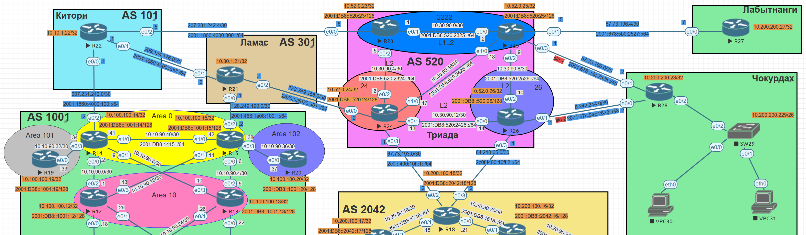
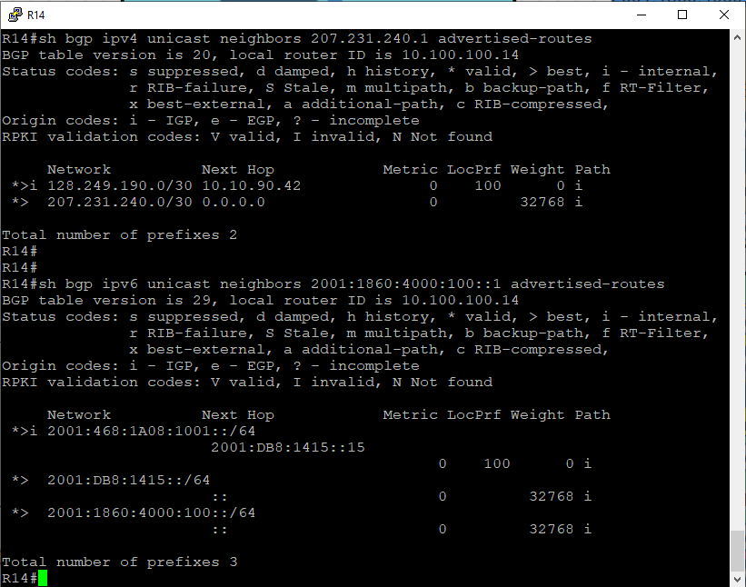
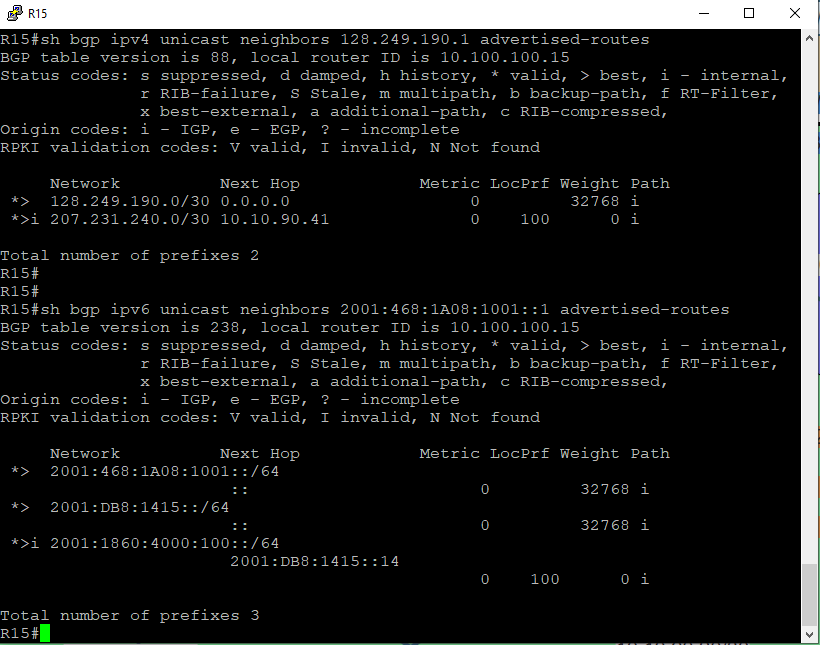
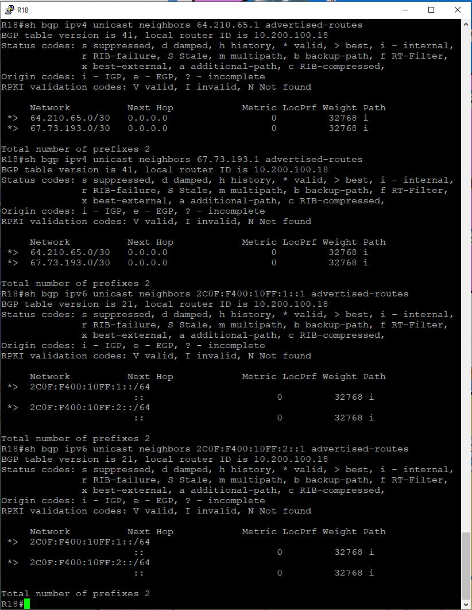
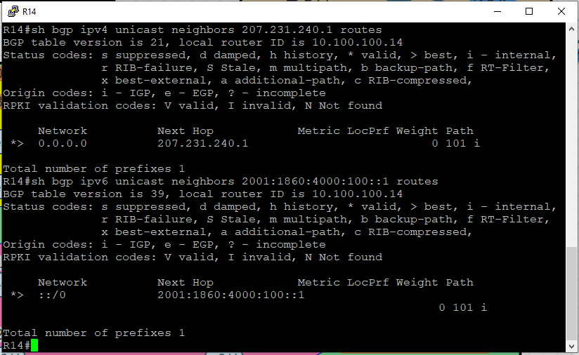

# Лабораторная №11

## BGP. Управление анонсами

### Цели задания

- Настроить фильтрацию для офисе Москва
- Настроить фильтрацию для офисе С.-Петербург

### Топология сети



### Задачи

- Настроить фильтрацию в офисе Москва так, чтобы не появилось транзитного трафика(As-path).
- Настроить фильтрацию в офисе С.-Петербург так, чтобы не появилось транзитного трафика(Prefix-list).
- Настроить провайдера Киторн так, чтобы в офис Москва отдавался только маршрут по умолчанию.
- Настроить провайдера Ламас так, чтобы в офис Москва отдавался только маршрут по умолчанию и префикс офиса С.-Петербург.
- Все сети в лабораторной работе должны иметь IP связность.
- План работы и изменения зафиксированы в документации.

# Настройка устройств:

<details>

<summary><H2>Настройка фильтрации в офисе Москва (As-path)</H2></summary>

При подключении к двум провайдерам возможна ситуации, когда **"наша"** AS может стать транзитной из-за того, что он анонсирует сети провайдеров друг другу. Чтобы предотвратить такое поведение "наша" AS должна анонсировать только **"свои"** сети, т.е. с пустым значением AS path.

### Создаем фильтр на R14 и R15

```
ip as-path access-list 1 permit ^$
```

### Применяем фильтр на вышестоящего провайдера

#### R14

```
!
router bgp 1001
 !
 address-family ipv4
  neighbor 207.231.240.1 filter-list 1 out
 exit-address-family
 !
 address-family ipv6
  neighbor 2001:1860:4000:100::1 filter-list 1 out
 exit-address-family
!

```

#### R15

```
!
router bgp 1001
 !
 address-family ipv4
  neighbor 128.249.190.1 filter-list 1 out
 exit-address-family
 !
 address-family ipv6
  neighbor 2001:468:1A08:1001::1 filter-list 1 out
 exit-address-family
!

```

### Проверка

#### R14 префиксы отдаваемые провайдеру



#### R15 префиксы отдаваемые провайдеру



Задача по предотвращению появления транзитного трафика в офисе Москва выполнена.

</details>

<details>

<summary><H2>Настройка фильтрации в офисе С.-Петербург (Prefix-list)</H2></summary>

Проблема с транзитным трафиком в офисе С.-Петербург аналогична проблеме в офисе Москва. Для ее решения используем prefix-list.

### Создаем prefix-list на R18

```
!
ip prefix-list pl_OUT seq 10 permit 67.73.193.0/30
ip prefix-list pl_OUT seq 20 permit 64.210.65.0/30
!
!
ipv6 prefix-list pl_OUT_v6 seq 10 permit 2C0F:F400:10FF:1::/64
ipv6 prefix-list pl_OUT_v6 seq 20 permit 2C0F:F400:10FF:2::/64
!

```

### Применяем prefix-list на вышестоящего провайдера

```
!
router bgp 2042
 !
 address-family ipv4
  neighbor 64.210.65.1 prefix-list pl_OUT out
  neighbor 67.73.193.1 prefix-list pl_OUT out
 exit-address-family
 !
 address-family ipv6
  neighbor 2C0F:F400:10FF:1::1 prefix-list pl_OUT_v6 out
  neighbor 2C0F:F400:10FF:2::1 prefix-list pl_OUT_v6 out
 exit-address-family
!

```

### Проверка

#### R18 префиксы отдаваемые провайдеру



Задача по предотвращению появления транзитного трафика в офисе С.-Петербург выполнена.

</details>

<details>

<summary><H2>Настройка провайдера Киторн так, чтобы в офис Москва отдавался только маршрут по умолчанию</H2></summary>

Создаем маршруты по умолчанию и route-map для фильтрации анонсируемых префиксов.

```
!
ip route 0.0.0.0 0.0.0.0 Null0
!
ip prefix-list pl_DEF seq 10 permit 0.0.0.0/0
!
ipv6 route ::/0 Null0
!
ipv6 prefix-list pl_DEF_ipv6 seq 5 permit ::/0
!
route-map rm_DEF_ipv6 permit 10
 match ipv6 address prefix-list pl_DEF_ipv6
!
route-map rm_DEF permit 10
 match ip address prefix-list pl_DEF
!
```

Настраиваем передачу маршрута по умолчанию и запрет передачи остальных префиксов.

```
!
router bgp 101
 !
 address-family ipv4
  neighbor 207.231.240.2 default-originate
  neighbor 207.231.240.2 route-map rm_DEF out
 exit-address-family
 !
 address-family ipv6
  neighbor 2001:1860:4000:100::2 default-originate
  neighbor 2001:1860:4000:100::2 route-map rm_DEF_ipv6 out
 exit-address-family
!
```

### Проверка

#### R14 префиксы получаемые от провайдера



</details>

<details>

<summary><H2>Настройка провайдера Ламас так, чтобы в офис Москва отдавался только маршрут по умолчанию и префикс офиса С.-Петербург</H2></summary>

```

```

</details>
