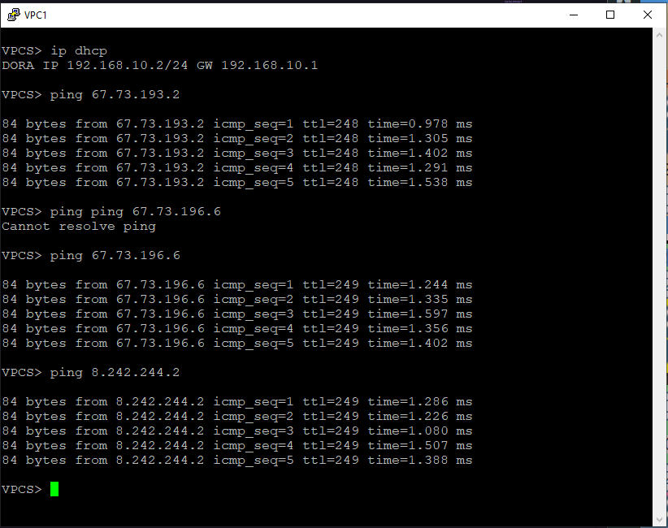
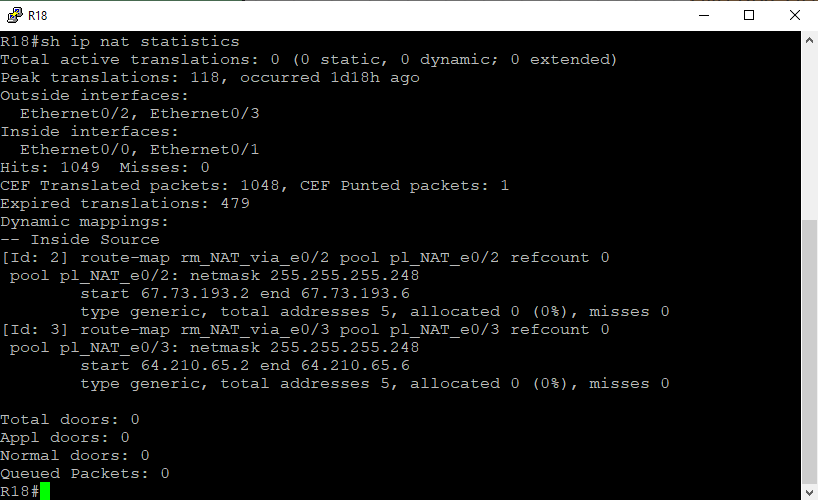
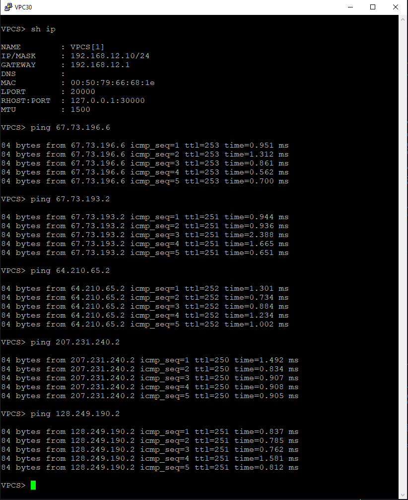

# Лабораторная №12

## Основные протоколы сети интернет

### Цели задания

- Настроить DHCP в офисе Москва
- Настроить синхронизацию времени в офисе Москва
- Настроить NAT в офисе Москва, C.-Перетбруг и Чокурдах

### Топология сети


### Задачи

- Настроите NAT(PAT) на R14 и R15. Трансляция должна осуществляться в адрес автономной системы AS1001.
- Настроите NAT(PAT) на R18. Трансляция должна осуществляться в пул из 5 адресов автономной системы AS2042.
- Настроите статический NAT для R20.
- Настроите NAT так, чтобы R19 был доступен с любого узла для удаленного управления.
- Настроите статический NAT(PAT) для офиса Чокурдах.
- Настроите для IPv4 DHCP сервер в офисе Москва на маршрутизаторах R12 и R13. VPC1 и VPC7 должны получать сетевые настройки по DHCP.
- Настроите NTP сервер на R12 и R13. Все устройства в офисе Москва должны синхронизировать время с R12 и R13.
- Все офисы в лабораторной работе должны иметь IP связность.
- План работы и изменения зафиксированы в документации.

# Настройка устройств:

Базовая настройка и настройка IP адресов была произведена в предыдущих лабораторных работах.

<details>

<summary><H3>Настроите NAT(PAT) на R14 и R15 в офисе Москва</H3></summary>

### Создаем списки доступа кому разрешен выход во внешние сети

#### R14 и R15

```
access-list 101 permit ip 192.168.10.0 0.0.0.255 any
access-list 101 permit ip 192.168.20.0 0.0.0.255 any
access-list 101 permit ip 10.100.100.0 0.0.0.255 any
access-list 101 permit ip 10.10.90.0 0.0.0.255 any
```

### Определяем внутренние и внешние интерфейсы

#### R14

```
interface Ethernet0/0
 description to_R12
 ip address 10.10.90.2 255.255.255.252
 ip nat inside
 ip virtual-reassembly in
!
interface Ethernet0/1
 description to_R13
 ip address 10.10.90.9 255.255.255.252
 ip nat inside
 ip virtual-reassembly in
!
interface Ethernet0/2
 description to_R22_AS101
 ip address 207.231.240.2 255.255.255.252
 ip nat outside
 ip virtual-reassembly in
!
interface Ethernet0/3
 description to_R19
 ip address 10.10.90.34 255.255.255.252
 ip nat inside
 ip virtual-reassembly in
!
interface Ethernet1/0
 description to_R15
 ip address 10.10.90.41 255.255.255.252
 ip nat inside
 ip virtual-reassembly in
!
```

#### R15

```
interface Ethernet0/0
 description to_R13
 ip address 10.10.90.6 255.255.255.252
 ip nat inside
 ip virtual-reassembly in
!
interface Ethernet0/1
 description to_R12
 ip address 10.10.90.14 255.255.255.252
 ip nat inside
 ip virtual-reassembly in
!
interface Ethernet0/2
 description to_R21_AS301
 ip address 128.249.190.2 255.255.255.248
 ip nat outside
 ip virtual-reassembly in
!
interface Ethernet0/3
 description to_R20
 ip address 10.10.90.38 255.255.255.252
 ip nat inside
 ip virtual-reassembly in
!
interface Ethernet1/0
 description to_R14
 ip address 10.10.90.42 255.255.255.252
 ip nat inside
 ip virtual-reassembly in
!
```

### Создаем динамическую трансляцию между внутренним локальным и внешним глобальным адресами

#### R14 и R15

```
ip nat inside source list 101 interface Ethernet0/2 overload
```

</details>

<details>

<summary><H3>Настройка для IPv4 DHCP сервер в офисе Москва на маршрутизаторах R12 и R13</H3></summary>

#### R12

```
!
ip dhcp excluded-address 192.168.10.1
ip dhcp excluded-address 192.168.20.1
!
ip dhcp pool CLIENT10
 network 192.168.10.0 255.255.255.0
 default-router 192.168.10.1
!
ip dhcp pool CLIENT20
 network 192.168.20.0 255.255.255.0
 default-router 192.168.20.1
!
```

#### R13

Т.к. R12 и R13 одновременно отвечают на DHCP запрос R13 сдвинем пул выдаваемых адресов для предотвращения конфликта адресов.

```
ip dhcp excluded-address 192.168.10.2 192.168.10.127
ip dhcp excluded-address 192.168.20.2 192.168.20.127

```

```
!
ip dhcp excluded-address 192.168.10.1
ip dhcp excluded-address 192.168.20.1
ip dhcp excluded-address 192.168.10.2 192.168.10.127
ip dhcp excluded-address 192.168.20.2 192.168.20.127
!
ip dhcp pool CLIENT10
 network 192.168.10.0 255.255.255.0
 default-router 192.168.10.1
!
ip dhcp pool CLIENT20
 network 192.168.20.0 255.255.255.0
 default-router 192.168.20.1
!

```

На коммутаторах SW4 и SW5 настраиваем SVI интерфейсы и VRRP на этих интерфейсах, а также указываем helper адрес через который происходит пересылка широковещательного пакета от клиента одноадресатным пакетом DHCP-серверу.

#### SW4

```
interface Vlan10
 description VLAN 10
 ip address 192.168.10.4 255.255.255.0
 ip helper-address 10.100.100.12
 ip helper-address 10.100.100.13
 ipv6 enable
 vrrp 10 description VLAN10
 vrrp 10 ip 192.168.10.1
 vrrp 10 priority 110
!
interface Vlan20
 description VLAN20
 ip address 192.168.20.4 255.255.255.0
 ip helper-address 10.100.100.12
 ip helper-address 10.100.100.13
 ipv6 enable
 vrrp 20 description VLAN20
 vrrp 20 ip 192.168.20.1
 vrrp 20 priority 110
!
interface Vlan100
 description MGMT
 ip address 10.100.100.204 255.255.255.192
 ipv6 enable
 vrrp 100 description MGMT
 vrrp 100 ip 10.100.100.193
 vrrp 100 priority 110
!
```

#### SW5

```
!
interface Vlan10
 description VLAN10
 ip address 192.168.10.5 255.255.255.0
 ip helper-address 10.100.100.12
 ip helper-address 10.100.100.13
 ipv6 enable
 vrrp 10 description VLAN10
 vrrp 10 ip 192.168.10.1
!
interface Vlan20
 description VLAN20
 ip address 192.168.20.5 255.255.255.0
 ip helper-address 10.100.100.12
 ip helper-address 10.100.100.13
 ipv6 enable
 vrrp 20 ip 192.168.20.1
!
interface Vlan100
 description MGMT
 ip address 10.100.100.205 255.255.255.192
 ipv6 enable
 vrrp 100 description MGMT
 vrrp 100 ip 10.100.100.193
!
```

</details>

<details>

<summary><H3>Проверка работы DHCP и NAT в Московском офисе.</H3></summary>

#### Получение IP адреса проверка работы NAT на VPC1



#### Получение IP адреса проверка работы NAT на VPC7


#### dhcp lease на R12


#### Таблица nat translations на R15

В лабораторной работе № 10 мы установили провайдера "Ламас" как приоритетный, поэтому весь исходящий трафик пойдет через R15


</details>

<details>

<summary><H3>Настройка NTP сервера на R12 и R13 и синхронизация всех устройств в ними</H3></summary>

#### R12 и R13

```
!
ntp source Loopback0
ntp master 3
ntp update-calendar
ntp server 207.231.240.1
```

#### На остальных устройствах

```
!
ntp update-calendar
ntp server 10.100.100.12
ntp server 10.100.100.13
!

```

### Проверка работы NTP

#### SW4


#### SW5


</details>

<details>

<summary><H3>Настройка NAT для удаленного доступа к R19 с любого устройства</H3></summary>

Настройку будем производить на R14

#### R14

```
ip nat inside source static tcp 10.100.100.19 22 207.231.240.2 22 extendable
```

На R19 включаем доступ по SSH

#### R19 (пароль **cisco**)

```
aaa new-model
ip domain name r19.msk.local
username admin privilege 15 password 7 070C285F4D06
ip ssh version 2
!
line vty 0 4
 exec-timeout 60 0
 logging synchronous
 transport input ssh
!
```

Генерация SSH ключей

```
crypto key generate rsa
```

### Проверка доступа к R19 c R27

#### R27


</details>

<details>

<summary><H3>Настройка статического NAT для R20 </H3></summary>

Настройку будем производить на R15

#### R15

```
ip nat inside source static 10.100.100.20 128.249.190.3
```

На R20 включаем доступ по telnet

```
line vty 0 4
 password 7 14141B180F0B
 login
 transport input telnet
!
```

### Проверка доступа к R20 c R27

#### R27


</details>

<details>

<summary><H3>Настройка NAT для R18 в офисе С.-Петербург</H3></summary>

Определяем внутренние и внешние интерфейсы на R18

```
interface Ethernet0/0
 description to_R16
 ip address 10.20.90.21 255.255.255.252
 ip nat inside
 ip virtual-reassembly in
!
interface Ethernet0/1
 description to_R17
 ip address 10.20.90.18 255.255.255.252
 ip nat inside
 ip virtual-reassembly in
!
interface Ethernet0/2
 description to_R24_AS520
 ip address 67.73.193.2 255.255.255.248
 ip nat outside
 ip virtual-reassembly in
!
interface Ethernet0/3
 description to_R26_AS520
 ip address 64.210.65.2 255.255.255.248
 ip nat outside
 ip virtual-reassembly in
!
```

Создаем списки доступа на R18

```
access-list 101 permit ip 10.200.100.0 0.0.0.255 any
access-list 101 permit ip 192.168.11.0 0.0.0.255 any
access-list 101 permit ip 192.168.21.0 0.0.0.255 any
access-list 101 permit ip 10.20.90.0 0.0.0.255 any
```

В лабораторной работе № 10 на R18 мы настроили балансировку для исходящего трафика, в связи с этим настраиваем route-map для каждого внешнего интерфейса.

```
route-map rm_NAT_via_e0/3 permit 10
 match ip address 101
 match interface Ethernet0/3
!
route-map rm_NAT_via_e0/2 permit 10
 match ip address 101
 match interface Ethernet0/2
!
```

создаем pool nat и включаем NAT

```
ip nat pool pl_NAT_e0/3 64.210.65.2 64.210.65.6 netmask 255.255.255.248
ip nat pool pl_NAT_e0/2 67.73.193.2 67.73.193.6 netmask 255.255.255.248
ip nat inside source route-map rm_NAT_via_e0/2 pool pl_NAT_e0/2 overload
ip nat inside source route-map rm_NAT_via_e0/3 pool pl_NAT_e0/3 overload
```

На коммутаторах SW9 и SW10 настаиваем SVI и VRRP

#### SW9

```
!
interface Vlan11
 ip address 192.168.11.9 255.255.255.0
 vrrp 11 description VLAN11
 vrrp 11 ip 192.168.11.1
 vrrp 11 priority 110
!
interface Vlan21
 ip address 192.168.21.9 255.255.255.0
 vrrp 21 description VLAN21
 vrrp 21 ip 192.168.21.1
 vrrp 21 priority 110
!
```

#### SW10

```
!
interface Vlan11
 ip address 192.168.11.10 255.255.255.0
 vrrp 11 description VLAN11
 vrrp 11 ip 192.168.11.1
!
interface Vlan21
 ip address 192.168.21.10 255.255.255.0
 vrrp 21 description VLAN 21
 vrrp 21 ip 192.168.21.1
!
```

### Проверка работы NAT в офисе С.-Петербург

#### VPC8 пинги на все офисы


#### VPC пинги на все офисы


#### таблица NAT на R18


#### статистика NAT на R18



</details>

<details>

<summary><H3>Настройка NAT для R28 в офисе Чокурдах</H3></summary>

NAT в офисе Чокурдах был ранее настроен в лабораторной работе #5

#### Определяем внутренние и внешние интерфейсы на R28

```
!
interface Ethernet0/0
 description to_R26_AS520
 ip address 8.242.244.2 255.255.255.252
 ip nat outside
 ip virtual-reassembly in
!
interface Ethernet0/1
 description to_R25_AS520
 ip address 67.73.196.2 255.255.255.252
 ip nat outside
 ip virtual-reassembly in
!
interface Ethernet0/2
 no ip address
!
interface Ethernet0/2.12
 description Client VLAN 12
 encapsulation dot1Q 12
 ip address 192.168.12.1 255.255.255.0
 ip nat inside
 ip nat enable
 ip virtual-reassembly in
 ip policy route-map rm_TRACKING
!
interface Ethernet0/2.22
 description Client VLAN 22
 encapsulation dot1Q 22
 ip address 192.168.22.1 255.255.255.0
 ip nat inside
 ip nat enable
 ip virtual-reassembly in
 ip policy route-map rm_TRACKING
!
```

#### создаем аксес листы для локальных сетей

```
!
access-list 112 permit ip 192.168.12.0 0.0.0.255 any
access-list 122 permit ip 192.168.22.0 0.0.0.255 any

```

#### настраиваем Service Level Agreements и track для внешних шлюзов

```
!
ip sla 1
 icmp-echo 67.73.196.1 source-ip 67.73.196.2
 frequency 10
ip sla schedule 1 life forever start-time now
ip sla 2
 icmp-echo 8.242.244.1 source-ip 8.242.244.2
 frequency 10
ip sla schedule 2 life forever start-time now
!

!
track 1 ip sla 1 reachability
 delay down 30 up 15
!
track 2 ip sla 2 reachability
 delay down 30 up 15

```

#### настраиваем маршруты по умолчанию и включаем на них tracking

```
ip route 0.0.0.0 0.0.0.0 67.73.196.1 10 track 1
ip route 0.0.0.0 0.0.0.0 8.242.244.1 20 track 2
!

```

#### настраиваем Route Map для tracking

```
route-map rm_TRACKING permit 10
 match ip address 112
 set ip next-hop verify-availability 67.73.196.1 10 track 1
 set ip next-hop verify-availability 8.242.244.1 20 track 2
!
route-map rm_TRACKING permit 20
 match ip address 122
 set ip next-hop verify-availability 8.242.244.1 10 track 2
 set ip next-hop verify-availability 67.73.196.1 20 track 1

```

#### настраиваем Route Map для NAT

```
!
route-map rm_NAT_via_e0/1 permit 10
 match ip address 112 122
 match interface Ethernet0/1
 set ip next-hop 67.73.196.1
!
route-map rm_NAT_via_e0/0 permit 10
 match ip address 122 112
 match interface Ethernet0/0
 set ip next-hop 8.242.244.1

```

#### включаем NAT

```
ip nat inside source route-map rm_NAT_via_e0/0 interface Ethernet0/0 overload
ip nat inside source route-map rm_NAT_via_e0/1 interface Ethernet0/1 overload
!
```

### Проверка работы NAT в офисе Чокурдах

#### VPC30 пинги на все офисы



#### VPC31 пинги на все офисы


#### таблица NAT на R28


#### статистика NAT на R28


</details>

<details>

<summary><H3>Проверка IP связности</H3></summary>

## Офис Москва

### Пинги из офиса Москва VPC1


### Пинги из офиса Москва VPC7


## Офис С.-Петербург

### VPC8 пинги на все офисы


### VPC пинги на все офисы


</details>
