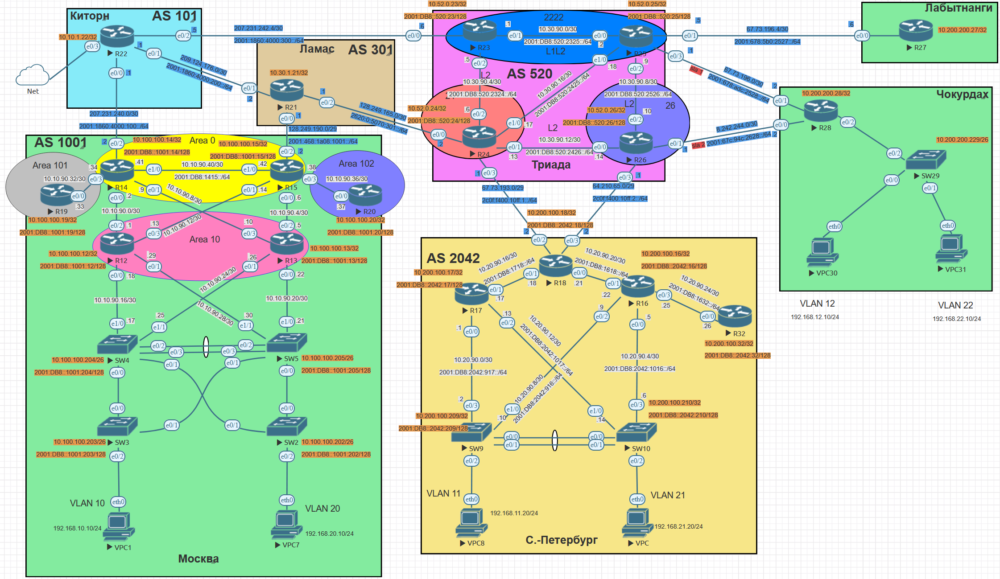
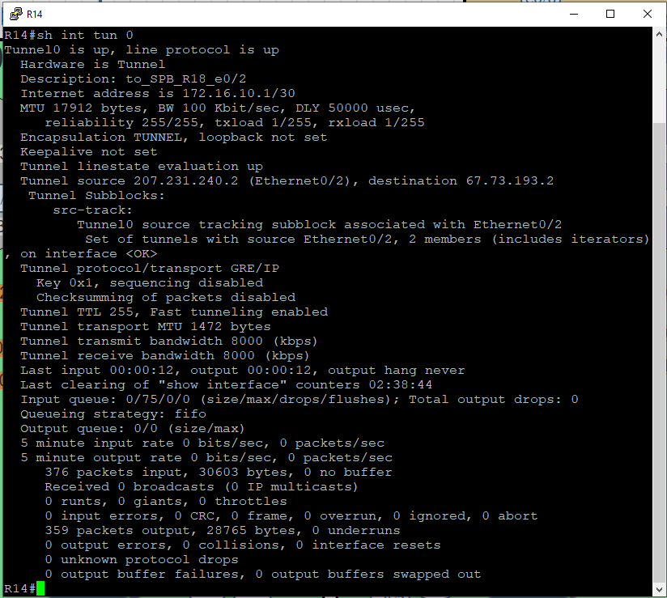
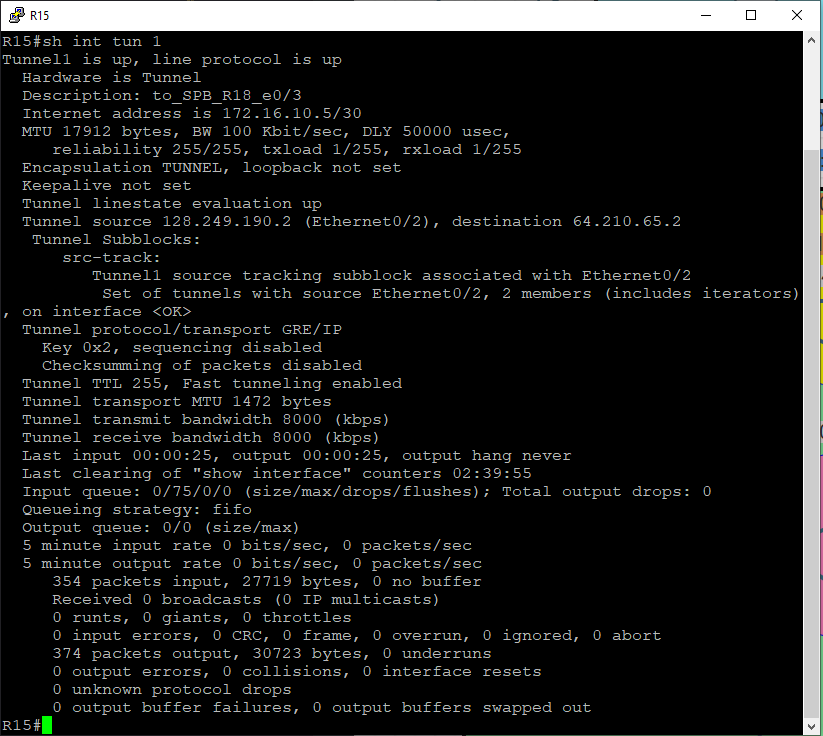
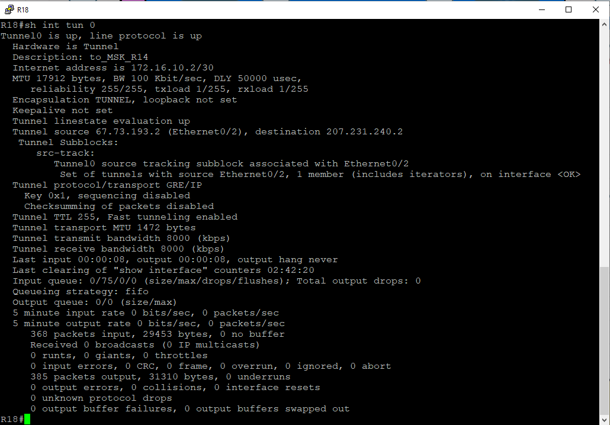
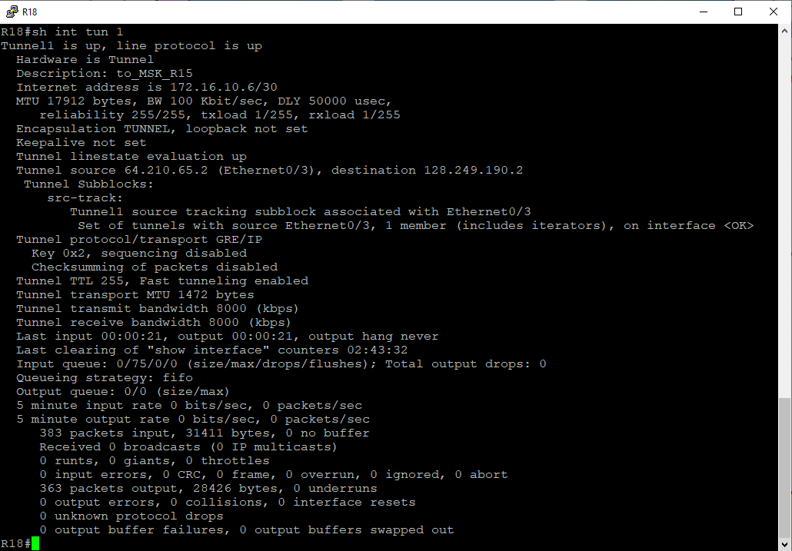

# Лабораторная №13

## Виртуальная частные сети - VPN

### Цели задания

- Настроить GRE между офисами Москва и С.-Петербург
- Настроить DMVPN между офисами Москва и Чокурдах, Лабытнанги

### Топология сети



### Задачи

- Настроите GRE между офисами Москва и С.-Петербург.
- Настроите DMVMN между Москва и Чокурдах, Лабытнанги.
- Все узлы в офисах в лабораторной работе должны иметь IP связность.
- План работы и изменения зафиксированы в документации.

# Настройка устройств:

Базовая настройка и настройка IP адресов была произведена в предыдущих лабораторных работах.

<details>

<summary><H3>Настройка GRE между офисами Москва и С.-Петербург</H3></summary>

Между офисами Москва и С.-Петербург создадим два GRE канала:

- от R14 до R18 на интерфейс **e0/2**
- от R15 до R18 на интерфейс **e0/3**

## Таблица адресов для GRE между офисами Москва и С.-Петербург

| Device | Interface | IP Address  | Subnet Mask     | Default Gateway | Description     |
| ------ | --------- | ----------- | --------------- | --------------- | --------------- |
| R14    | tun0      | 172.16.10.1 | 255.255.255.252 |                 | to_SPB_R18_e0/2 |
| R15    | tun1      | 172.16.10.5 | 255.255.255.252 |                 | to_SPB_R18_e0/3 |
| R18    | tun0      | 172.16.10.2 | 255.255.255.252 |                 | to_MSK_R14      |
|        | tun1      | 172.16.10.6 | 255.255.255.252 |                 | to_MSK_R15      |

### R14

```
interface Tunnel0
 description to_SPB_R18_e0/2
 ip address 172.16.10.1 255.255.255.252
 tunnel source Ethernet0/2
 tunnel destination 67.73.193.2
 tunnel key 1
!
```

### R15

```
interface Tunnel1
 description to_SPB_R18_e0/3
 ip address 172.16.10.5 255.255.255.252
 tunnel source Ethernet0/2
 tunnel destination 64.210.65.2
 tunnel key 2
!
```

### R18

```
!
interface Tunnel0
 description to_MSK_R14
 ip address 172.16.10.2 255.255.255.252
 tunnel source Ethernet0/2
 tunnel destination 207.231.240.2
 tunnel key 1
!
interface Tunnel1
 description to_MSK_R15
 ip address 172.16.10.6 255.255.255.252
 tunnel source Ethernet0/3
 tunnel destination 128.249.190.2
 tunnel key 2
!
```

### Проверка работы GRE туннелей

#### tun0 R14



#### tun1 R15



#### tun0 R18



#### tun1 R18



</details>

<details>

<summary><H3>Настройка DMVMN между Москва и Чокурдах, Лабытнанги</H3></summary>

Маршрутизаторам R14 и R15 в офисе Москва назначим роль **HUB**

### R14

```
!
interface Tunnel10
 description DMVPN
 ip address 172.16.100.14 255.255.255.0
 no ip redirects
 ip nhrp map multicast dynamic
 ip nhrp network-id 100
 tunnel source Ethernet0/2
 tunnel mode gre multipoint
 tunnel key 100
!
```

### R15

```
!
interface Tunnel10
 description DMVPN
 ip address 172.16.100.15 255.255.255.0
 no ip redirects
 ip nhrp map multicast dynamic
 ip nhrp network-id 100
 tunnel source Ethernet0/2
 tunnel mode gre multipoint
 tunnel key 100
!
```

Маршрутизаторам R27 и R28 назначим роль **SPOKE** и создадим **nhrp map** на оба **HUB**

### R27

```
!
interface Tunnel10
 ip address 172.16.100.27 255.255.255.0
 no ip redirects
 ip nhrp map 172.16.100.14 207.231.240.2
 ip nhrp map multicast 207.231.240.2
 ip nhrp map 172.16.100.15 128.249.190.2
 ip nhrp map multicast 128.249.190.2
 ip nhrp network-id 100
 ip nhrp nhs 172.16.100.14
 ip nhrp nhs 172.16.100.15
 tunnel source Ethernet0/0
 tunnel mode gre multipoint
 tunnel key 100
!
```

### R28

```
!
interface Tunnel10
 ip address 172.16.100.28 255.255.255.0
 no ip redirects
 ip nhrp map 172.16.100.14 207.231.240.2
 ip nhrp map 172.16.100.15 128.249.190.2
 ip nhrp map multicast 207.231.240.2
 ip nhrp map multicast 128.249.190.2
 ip nhrp network-id 100
 ip nhrp nhs 172.16.100.14
 ip nhrp nhs 172.16.100.15
 tunnel source Ethernet0/1
 tunnel mode gre multipoint
 tunnel key 100
!
```

</details>
