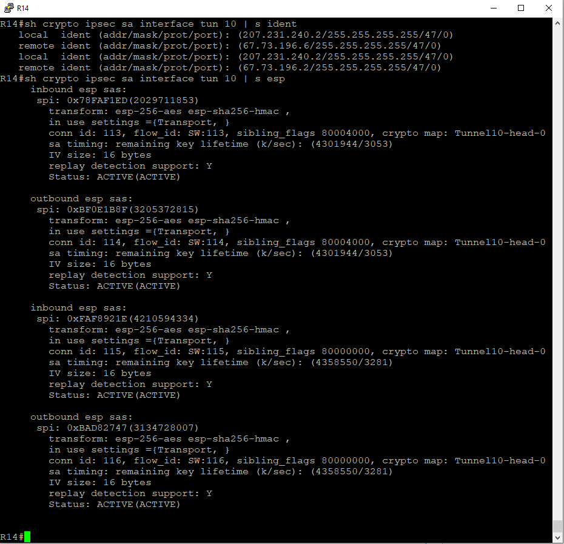

# Лабораторная №14

## Сертификаты.

### Цели задания

- Настроить GRE поверх IPSec между офисами Москва и С.-Петербург
- Настроить DMVPN поверх IPSec между офисами Москва и Чокурдах, Лабытнанги

### Топология сети


### Задачи

- Настроите GRE поверх IPSec между офисами Москва и С.-Петербург.
- Настроите DMVPN поверх IPSec между Москва и Чокурдах, Лабытнанги.
- Все узлы в офисах в лабораторной работе должны иметь IP связность.
- План работы и изменения зафиксированы в документации.
- Для IPSec использовать CA и сертификаты.

# Настройка устройств:

Базовая настройка и настройка IP адресов была произведена в предыдущих лабораторных работах.

Настройка GRE и DMVPN была произведена в [лабораторной работе №13](../lab_13/README.md)

<details>

<summary><H3>Настройка центра сертификатов CA и выдача клиентских сертификатов</H3></summary>

В качестве CA-сервера выберем маршрутизатор R20. На маршрутизаторе R20 настроен статический NAT и он доступен по внешнему адресу **_128.249.190.3_**
Также на маршрутизаторе R20 уже настроена синхронизация времени по протоколу NTP.

### Настройка центра сертификатов

#### Настройка имени хоста и доменного имени

```
!
hostname R20CA
!
ip domain name otus.ru
!
ip http server
```

#### Генерация ключевой пары сервера CA

```
(config)# crypto key generate rsa general-keys label R20CA modulus 2048 exportable
```

##### Key pair


#### Настройка CA-сервера на маршрутизаторе

```
!
crypto pki server R20CA
 database level complete
 no database archive
 issuer-name CN=R20CA, O=Otus, C=RU
 lifetime crl 24
!
crypto pki trustpoint R20CA
 revocation-check crl
 rsakeypair R20CA
!

```

##### R20CA Server


### Настройка маршрутизаторов R14, R15, R18, R27 и R28 для получения сертификатов от CA

#### Настройка доменного имени, статической записи хост-ip на CA R20 и синхронизация времени по протоколу NTP

```
ip domain name otus.ru
ip host R20CA 128.249.190.3
ip host r20ca.otus.ru 128.249.190.3
!
ntp update-calendar
ntp server 209.124.176.1

```

#### Настройка trustpoint

где xx - номер маршрутизатора

```
!
crypto pki trustpoint R20CA
 enrollment url http://r20ca.otus.ru:80
 serial-number
 subject-name CN=Rxx, O=Otus, C=RU
 revocation-check crl
!
```

### Генерация ключевой пары на маршрутизаторах R14, R15, R18, R27 и R28 и получение собственных сертификатов

```
(config)# crypto key generate rsa modulus 2048
```

#### Получить сертификат CA-сервера

```
(config)# crypto pki authenticate R20CA
```

#### Запрос собственного сертификата:

```
(config)# crypto pki enroll R20CA
```

##### Список выданных сертификатов CA сервером


</details>

<details>

<summary><H3>GRE поверх IPSec между офисами Москва и С.-Петербург</H3></summary>

### Настройка IPsec на маршрутизаторах R14, R14 и R18

#### Настройка первой фазы

```
crypto isakmp policy 10
 encr aes 256
 hash sha256
 group 16
 lifetime 3600
!
```

#### Настройка второй фазы

```
!
crypto ipsec transform-set ts_GRE esp-aes esp-sha-hmac
 mode transport
!
!
crypto ipsec profile pof_GRE
 set transform-set ts_GRE
!
```

#### Применение IPsec профиля на GRE интерфейсах

##### R14

```
interface Tunnel0
 tunnel protection ipsec profile pof_GRE
```

##### R15

```
interface Tunnel1
 tunnel protection ipsec profile pof_GRE
```

##### R18

```
interface Tunnel0
 tunnel protection ipsec profile pof_GRE
!
interface Tunnel1
 tunnel protection ipsec profile pof_GRE

```

### Проверка работы GRE over IPsec

#### Состояние туннелей GRE

##### R14 tun 0


##### R15 tun 1


##### R18 tun 0


##### R18 tun 1


#### Состояние IPsec

##### R14 IPsec tun 0


##### R15 IPsec tun 1


##### R18 IPsec tun 0


##### R18 IPsec tun 1


##### Проверка ping туннельных интерфейсов


</details>

<details>

<summary><H3>DMVPN поверх IPSec между Москва и Чокурдах, Лабытнанги</H3></summary>

### Настройка IPsec на маршрутизаторах R14, R14, R27 и R28

#### Настройка первой фазы

Первую фазу оставляем без изменений

```
crypto isakmp policy 10
 encr aes 256
 hash sha256
 group 16
 lifetime 3600
!
```

#### Настройка второй фазы

```
!
crypto ipsec transform-set ts_DMVPN esp-aes 256 esp-sha256-hmac
 mode transport
!
crypto ipsec profile pof_DMVPN
 set transform-set ts_DMVPN
!
```

#### Применение IPsec профиля на GRE интерфейсах

##### R14

```
interface Tunnel10
 tunnel protection ipsec profile pof_DMVPN
```

##### R15

```
interface Tunnel10
 tunnel protection ipsec profile pof_DMVPN
```

##### R27

```
interface Tunnel10
 tunnel protection ipsec profile pof_DMVPN
```

##### R28

```
interface Tunnel10
 tunnel protection ipsec profile pof_DMVPN

```

### Проверка работы DMVPN over IPsec

#### Состояние туннелей DMVPN

##### R14 tun 10


##### R15 tun 10


##### R27 tun 10


##### R28 tun 10


#### Состояние IPsec

##### R14 IPsec tun 10



##### R15 IPsec tun 10


##### R27 IPsec tun 10


##### R28 IPsec tun 10


##### Проверка ping туннельных интерфейсов

R27


R28


#### Просмотр соединений WireShark

##### R14


##### R15


##### R18


##### R27


</details>

<details>

<summary><H3>Проверка  IP связности между офисами</H3></summary>

## Москва

#### пинги от VPC1 до рабочих станций в других офисах


#### трассировка от VPC1 до рабочих станций в других офисах


#### пинги от VPC7 до рабочих станций в других офисах


#### трассировка от VPC7 до рабочих станций в других офисах


## С.-Петербург

#### пинги от VPC8 до рабочих станций в других офисах


#### пинги от VPC до рабочих станций в других офисах


## Чокурдах


#### пинги от VPC до рабочих станций в других офисах


## Лабытнанги

#### пинги от R27 до рабочих станций в других офисах


</details>
